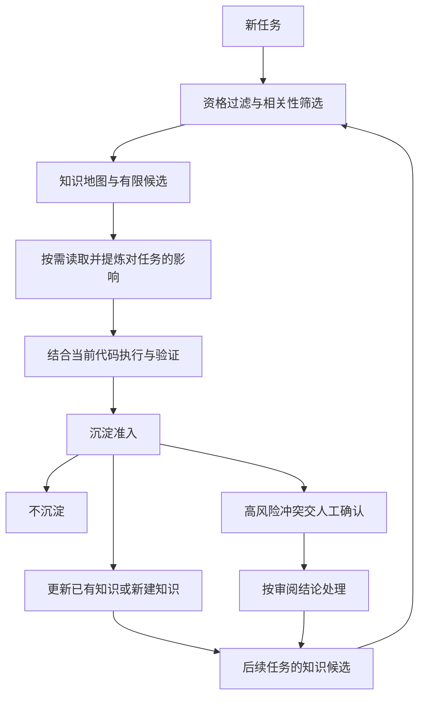

> 原文：[[Agent每次接新任务都像新人第一天入职？带你告别“一次性智能”]]，田倬月，腾讯云开发者，2026-09-03。以下基于收藏文章正文整理。

**核心观点：将任务中验证过的工程判断整理成有来源、有适用范围、可修正的项目知识，按需带入后续任务，再用最新代码和验证结果持续校正，让团队经验跨任务积累。**

文中介绍的 Forge 框架包含三个分工：OpenSpec 明确任务目标，Harness 组织执行和验证，Memory 负责让有效经验进入下一次任务。

**为什么 Agent 总像第一天入职**

工程经验在三个位置容易断开：

1. **代码与理由之间**：代码保留最终实现，却很少交代排除过哪些方案、为什么接受某项代价、什么条件变化后需要重新设计。
2. **任务与任务之间**：经验留在聊天、Review 和参与者记忆中，其他成员和新会话无法稳定复用。
3. **保存与决策之间**：文档存在，也可能找不到、已经过期，或者被读取后没有影响实际判断。

因此，保存更多聊天记录、扩充上下文和增加检索能力，只解决其中一部分问题。还需要判断哪些内容值得保留、适用于当前任务，以及何时应被更新或淘汰。

**什么值得成为长期知识**

作者经历了“每日日志 → 结构化知识对象 → 读写双向准入 → 职责分层”的演进。日志容易混杂事实和猜测、重复追加、无限增长；知识对象则用稳定 ID、适用范围、证据、状态和修正历史支持持续维护。

知识正文优先保存难以从代码直接恢复、又会影响未来判断的信息，避免不断复制容易过期的实现细节。文中按用途划分六种知识角色：

| 角色 | 回答的问题 | 保存的重点 |
| --- | --- | --- |
| 导航知识 | 从哪里开始读？ | 入口、目录关联、阅读顺序 |
| 模型知识 | 系统怎样协同？ | 模块职责、依赖方向、跨模块关系 |
| 操作手册 | 这类任务怎样完成？ | 前置条件、步骤、验证方式 |
| 诊断知识 | 出现异常怎样定位？ | 现象、假设、验证分支、回归位置 |
| 决策理由 | 当时为什么这样选？ | 备选方案、取舍、代价、重评条件 |
| 约束规则 | 哪些选择受到限制？ | 适用边界、依据、例外、失效条件 |

约束规则会提前影响方案的候选范围，因此需要更严格的人工确认。

**核心机制：读取和沉淀各有一道准入门**

读取时，先检查知识是否具备使用资格：未完成的骨架、停用对象、结构不合规内容不进入正常推荐，未经人工确认的约束不成为默认边界。随后依据任务涉及的文件、模块、符号和概念筛出有限候选，提供轻量知识地图，再按需展开少量正文。探索出现新线索后，可以重新筛选。

历史知识提供探索方向和判断依据；Agent 仍需回到当前代码与验证结果，确认它今天是否成立。发现旧判断不适用也是有价值的使用，但读取阶段不直接改写知识，修正需在获得证据后通过沉淀准入。

沉淀时，默认不写入，依次判断：未来是否还会遇到、是否有证据、离开本次任务能否独立成立、内容是否完整、已有知识是否记录了同一判断。结果优先级是：

1. **不沉淀**：没有长期价值，或事实能从当前代码低成本恢复。
2. **更新已有知识**：同一判断出现了新证据、新场景或更准确的边界。
3. **新建知识**：出现独立的新判断，且证据、边界和失效条件完整。

证据不足时保留不确定性；涉及已确认约束或无法自动解决的高风险冲突时转人工审阅，不能静默覆盖旧规则。

**谁负责什么，怎样接入主任务**

| 责任方 | 工作 |
| --- | --- |
| AI | 判断相关性、适用性、长期价值，以及是否与已有知识重复 |
| 确定性工具 | 资格过滤、候选计算、ID、路径、字段校验、写入、索引与状态迁移 |
| 人工与 Git 审阅 | 确认高风险约束、团队事实与难以自动解决的冲突 |

Memory 作为按需能力接入 Harness：主 Agent 知道何时调用、返回结果意味着什么即可。知识筛选、正文阅读与沉淀流程放在独立上下文中完成，只返回对当前任务的影响、沉淀结果和待确认事项，减少主任务的上下文负担。

这套设计同时追求连续性、准确性、安全性和复利性：经验能跨任务复用，读取保持相关，错误知识能够被纠正，成熟经验进一步进入测试、检查规则、Schema、Skill 或工具，形成稳定执行机制。

**作者观察到的效果及其边界**

文章报告，约 70% 的任务能从轨迹中看到知识被读取并影响后续判断；近 30% 的任务明确无需新增长期知识；超过 40% 的任务形成知识更新或新对象，完成“读取—使用—验证—沉淀”闭环的任务也超过四成。这些比例描述不同指标，不能相加。

作者还依据真实任务轨迹反向复盘，认为相关探索路径通常可以缩短一半以上。**这一表述针对探索路径，不能直接等同于任务总耗时减少一半或开发效率翻倍。**它属于文中的实践复盘结论，不能据此推出所有项目都能获得同等收益。

**后续架构方向**

文章进一步提出五层边界：来源 → 知识资产 → 资产运行时 → 访问入口 → 消费者。当前主要是 Git 中的 Knowledge 经 Knowledge Runtime 和 CLI 被 Coding Agent 使用；未来可以扩展到 Skill、Document、CodeGraph 等资产，以及 MCP、HTTP API、Web UI 等入口。不同资产保留各自结构和使用方式，Forge Memory 目前主要承担 Knowledge Runtime 的职责。

**阅读后的实践启发（总结者归纳）**

对已有 Obsidian 笔记与 Agent 工作流，优先值得借鉴的是：

- 在 Bug 复盘和设计记录中补齐“为什么、证据、适用范围、何时失效”，帮助后续任务判断能否复用。
- 任务开始时通过索引定位少量相关知识，任务结束时判断应更新哪条旧知识；没有新经验时可以不新增。
- 定期清理失效判断，把已稳定、可机械检查的经验转成工具或测试，减少反复阅读与解释的成本。

以上是从文章提炼的实施思路，未检查或改造当前项目的知识读取机制。

相关收藏：[[万字干货！Harness Engineering如何工程化落地？-总结]]。
