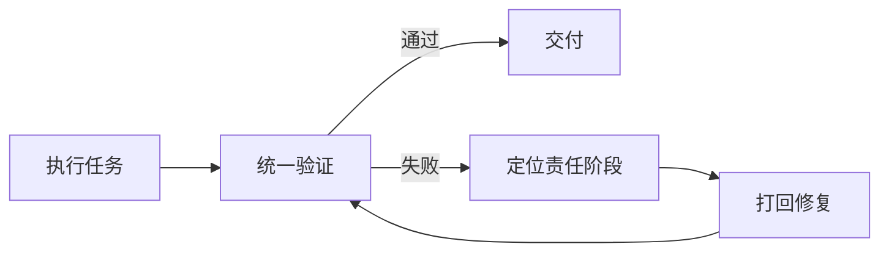

# Harness Engineering 如何工程化落地——文章总结

> 原文：[[万字干货！Harness Engineering如何工程化落地？]]

## 一句话结论

Harness Engineering 不是靠更长的 Prompt 让 AI “更聪明”，而是把 **规格、规则、标准动作、角色分工、流程、机器门禁和项目知识** 固化进仓库，让 AI 从临场发挥的聊天模型，变成 **可约束、可协作、可校验、可追踪、可持续维护的工程执行系统**。

## 一、作者搭出的整体框架

文章最终把 Harness 归纳为四块相互咬合的拼图：

| 拼图 | 解决的问题 | 典型载体 |
| --- | --- | --- |
| 约束与流程 | AI 应按什么边界和顺序工作 | SPEC、Rule、Skill、Sub Agent、Workflow、角色契约 |
| 反馈 | AI 的产出到底是否合格 | 编译、测试、静态扫描、总验证脚本、基线对比 |
| 知识库 | AI 如何快速理解整个项目，避免重复造轮子 | dev-map、任务看板、README、模块索引 |
| 进化 | 经验如何反哺系统，使 Harness 跟着项目成长 | Rule 脚本化、地图更新、流程升级、模板沉淀 |

这四块缺一不可：只有流程没有反馈，会产生“完成幻觉”；只有反馈没有流程，上游仍然混乱；没有知识索引，AI 会反复踩坑和重复实现；没有持续进化，规则、门禁和地图会逐渐过期。

## 二、六个核心概念的分工

| 概念 | 核心作用 | 类比 |
| --- | --- | --- |
| Rule | 规定不能违反的原则和红线 | 研发制度 |
| Skill | 固化高频任务的标准执行步骤 | 标准操作手册（SOP） |
| Scripts | 用机器判定结果是否过关 | 闸机、裁判 |
| Sub Agent | 把复杂任务拆给不同专业角色 | 团队岗位 |
| Workflow | 规定角色如何接力、暂停和打回 | 流程与状态机 |
| MCP | 在受控边界内连接 CI、签名、制品、发布等外部系统 | 标准插座 |

它们不是替代关系，而是逐层加固：**Rule 说必须做什么，Skill 说具体怎么做，Scripts 判断到底做到没有；Sub Agent 负责分工，Workflow 负责协作秩序，MCP 把闭环延伸到仓库之外。**

## 三、从零落地的推荐顺序

### 1. 先写清 SPEC

第一步不是堆 Rule 或拆 Agent，而是把版本目标、范围、边界、兼容要求和验收标准写清楚。SPEC 中要尽量消除“建议、可以、推荐、可选”之类的不确定表达。

SPEC 解决“要做什么”，但不能保证 AI 严格执行，也不能证明它真的完成了，因此还需要后面的约束和反馈体系。

### 2. 只补最关键的 Rule

先记录那些高频犯错、最容易偷懒、且必须遵守的底线，例如：代码修改后必须编译、测试和验证。Rule 不宜一开始写几十条；它是软约束，会被遗忘或被 AI “解释性执行”。

### 3. 把固定动作下沉为 Skill

编译、测试、事后验证等动作步骤固定、频率高，不应每次让 AI 自己拼命令。将它们做成 Skill 后：

- Rule 只保留“必须执行”的原则；
- Skill 维护“如何执行”的唯一标准步骤；
- 流程变化时只改一处，减少多处说明不一致。

### 4. 单 Agent 失稳后，再拆多 Agent

不要为“多 Agent 很酷”而拆。只有当单 Agent 开始混淆需求、方案、实现和自我审查时，才值得拆分。文章的案例最终形成七个角色：

1. PM：只做路由、交接、回退和进度维护；
2. 需求分析：把模糊诉求变成结构化需求；
3. 方案设计：把需求转为可实施技术方案；
4. 闸门总控：开发前检查可行性、完整性和风险；
5. 开发实现：按上游文档落地代码；
6. 代码审查：检查实现质量以及需求、方案一致性；
7. 测试验证：检查功能、边界、回归、稳定性和基础性能。

重点不是“必须七个”，而是每个角色都应解决一个独立问题，并拥有明确责任边界。简单任务可以使用裁剪后的流程。

### 5. 多 Agent 复杂后，工程化 Workflow

流程不能只藏在 PM 的长提示词里。应拆成三类可维护资产：

- **流程定义文件**：阶段、负责人、正常迁移和允许的回退路径；
- **角色契约**：每个 Agent 必须读取什么、输出什么、何时阻塞；
- **流程校验脚本**：检查流程定义、角色契约和引用关系是否齐全一致。

一条关键纪律是：**下游不能直接修改上游文档。** 发现问题只能提出阻塞项，由 PM 正式打回；否则责任归属和事实来源会被破坏。PM 也不能替专业角色做判断，它只是“总路由器”，不是“总专家”。

### 6. 尽早建立统一的总验证入口

这是全文最值得重视的部分。AI 说“做完了”不能作为完成标准，必须由统一脚本检查：

- 静态规范和项目红线；
- 编译是否成功；
- 测试是否全部通过，测试数量是否异常减少；
- 工程文件、规则文件和项目结构是否一致；
- 项目特有的安全、日志、本地化、兼容性约束。

推荐开发前后都执行同一套验证并保存报告，做 **基线对比**。这样可以客观判断新增错误、告警和违规项，避免 AI 用“历史遗留问题”绕过门禁。

完整反馈环应是：

### 7. 持续迭代后，再补项目级知识索引

项目变大后，仅理解当前任务不够。文章使用两类仓库内资产：

- **dev-map**：面向开发，记录功能落点、模块关系、标准模式和影响范围，由实际改代码的 Agent 同步维护；
- **任务看板**：面向需求和项目管理，记录任务历史、当前阶段、文档入口和交付结论，由 PM 维护。

知识库应首先是一套“从哪里读起”的轻量索引，而不是把整个仓库写成百科全书。大项目可以把总地图拆成模块地图，具体符号和文件再交给搜索、语言服务或检索工具。

### 8. 开发闭环稳定后，再接 MCP

MCP 不是起步时的主干。只有本地开发闭环稳定后，才适合把 AI 受控地接入：

- CI 构建与日志；
- 签名服务；
- 制品上传；
- 灰度和发布系统；
- 发布结果及版本状态回写。

外部动作必须结构化、可审计、有权限边界，不能把凭据和临时命令散落在对话中。

## 四、最重要的实践原则

1. **先解决最痛、最反复的问题，不追求第一天搭全。** Harness 是“运行—撞墙—补洞—再运行”逐步长出来的。
2. **能机器判定的规则，最终都应下沉为脚本。** 自然语言永远存在遗忘和解释空间。
3. **每个阶段都要有明确输入、输出、责任人和回退路径。** 多 Agent 的价值是责任隔离，不是角色数量。
4. **完成必须由验证结果定义，而不是由 Agent 自述。** 总验证脚本是反馈闭环的核心。
5. **团队真相必须进入仓库。** 决策进 SPEC/文档，成功与失败样例进测试，红线优先进 Scripts、其次进 Rule。
6. **Memory 只能做润滑剂，不能做团队规范源。** 私人记忆不可见、不可审计、可能互相冲突。
7. **谁改变项目，谁顺手维护对应地图。** 知识资产必须嵌入开发流程，否则很快过期。
8. **按角色配置模型能力。** PM 等路由角色可使用成本较低的模型，方案、审查、测试等专业判断角色使用更强模型。

## 五、可以直接采用的最小版本

如果暂时不做完整多 Agent，最小可用 Harness 可以只有以下五项：

1. 一份写清目标、边界和验收标准的 SPEC；
2. 一份很短的项目 Rule，只保留真正红线；
3. 三个固定 Skill：编译、测试、事后验证；
4. 一个统一验证脚本，开发前后都运行并比较基线；
5. 一份轻量 dev-map，告诉 AI 从哪里读代码、已有模式在哪里。

当这个版本能够稳定运行，再根据真实故障逐步增加角色契约、Workflow、任务看板和 MCP。评价 Harness 成熟度的标准不是文件数量，而是：**同类任务能否重复稳定地做对，失败能否被发现、定位、打回并沉淀成下一轮机制。**

## 六、对全文的简短评价

文章最有价值的地方，是把 Harness 从抽象概念还原成了仓库中的具体资产，并强调“反馈”比提示词更重要。其七 Agent 方案是 JK Launcher 项目的实例，不应机械照搬；真正可复用的是演进逻辑：

> **先明确目标，再固定底线与标准动作；复杂后才拆职责；最后用机器门禁定义完成，并把经验持续沉淀回仓库。**

换句话说，Harness Engineering 的本质并不是管理 AI 的 Prompt 技巧，而是把传统软件工程中的规格、职责、流程、测试、质量门禁和知识管理，重新组织成适合 AI 执行的工程环境。
