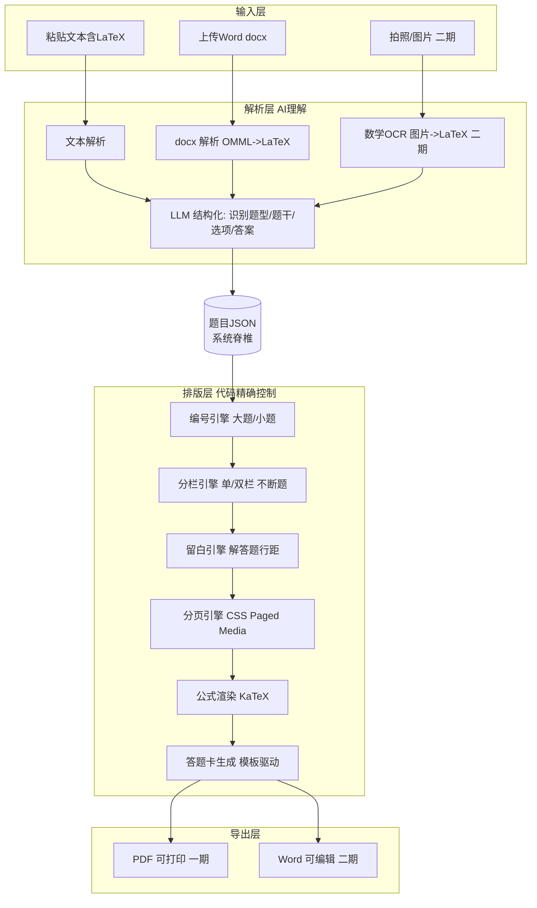
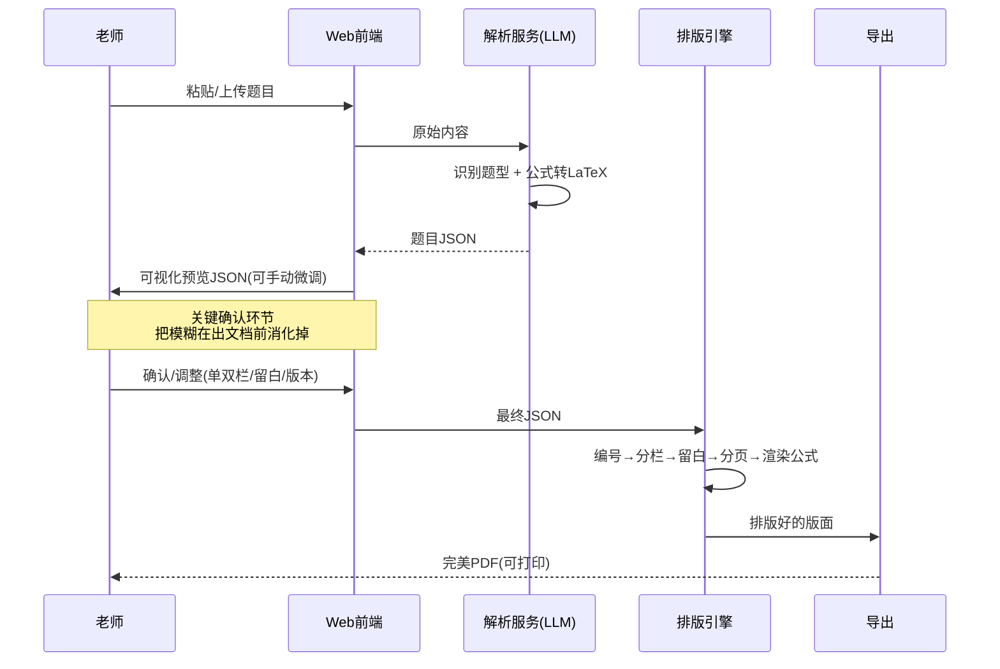

# AI 试卷排版工具 架构总览

> 本文是该工具的**顶层架构总览**,后续所有模块实现都以此为准。
> 一句话定位:**不管题从哪来,一键变成排版完美、能直接打印的试卷。**

---

## 一、产品定位

### 1.1 做什么

老师/教培机构在出卷时,**找题不难、排版很痛**。本工具只解决"排版"这一段:

- 输入:老师**已有的题目**(粘贴文本 / Word / 后续支持拍照),或一段知识点让 AI 出题
- 处理:自动编号、分栏、公式正确渲染、留白、分页、答题卡
- 输出:**排版完美、可直接打印的 PDF**(二期支持可编辑 Word)

### 1.2 不做什么(边界,极其重要)

| 不做 | 原因 |
|------|------|
| **题库** | 学科网/组卷网/菁优网用十几年砸出几百万道题,打不过,绝不碰 |
| 题目质量/教研 | 不评判题目好坏,只负责把它排好 |
| 大而全的教学平台 | 聚焦"排版"一个点做到极致 |

**战略:接在题库巨头后面** —— 老师从学科网导出题目 → 用本工具排版。不抢存量,做它们做得最烂的环节。

### 1.3 核心卖点 / 护城河

排版引擎里的 **公式渲染 + 分栏不断题 + 答题卡生成** 是真·工程难题,套壳 GPT 做不出来。这是工程能力的壁垒,也是与"AI 文档生成"类竞品的本质区别。

---

## 二、核心设计原则

### 铁律:AI 负责"理解",代码负责"排版"

```
LLM/OCR 只把"乱输入"翻译成"结构化 JSON";
排版由确定性代码 100% 精确执行,LLM 碰都不碰。
```

**为什么**:LLM 处理的是 token,天然控制不了字体/磅值/分栏/分页。让它直接输出带格式的文档 → 必崩。把"理解"和"排版"彻底分离,格式才能做到"完美",这也正是工程壁垒所在。

---

## 三、整体架构



---

## 四、模块拆解

| 模块 | 职责 | 一期 | 技术要点 |
|------|------|:---:|----------|
| **输入层** | 接收老师的原始题目 | 仅文本 | 文本/docx/图片三通道 |
| **解析层** | 乱输入 → 结构化 JSON | ✅ | LLM 识别题型结构;公式统一成 LaTeX |
| **题目JSON** | 全系统唯一数据契约 | ✅ | 见第五节,先定稳 |
| **排版引擎** | JSON → 完美版面 | ✅ | HTML/CSS + Paged Media,核心壁垒 |
| **公式模块** | LaTeX → 可视渲染 | ✅文本 | KaTeX(网页)/ OMML(Word二期) |
| **答题卡** | 按题型生成涂卡区 | 二期 | 模板驱动,从同一 JSON 出 |
| **导出层** | 出 PDF / Word | PDF | WeasyPrint/Paged.js;Word 用 python-docx |
| **Web 壳** | 上传→处理→下载 | ✅ | 后端可 Go,排版引擎独立服务 |

---

## 五、核心数据结构:题目 JSON

**整个系统的脊椎,前后端都围着它转。先定稳再写代码。**

```jsonc
{
  "paper": {
    "title": "2026 春季期中测试",
    "subject": "数学",
    "grade": "初二",
    "columns": 2,            // 1=单栏 2=双栏
    "paperSize": "A3",       // A3/A4/B4
    "totalScore": 120,
    "duration": 120          // 分钟
  },
  "sections": [
    {
      "name": "一、选择题",
      "instruction": "本大题共 10 小题,每小题 3 分",
      "questions": [
        {
          "type": "choice",          // choice/fill/judge/essay/solution
          "number": 1,               // 编号引擎可自动重排
          "score": 3,
          "stem": "已知 $x^2+1=0$,则 $x=$",   // 公式统一 LaTeX
          "options": ["$x=1$", "$x=-1$", "无解", "以上都不对"],
          "answer": "C",
          "analysis": "...",          // 答案/解析,出"教师版"时用
          "answerSpace": { "lines": 0 }   // 解答题留白行数
        }
      ]
    }
  ],
  "options": {
    "withAnswerSheet": true,    // 是否附答题卡
    "version": "student"        // student=学生版(无答案) / teacher=教师版(带解析)
  }
}
```

**关键约定:公式内部一律规范成 LaTeX** —— 它是唯一能同时喂给"网页渲染(KaTeX)"和"Word(OMML)"的中间格式。所有输入通道最终都收敛到 LaTeX。

---

## 六、端到端流程



> **"②可视化预览+微调"是点睛之笔**:既给老师掌控感,又把"AI 理解可能出错"的风险在出成品前拦下,保证最终"完美"。

---

## 七、三大技术难点与方案

### 7.1 公式(最硬的骨头)

输入来源混乱,逐通道归一到 **LaTeX**:

| 来源 | 处理 | 阶段 |
|------|------|:---:|
| 纯文本 `$...$` | 直接当 LaTeX | 一期 |
| Word(MathType/公式) | 解压 docx,**OMML → LaTeX** | 二期 |
| 图片公式 | **数学 OCR(视觉模型/Mathpix 类)→ LaTeX** | 二期 |

渲染:网页端 **KaTeX/MathJax**;Word 端 LaTeX → **OMML**(现成 XSLT/库)。
**一期只啃"文本 + LaTeX",图片/Word 公式延后**,别一上来碰最硬的。

### 7.2 分栏排版(A3 双栏,Word 做得最烂处)

**PDF 优先,用 HTML/CSS 做版面:**
- `column-count` 分栏
- `break-inside: avoid` 防止一道题被拦腰断开
- **Paged.js / WeasyPrint / Prince** 做分页(CSS Paged Media)
- 公式直接 KaTeX 渲染,无缝

这套组合做"完美打印版"又快又稳,是一期主力路线。

### 7.3 答题卡(亮眼卖点,纯代码)

模板驱动,从**同一份 JSON** 生成:
- 选择题:ABCD 涂卡框
- 填空:横线
- 解答题:作答方框
按题型摆位即可,不难,但很出彩。**二期做。**

---

## 八、技术栈选型

| 层 | 选型 | 说明 |
|----|------|------|
| 解析层 | LLM API + 数学OCR | 乱输入 → JSON |
| **排版引擎** | **Python + HTML/CSS + WeasyPrint / Paged.js** | 文档生态 Python 最全,不跟生态较劲 |
| 公式 | KaTeX(网页)/ OMML(Word) | LaTeX 作中间格式 |
| Word 导出 | python-docx + OMML | 二期高保真 |
| Web 后端 | Go(熟) 或 Python | 排版引擎做成独立服务被调用 |
| 前端 | 任意主流框架 | 上传 + JSON 预览微调 + 下载 |

> 提醒:虽然主力语言是 Go,但 docx/排版/公式生态 **Python 成熟太多**,排版核心建议用 Python,Web 壳子随意。

---

## 九、分阶段实施路线

### MVP(一期)— 只证明"排版值钱"

**只做**:
1. 老师**粘贴文本**(含 `$...$`)→ 选题型 → 自动编号
2. **单/双栏 + 不断题 + 解答题留白**
3. 导出**完美 PDF**(可打印)

**砍掉**:图片/Word 公式、Word 导出、答题卡、AI 出题、题库、账号体系。

**验收命题**:老师愿不愿为"粘进去 → 出一张完美能打印的卷子"省那两小时,甚至付费。

### 二期 — 补全核心体验

- 答题卡生成
- Word(.docx)可编辑导出
- Word/图片公式解析(OMML / 数学OCR)
- 学生版/教师版(带解析)一键切换

### 三期 — 放大与商业化

- 试卷模板库(版式风格)
- AI 辅助出题(接知识点)
- 批量/班级管理、账号与付费
- 私有化/本地版(面向学校,数据不外传,可溢价)

---

## 十、风险与边界

| 风险 | 说明 | 应对 |
|------|------|------|
| **付费意愿** | 老师爱用免费的 | 先验证!手动排几张给真实老师看反应,再写代码 |
| 痛点判断 | 万一多数人痛在"找题"而非"排版" | 已确认痛在排版,持续校验 |
| 公式复杂度 | 数学/物理公式千变万化 | 一期限定 LaTeX,逐步扩展 |
| 巨头下场 | WPS/学科网哪天自己把排版做好 | 切它们看不上的细分(中文国标/特定学段/私有化) |
| Word 高保真 | docx 双栏+公式极难做"完美" | 一期 PDF 优先,Word 延后且降级预期 |

---

## 十一、竞品与差异化(备忘)

- 海外 **Jenova / Format Magic / Claude for Word**:自然语言 → 格式化文档,但面向通用/英文,不碰中文试卷的分栏+公式+答题卡。
- 国内题库平台(学科网等):强在题库,**排版是它们的短板**,本工具正好补位、可接在其后。
- 差异化锚点:**中文 + 试卷专属版面(双栏/公式/答题卡)+ 完美可打印**。

---

## 十二、下一步

1. **不写产品代码**,先用 HTML/CSS 手动给真实老师排 1~2 张卷 → 验证"完美 PDF"能不能打动人。
2. 反应好 → 按第五节先把**题目 JSON 定稳**,再搭 MVP 排版引擎(7.2)。

## 关联
- 本系统独立文档归于 `AI试卷排版工具/` 文件夹,后续模块设计/需求/日志均放此目录
