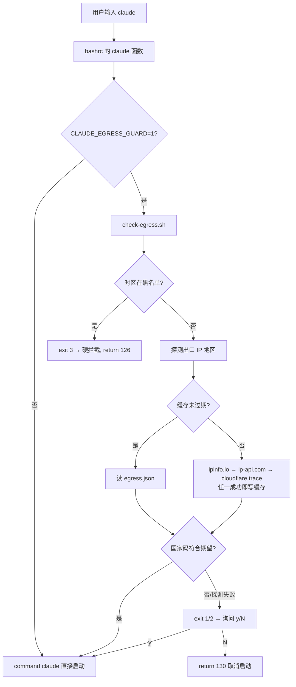

# Claude Code 启动出口与时区门禁

## 目标

在 Linux 开发机上启动 Claude Code 之前自动做两项环境校验，避免用非美国出口或中国大陆时区去连 Anthropic 服务：

- **出口地区**：当前公网出口 IP 必须落在期望国家（默认 `US`）。不符合时**软拦截**——打印警告并询问是否继续。
- **系统时区**：命中 `Asia/Shanghai`（含其 tzdata 别名）时**硬拦截**，直接拒绝启动，不提供继续选项。

## 涉及文件

| 文件 | 作用 |
|------|------|
| `~/.claude/check-egress.sh` | 检测器本体，按退出码表达结果，可独立运行 |
| `~/.bashrc`（`claude-egress-guard` 标记块） | `claude()` shell 函数，启动前调用检测器并决定放行/拦截 |
| `~/.claude/cache/egress.json` | 出口探测结果缓存（TTL 300s） |

## 核心流程



时区检测放在出口探测**之前**：它零网络开销，命中黑名单可直接短路，省掉一次 HTTP 探测。

## 退出码约定

`~/.claude/check-egress.sh` 的退出码：

| 码 | 含义 | `claude()` 的处理 |
|----|------|------------------|
| 0 | 全部检查通过 | 放行 |
| 1 | 出口不在期望地区 | 询问，确认可放行 |
| 2 | 出口探测失败（全部源超时） | 询问，确认可放行 |
| 3 | 时区在黑名单中 | 硬拦截，`return 126` |

## 探测源与顺序

按本机实测延迟排序（经 `HTTPS_PROXY=http://10.0.2.2:7897`）：

| 顺序 | 源 | 实测耗时 | 解析字段 |
|------|-----|---------|---------|
| 1 | `https://ipinfo.io/json` | ~1.0s | `country` / `ip` |
| 2 | `http://ip-api.com/json/?fields=countryCode,query` | ~0.9s | `countryCode` / `query` |
| 3 | `https://www.cloudflare.com/cdn-cgi/trace` | ~6.1s | `loc=` / `ip=` |

Cloudflare trace 虽然无需 key、无速率限制，但经该代理明显慢（4s 超时会直接失败），因此降为兜底。

`curl` 默认读取 `http_proxy` / `https_proxy`，所以探测走的就是 Claude Code 实际出网的那条链路。

## 时区检测

来源优先级：`$TZ` → `/etc/localtime` 符号链接 → `timedatectl show -p Timezone --value`。

黑名单默认值：

```
Asia/Shanghai,Asia/Chongqing,Asia/Chungking,Asia/Harbin,PRC
```

后四个不是「额外拦了别的地区」——tzdata 里 `Asia/Chongqing`、`Asia/Harbin` 就是指向 `Asia/Shanghai` 的软链，`PRC` 是同一时区的旧别名。列出它们是为了防止把系统时区改成别名绕过检测，本质上仍然只拦上海这一个时区。

## 配置项

全部通过环境变量覆盖，写进 `~/.bashrc` 即持久生效：

| 变量 | 默认值 | 说明 |
|------|--------|------|
| `CLAUDE_EGRESS_GUARD` | `1` | 设 `0` 完全关闭门禁 |
| `EGRESS_EXPECT_COUNTRY` | `US` | 期望国家码，逗号分隔多个，如 `US,CA` |
| `EGRESS_BLOCK_TIMEZONES` | 见上 | 禁止的时区名，精确匹配、大小写不敏感 |
| `EGRESS_BLOCK_OFFSETS` | 空 | 按 UTC 偏移拦截，如 `+0800`。**当前未启用** |
| `EGRESS_CACHE_TTL` | `300` | 出口探测缓存秒数 |
| `EGRESS_TIMEOUT` | `4` | 单个探测源超时秒数 |

## 使用

```bash
claude                                  # 命令不变，函数优先于 PATH 上的二进制
type claude                             # 输出「claude 是函数」即已加载

~/.claude/check-egress.sh               # 手动检查
~/.claude/check-egress.sh --json        # JSON 输出
~/.claude/check-egress.sh --no-cache    # 强制重新探测

CLAUDE_EGRESS_GUARD=0 claude            # 临时跳过
command claude                          # 绕过包装直接调二进制
TZ=America/Los_Angeles claude           # 临时用美国时区启动
```

## 验证记录（2026-07-27）

本机环境：出口 `107.172.161.203` / `US`（ipinfo.io），系统时区 `Asia/Taipei` `+0800`。

| 场景 | 输出 | 退出码 |
|------|------|--------|
| 默认 | `✓ 出口 US (...) 符合预期，时区 Asia/Taipei` | 0 |
| `TZ=Asia/Shanghai` | `✗ 时区 Asia/Shanghai (UTC+0800) 在禁止列表中，拒绝启动` | 3 → 126 |
| `TZ=PRC` | 同上（别名生效） | 3 |
| `TZ=Asia/Taipei` / `Hong_Kong` / `Tokyo` / `America/New_York` | 放行 | 0 |
| `EGRESS_EXPECT_COUNTRY=JP` + 回答 `n` | `⚠ 出口 US，期望 JP` → 已取消 | 130 |
| `EGRESS_EXPECT_COUNTRY=JP` + 回答 `y` | 放行 | 0 |
| 代理指向不可用端口 | `✗ 无法探测出口地区` | 2 |
| `EGRESS_BLOCK_OFFSETS=+0800` | `Asia/Taipei` 也被拦 | 3 |

## 风险与边界

- **探测的是通用出网 IP，不等于 `api.anthropic.com` 的实际出口**。如果代理侧按域名分流（anthropic 走美国节点、其他直连），结论可能失真。要精确需把探测域名与 anthropic 归入同一策略组。
- **只在 bash 交互式 shell 生效**。非交互启动（cron / systemd / 脚本调用）不会触发。已开着的旧终端需要 `source ~/.bashrc` 或重开窗口——shell 函数只在启动读 `.bashrc` 时定义，无法从外部注入到已运行的进程。
- 曾考虑改为在 `~/.local/bin/claude` 放同名包装脚本（该目录在 PATH 中优先于 nvm 的 bin），可覆盖所有 shell 与非交互场景，**当前未采用**。
- 缓存 300s 内切换代理节点不会立即反映，需 `--no-cache`。
- 显示瑕疵：`TZ=PRC` 时提示里的偏移显示为 `UTC+0000`（glibc 未解析该别名，回退 UTC）。拦截按名字匹配，功能正常。
- Claude Code 启动时不使用 alt-screen（实测无 `?1049h` / `2J` / `3J`），检测输出会保留在 banner 上方，不会被清屏吞掉。

## 关联

- 同期把 `~/.claude/settings.json` 的 `env` 块清空还原为官方默认（原先指向自建代理 base URL 并内联了明文 token），备份在 `~/.claude/backups/settings.json.bak-20260727-094946`。
- [[Claude Code 状态栏配置]] — 同一份 `~/.claude/settings.json` 里的另一项自定义。
