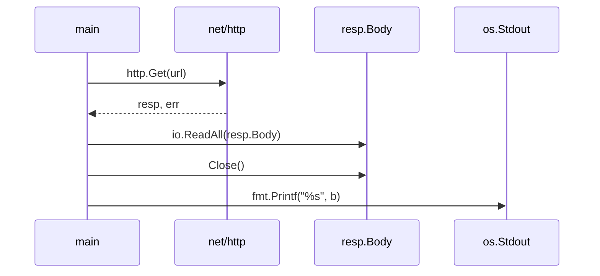
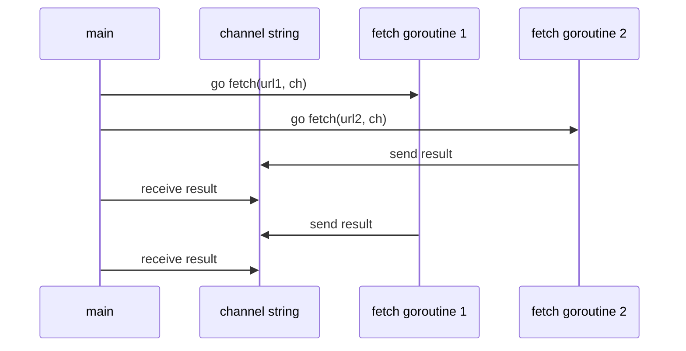

# 第1章-入门

关联：[[00-Go语言学习索引]]

## 本章定位
第一章不是系统讲语法，而是用一组可运行的小程序快速建立 Go 的整体感觉。原文入口是 `ch1/ch1.md:1`，章节包括 Hello World、命令行参数、重复行统计、GIF 生成、HTTP 客户端、并发抓取、Web 服务和本章要点。

这一章学习时不要急着背语法，重点是把每个示例跑起来，并能说清楚程序输入从哪里来、输出到哪里去、中间用了哪些标准库。

## 章节地图
| 小节 | 主题 | 重点 | 来源 |
|---|---|---|---|
| 1.1 | Hello, World | `package main`、`import`、`func main`、`go run`、`go build`、`gofmt` | `ch1/ch1-01.md:1` |
| 1.2 | 命令行参数 | `os.Args`、slice、`for`、`range`、短变量声明、`strings.Join` | `ch1/ch1-02.md:1` |
| 1.3 | 查找重复的行 | 标准输入、文件读取、`map`、`bufio.Scanner`、错误处理 | `ch1/ch1-03.md:1` |
| 1.4 | GIF 动画 | `const`、slice、struct、复合字面量、`io.Writer` | `ch1/ch1-04.md:1` |
| 1.5 | 获取 URL | `net/http`、响应体读取、资源关闭、`os.Exit` | `ch1/ch1-05.md:1` |
| 1.6 | 并发获取多个 URL | `goroutine`、`channel`、并发等待结果 | `ch1/ch1-06.md:1` |
| 1.7 | Web 服务 | `http.HandleFunc`、`http.ResponseWriter`、`http.Request`、互斥锁 | `ch1/ch1-07.md:1` |
| 1.8 | 本章要点 | `switch`、命名类型、指针、方法、接口、包、注释 | `ch1/ch1-08.md:1` |

## 1.1 Hello, World
最小 Go 程序由三部分组成：

```go
package main

import "fmt"

func main() {
	fmt.Println("Hello, 世界")
}
```

对应示例在 `vendor/gopl.io/ch1/helloworld/main.go:8` 和 `ch1/ch1-01.md:5`。这里要抓住几个规则：

- `package main` 表示这是一个可执行程序，不是普通库。
- `func main()` 是程序入口。
- `import "fmt"` 引入标准库格式化输入输出包。
- `fmt.Println` 会输出一行并自动换行。
- Go 原生支持 Unicode，所以字符串里可以直接写中文。
- 未使用的 import 会导致编译失败，这是 Go 有意保持代码干净的规则。

常用命令：

```bash
go run helloworld.go
go build helloworld.go
./helloworld
```

学习动作：运行示例，然后故意删掉 `import "fmt"` 或多导入一个没用的包，观察编译器报错。

## 1.2 命令行参数
命令行参数来自 `os.Args`，它是字符串 slice。`os.Args[0]` 是命令自身，真正传入的参数通常从 `os.Args[1:]` 开始。来源见 `ch1/ch1-02.md:13`。

第一版 `echo` 用普通 `for` 循环拼接参数：

```go
for i := 1; i < len(os.Args); i++ {
	s += sep + os.Args[i]
	sep = " "
}
```

第二版用 `range` 遍历：

```go
for _, arg := range os.Args[1:] {
	s += sep + arg
	sep = " "
}
```

第三版用 `strings.Join`，语义更直接，性能也更好：

```go
fmt.Println(strings.Join(os.Args[1:], " "))
```

本节必须理解：

- `s[m:n]` 是左闭右开的切片区间。
- `:=` 是短变量声明，只能在函数内部使用。
- `_` 是空标识符，用来丢弃不需要的值。
- Go 只有 `for` 一种循环语句，但有普通循环、类 while 循环、无限循环、range 循环多种写法。
- `i++` 是语句，不是表达式，不能写成 `j := i++`。

练习建议：优先做 `ch1/ch1-02.md:140` 和 `ch1/ch1-02.md:142`，也就是打印命令自身名称、逐行打印参数索引和值。

## 1.3 查找重复的行
`dup` 系列示例展示 Go 处理输入的常见骨架：读取输入、逐项处理、最后输出结果。来源见 `ch1/ch1-03.md:7`。

核心数据结构：

```go
counts := make(map[string]int)
```

`map[string]int` 表示键是字符串、值是整数。第一次访问不存在的键时，值是对应类型的零值，`int` 的零值是 `0`，因此可以直接写：

```go
counts[input.Text()]++
```

三个版本的差异：

| 版本 | 输入来源 | 关键点 | 示例位置 |
|---|---|---|---|
| dup1 | 标准输入 | `bufio.NewScanner(os.Stdin)` 按行扫描 | `vendor/gopl.io/ch1/dup1/main.go:17` |
| dup2 | 标准输入或多个文件 | `os.Open`、`err != nil`、函数抽取 | `vendor/gopl.io/ch1/dup2/main.go:17` |
| dup3 | 指定文件整体读取 | `ioutil.ReadFile`、`strings.Split` | `vendor/gopl.io/ch1/dup3/main.go:19` |

本节必须理解：

- `bufio.Scanner` 适合按行读取文本。
- `fmt.Printf` 使用格式化动词，例如 `%d`、`%s`、`%v`、`%T`。
- `fmt.Fprintf(os.Stderr, ...)` 可以把错误写到标准错误。
- `os.Open` 返回文件和错误两个值，Go 中显式处理错误是常态。
- `map` 遍历顺序不稳定，不能依赖输出顺序。

练习建议：做 `ch1/ch1-03.md:180`，让重复行输出时包含文件名。这个练习能逼你把 `map[string]int` 升级成能记录文件来源的数据结构。

## 1.4 GIF 动画
`lissajous` 示例展示 Go 标准库生成 GIF 动画。来源见 `ch1/ch1-04.md:13`，代码入口见 `vendor/gopl.io/ch1/lissajous/main.go:38`。

本节的新概念比较多，不需要一次吃透，但要知道它们各自解决什么问题：

- `const`：声明运行期不会变化的常量，例如帧数、画布大小、延迟。
- `var palette = []color.Color{...}`：声明颜色 slice。
- `gif.GIF{LoopCount: nframes}`：struct 复合字面量，只设置指定字段，其余字段用零值。
- `append`：向 slice 末尾追加元素。
- `io.Writer`：抽象输出目标，既可以写到标准输出，也可以写到 HTTP 响应。

运行方式：

```bash
go build gopl.io/ch1/lissajous
./lissajous > out.gif
```

学习动作：先做 `ch1/ch1-04.md:93`，把调色板从黑色改成绿色。这个练习简单，但能让你熟悉 `color.RGBA` 和 `SetColorIndex` 的关系。

## 1.5 获取 URL
`fetch` 是一个最小 HTTP 客户端，来源见 `ch1/ch1-05.md:7`，代码入口见 `vendor/gopl.io/ch1/fetch/main.go:17`。

关键流程：



要点：

- `http.Get` 发起 GET 请求。
- `resp.Body` 是可读取的响应体流，用完必须 `Close()`。
- 读取失败或请求失败时，示例用 `fmt.Fprintf(os.Stderr, ...)` 输出错误，并用 `os.Exit(1)` 退出。
- 大响应体不适合全部读入内存，可以用 `io.Copy` 直接流式复制。

练习建议：优先做 `ch1/ch1-05.md:64` 和 `ch1/ch1-05.md:68`：用 `io.Copy` 替代整块读取，并输出 HTTP 状态码。

## 1.6 并发获取多个 URL
`fetchall` 是第一章最重要的并发示例，来源见 `ch1/ch1-06.md:7`，核心函数在 `vendor/gopl.io/ch1/fetchall/main.go:31`。

核心思想：每个 URL 启动一个 goroutine，结果通过 channel 送回主 goroutine。

```go
go fetch(url, ch)
fmt.Println(<-ch)
```

流程：



要点：

- `go fetch(...)` 会并发启动函数。
- `make(chan string)` 创建字符串 channel。
- `ch <- value` 发送，`<-ch` 接收。
- 无缓冲 channel 的发送和接收会互相等待。
- 主 goroutine 接收和打印结果，可以避免多个 goroutine 同时写输出导致内容交错。

练习建议：做 `ch1/ch1-06.md:68`，对同一批 URL 请求两次，比较缓存效果和响应大小。

## 1.7 Web 服务
`server1` 展示最小 HTTP 服务，来源见 `ch1/ch1-07.md:5`，代码入口见 `vendor/gopl.io/ch1/server1/main.go:16`。

核心结构：

```go
http.HandleFunc("/", handler)
log.Fatal(http.ListenAndServe("localhost:8000", nil))
```

处理函数形态：

```go
func handler(w http.ResponseWriter, r *http.Request) {
	fmt.Fprintf(w, "URL.Path = %q\n", r.URL.Path)
}
```

要点：

- `http.HandleFunc` 绑定 URL pattern 和处理函数。
- `http.ListenAndServe` 启动监听。
- `http.ResponseWriter` 是响应输出目标。
- `*http.Request` 包含请求方法、URL、Header、Form 等信息。
- Web 服务内部会为请求启动 goroutine，因此共享变量需要同步。

`server2` 引入 `sync.Mutex` 保护全局计数器，来源见 `ch1/ch1-07.md:51` 和 `vendor/gopl.io/ch1/server2/main.go:20`。要记住：只要多个 goroutine 可能同时读写同一个变量，就要考虑竞态条件。

练习建议：做 `ch1/ch1-07.md:164`，从 URL 参数读取 `cycles`，让 Lissajous 服务支持动态参数。

## 1.8 本章要点补充
来源见 `ch1/ch1-08.md:1`。这一节提前点名后续章节会系统讲的内容：

- `switch`：Go 的 case 默认不会继续向下执行，不需要写 `break`。
- 命名类型：例如 `type Point struct { X, Y int }`。
- 指针：支持 `&` 取地址和 `*` 解引用，但不支持指针运算。
- 方法：和命名类型关联的函数，第 6 章展开。
- 接口：用同一种方式处理不同具体类型，第 7 章展开。
- 包：写 Go 多数时候是在组合标准库和社区库。
- 注释：包、导出函数、重要类型的注释会被 `godoc` 使用。

## 第一章学习检查表
- [ ] 能独立写出并运行 Hello World。
- [ ] 能解释 `package main` 和 `func main` 的作用。
- [ ] 能用 `os.Args[1:]` 读取命令行参数。
- [ ] 能写普通 `for` 和 `range` 循环。
- [ ] 能用 `map[string]int` 统计字符串出现次数。
- [ ] 能处理 `err != nil` 的错误分支。
- [ ] 能用 `http.Get` 获取 URL 并关闭响应体。
- [ ] 能解释 goroutine 和 channel 在 `fetchall` 中怎么配合。
- [ ] 能启动一个最小 HTTP 服务并访问 `localhost:8000`。
- [ ] 至少完成 3 个练习：推荐 1.1、1.2、1.7、1.9、1.12。

## 建议练习顺序
1. 练习 1.1：打印 `os.Args[0]`。
2. 练习 1.2：逐行打印参数索引和值。
3. 练习 1.7：用 `io.Copy` 改写 `fetch`。
4. 练习 1.9：打印 HTTP 状态码。
5. 练习 1.12：让 Lissajous Web 服务支持 URL 参数。

## 下一步
学完第一章后进入第 2 章程序结构。第 2 章会把第一章里先用起来的变量、声明、赋值、类型、包和作用域系统补齐。
