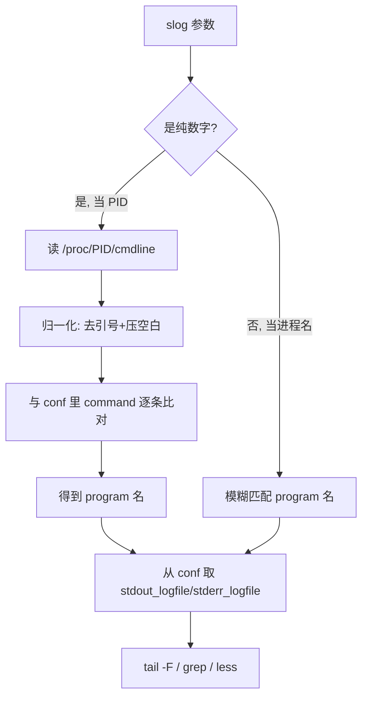

# slog 日志快捷查看

> 自建命令，解决「看 supervisor 进程日志每次都要翻目录」的问题。支持**按进程名或 PID** 直接看日志，不用记路径、不用输 sudo 密码。
> 脚本位置：`/home/cc/.local/bin/slog`（已在 `PATH`，开新终端直接可用）

## 一、为什么不用 supervisorctl

在项目目录直接敲 `supervisorctl status` 会报错：

```
unix:///tmp/supervisor.sock no such file
```

原因是**两份配置对不上**：

| | socket 路径 | 权限 |
|---|---|---|
| 真实 supervisord 用的 | `/var/run/supervisor.sock` | `root:root 0700` → **必须 sudo** |
| 项目下 `gs/supervisord.conf` 写的 | `/tmp/supervisor.sock` | 根本不存在 |

supervisorctl 不带 `-c` 时会就近找 `./supervisord.conf`，于是读到了项目里那份错的路径。

**但日志文件本身是 `644`，普通用户可读**——所以看日志这件事根本不需要 supervisorctl，也不需要 sudo。`slog` 就是绕开它，直接读文件。

## 二、常用命令

| 操作 | 命令 |
|---|---|
| ⭐ 列出所有进程 + PID + 日志路径 | `slog` |
| ⭐ 实时跟踪某进程日志 | `slog game` |
| 按 PID 看（自动反查进程名） | `slog 362859` |
| 看 stderr | `slog game -e` |
| 只看最后 N 行，不跟踪 | `slog game -n 500` |
| 关键字过滤（实时跟踪时也生效） | `slog game -g "panic\|error"` |
| 连轮转日志 `.1`~`.10` 一起搜 | `slog cross -g etcd -A` |
| less 分页打开（从末尾开始） | `slog game -p` |
| 帮助 | `slog -h` |

`slog` 无参数输出：

```
NAME       PID      STATE    SIZE      STDOUT LOG
actv       362855   RUNNING  8.6M      /home/cc/slgh5/gs/log/actv_stdout.log
chat       362856   RUNNING  1.4M      /home/cc/slgh5/gs/log/chat_stdout.log
cross      362857   RUNNING  902.3K    /home/cc/slgh5/gs/log/cross_stdout.log
door       362858   RUNNING  8.7M      /home/cc/slgh5/gs/log/door_stdout.log
game1      362859   RUNNING  1.4M      /home/cc/slgh5/gs/log/game_stdout.log
gate       362860   RUNNING  4.7M      /home/cc/slgh5/gs/log/gate_stdout.log
global     362861   RUNNING  9.5M      /home/cc/slgh5/gs/log/global_stdout.log
```

**进程名支持模糊匹配**：`slog game` 命中 `game1`，`slog cro` 命中 `cross`。优先精确匹配，其次前缀，最后子串。

`-g` 是正则、忽略大小写、带高亮；跟踪模式下用 `--line-buffered` 保证实时出结果。

## 三、本机环境布局

- 进程配置：`/etc/supervisor/conf.d/*.conf`，7 个 program：`actv` `chat` `cross` `door` `game1` `gate` `global`
- 日志目录：`/home/cc/slgh5/gs/log/`
- 命名：`{名字}_stdout.log` / `{名字}_stderr.log`
- 轮转：单文件 10MB，保留 `.1` ~ `.10`

> ⚠️ **坑：program 名和日志名不一定一致**。`[program:game1]` 的日志文件叫 `game_stdout.log`，不是 `game1_stdout.log`。
> 所以任何工具都**不能靠拼接路径**猜日志位置，必须解析 conf 里的 `stdout_logfile` 字段。这是 `slog` 不写死路径的原因。

## 四、实现原理

两步：解析配置拿日志路径，扫 `/proc` 拿运行状态。全程不碰 supervisorctl，零 sudo。



**PID 反查为什么要归一化**：`/proc/<pid>/cmdline` 里的参数已被 shell 剥掉引号（`--loglevel debug`），而 conf 里写的是 `--loglevel "debug"`。两边都去掉引号、压缩连续空白后再比对，才能对上。

**为什么比对完整 command 而不只是二进制路径**：`game1`、`game2` 用的是同一个 `bin/game`，只有 `--serverid` 不同。比对完整命令行才能区分是哪个实例。

**状态判断**：拿 conf 里的 `command` 去 `/proc` 里找有没有匹配的进程，找到即 `RUNNING`，否则 `STOPPED`。

### 性能：从 4 秒优化到 0.03 秒

最初版本 `slog` 列表要跑 **4 秒**，`sys` 时间占 5.1s——典型的 fork 开销过大。原因是：

> 7 个 program × 326 个 `/proc` 条目 × 每个条目 fork `tr｜tr｜sed` ≈ **9000 次 fork**

三处改动把它降到 **0.03 秒**（约 130 倍）：

| 问题 | 改法 |
|---|---|
| 每个 program 各扫一遍 `/proc` | `/proc` **只扫一次**，结果存进 bash 关联数组 `PROC_BY_CMD`（归一化命令行 → PID）供所有 program 共用 |
| 读 cmdline / 归一化都 fork 外部命令 | 全换成 bash 内建：`mapfile -d ''` 读 NUL 分隔的 cmdline，`read -ra` + `${arr[*]}` 做分词与拼接，**零 fork** |
| `human()` 每次调 `bc` 算大小 | 纯整数运算 `(b*20+unit)/(unit*2)`，保留 1 位小数并四舍五入（与 `bc` 的 `%.1f` 逐值比对一致） |

另外 `awk` 解析 conf 的结果也缓存进 `CONF_CACHE`，全程只跑一次。

> 💡 经验：shell 脚本慢，先看 `time` 的 **`sys` 时间**。`sys` 远大于 `user` 基本就是 fork 太多，优先把循环里的 `管道 / $(...)` 换成 bash 内建。

## 五、可移植性

配置目录不写死，用环境变量覆盖即可换项目/换机器：

```bash
SLOG_CONF_DIR=/etc/supervisor/conf.d slog          # 默认值
SLOG_CONF_DIR=~/other/supervisor slog              # 换一套配置
```

## 六、已验证场景

列表、名称模糊匹配、PID 正查反查、stderr、grep 过滤、跨轮转搜索、follow 实时跟踪，以及三种报错路径：PID 不存在 / PID 非 supervisor 管理 / 进程名不存在（会列出可用进程名提示）。

## 七、安装

脚本本体已随本笔记存放：**`工具/supervisor/slog.sh`**（与本文件同目录）。

装到新机器：

```bash
# 1. 从 vault 拷到 PATH 里（去掉 .sh 后缀，命令名就叫 slog）
cp /media/sf_obsidianRambo/ramboYe/工具/supervisor/slog.sh ~/.local/bin/slog
chmod +x ~/.local/bin/slog

# 2. 确认 ~/.local/bin 在 PATH 里，不在就加到 ~/.bashrc
echo $PATH | tr ':' '\n' | grep '.local/bin' || echo 'export PATH="$HOME/.local/bin:$PATH"' >> ~/.bashrc

# 3. 装 Tab 补全（可选，但强烈建议）
mkdir -p ~/.local/share/bash-completion/completions
cp /media/sf_obsidianRambo/ramboYe/工具/supervisor/slog-completion.bash \
   ~/.local/share/bash-completion/completions/slog

# 4. 验证
slog
```

**依赖**：`bash` `awk` `sed` `grep` `tail` `less`（都是系统自带；`bc` 在性能优化后已不再需要）。
**不需要 root**，只要日志文件对当前用户可读即可。

### Tab 补全

装好后：

| 敲的内容 | 补出什么 |
|---|---|
| `slog <TAB>` | 全部进程名：`actv chat cross door game1 gate global` |
| `slog ga<TAB>` | `game1 gate` |
| `slog -<TAB>` | 全部选项 |
| `slog game -n <TAB>` | 常用行数 `50 100 200 500 1000 5000` |
| `slog game -g <TAB>` | 常用关键字 `error panic FATAL WARN ...` |

进程名不是写死的，由 `slog --names` 实时从 conf.d 解析（9ms），**新增服务后自动就能补出来**。

> ⚠️ **补全装完在当前终端不生效**：如果你之前在这个终端敲过 `slog <TAB>` 且没补出东西，bash-completion 会把 `slog` 缓存成「无补全」，之后不再去查文件。
> 解决：**新开一个终端**；或在当前终端执行 `source ~/.local/share/bash-completion/completions/slog`。

## 相关

- [[supervisor 常用操作]] —— 进程启停、改配置生效流程、状态机、排查思路
- [[tmux 常用操作]] —— 配合使用：tmux 开多个 pane，每个 pane 跟一个服务的 `slog`
