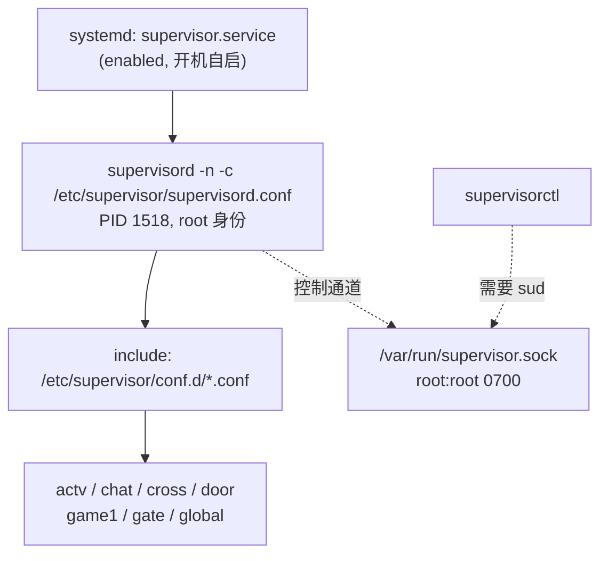
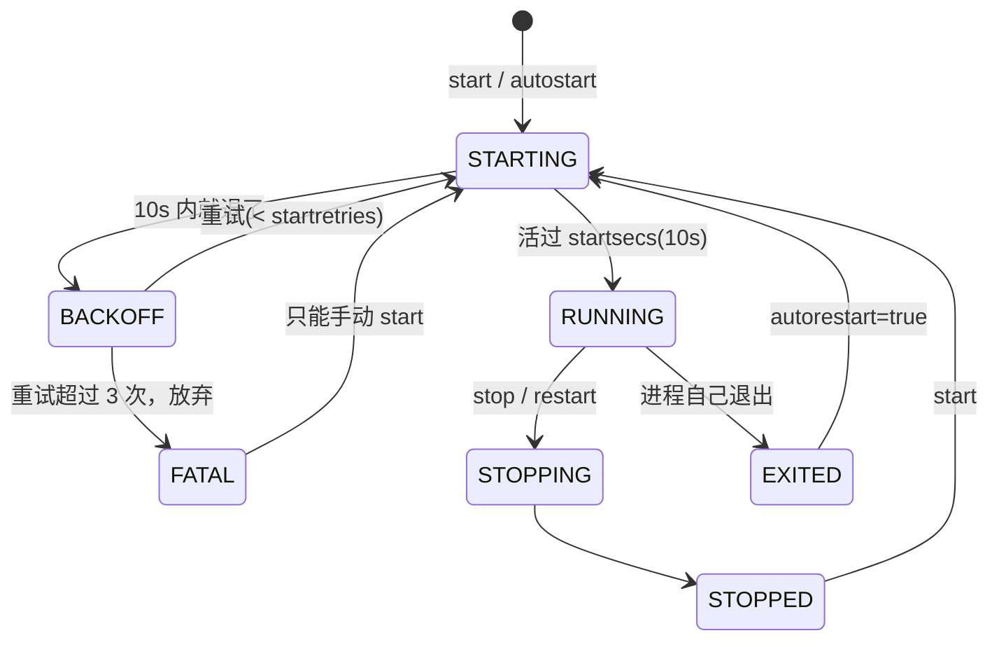

# supervisor 常用操作

> supervisor 是进程守护工具：进程挂了自动拉起，开机自启，统一管日志。本机用它守着 7 个游戏服务进程。
> 版本 **4.2.5**，配套笔记见 [[slog 日志快捷查看]]。

## 一、本机是怎么跑起来的



| 项 | 值 |
|---|---|
| systemd unit | `/usr/lib/systemd/system/supervisor.service` |
| 启动命令 | `/usr/bin/supervisord -n -c /etc/supervisor/supervisord.conf` |
| 主配置 | `/etc/supervisor/supervisord.conf` |
| 进程配置 | `/etc/supervisor/conf.d/*.conf`（一个服务一个 `.conf`） |
| 控制 socket | `/var/run/supervisor.sock`（`root:root 0700`） |
| supervisord 主日志 | `/var/log/supervisor/supervisord.log`（644，**免 sudo 可读**） |
| 各进程日志 | `/home/cc/slgh5/gs/log/{名字}_stdout.log` |

## 二、⚠️ 权限与配置陷阱（本机必读）

### 1. 直接敲 supervisorctl 一定报错

实测三种情况：

| 在哪敲 | 结果 | 原因 |
|---|---|---|
| 项目目录 `/home/cc/slgh5/gs` | `unix:///tmp/supervisor.sock no such file` | 就近读到项目里的 `gs/supervisord.conf`，那份写的 socket 是 `/tmp/supervisor.sock`，根本不存在 |
| 其他目录（如 `/tmp`） | `PermissionError: [Errno 13] Permission denied` | 读到了正确的系统配置，但 socket 是 `root 0700`，普通用户连不上 |

> supervisorctl 不带 `-c` 时会**就近查找 `./supervisord.conf`**，所以在项目目录下敲必然读错配置。

### 2. 正确姿势：sudo + 显式 `-c`

```bash
sudo supervisorctl -c /etc/supervisor/supervisord.conf status
```

建议在 `~/.bashrc` 加个别名，省得每次写一长串：

```bash
alias sctl='sudo supervisorctl -c /etc/supervisor/supervisord.conf'
```

之后就是 `sctl status`、`sctl restart game1`。

### 3. 两个「看起来有用其实没加载」的残留文件

| 文件 | 内容 | 为什么无效 |
|---|---|---|
| `/etc/supervisor/conf` | `[program:game1]` 的完整副本 | 它在 `/etc/supervisor/` 下、不在 `conf.d/` 里，`include` 只匹配 `conf.d/*.conf`，**不会被加载**。改它没有任何效果 |
| `/etc/supervisor/conf.d/supervisor.service` | `[Service]`<br/>`User=cc` | 文件名不是 `*.conf`，supervisord 不读；它也不在 systemd 的 drop-in 路径（应为 `/etc/systemd/system/supervisor.service.d/override.conf`），systemd 也不读。**两头都不生效** |

> 后者本意应该是想让 supervisord 以 `cc` 用户身份跑（那样日志就不是 root 属主了）。目前没生效，`supervisord` 仍以 **root** 运行，所以日志文件属主是 `root:root`。
> 要真正生效得建 drop-in 目录并 `systemctl daemon-reload`，属于会影响所有服务的改动，动之前想清楚。

## 三、常用命令

以下用上面的 `sctl` 别名。

| 操作 | 命令 |
|---|---|
| ⭐ 看所有进程状态 | `sctl status` |
| 看单个 | `sctl status game1` |
| 重启单个 | `sctl restart game1` |
| 重启全部 | `sctl restart all` |
| 停止 / 启动 | `sctl stop game1` / `sctl start game1` |
| ⭐ 改完配置生效 | `sctl reread && sctl update` |
| 进交互式命令行 | `sctl`（然后直接敲 `status`、`restart xxx`，`quit` 退出） |
| 看某进程日志末尾 | `sctl tail -f game1` （或直接用 `slog game`，免 sudo） |

`status` 输出形如：

```
game1    RUNNING   pid 362859, uptime 0:12:34
gate     RUNNING   pid 362860, uptime 0:12:34
```

> 💡 **只是看日志的话不用碰 supervisorctl**，用 `slog` 更快且免 sudo，见 [[slog 日志快捷查看]]。

## 四、reread / update / reload / restart 的区别

这四个最容易混，记住这张表：

| 命令 | 作用 | 会不会重启进程 |
|---|---|---|
| `reread` | 重新**读配置文件**，只告诉你哪些变了 | ❌ 不动进程 |
| `update` | 把配置变更**应用**上去 | ✅ 只重启配置有变化的那些 |
| `restart <名字>` | 重启指定进程 | ✅ 但**用的还是旧配置**（不重读文件） |
| `reload` | 重启 supervisord 自身 | ✅ **所有进程全停再全起**，慎用 |

**改配置的标准流程**：

```bash
sudo vim /etc/supervisor/conf.d/game.conf     # 1. 改
sctl reread                                    # 2. 看看它认出了什么变化
sctl update                                    # 3. 应用（只重启受影响的）
sctl status                                    # 4. 确认
```

> ⚠️ 常见坑：改完配置直接 `restart`，**改动不会生效**——`restart` 不重读配置文件。必须 `reread` + `update`。

**新增一个服务**：在 `conf.d/` 下建 `xxx.conf`，然后同样 `reread` + `update`，新进程会自动起来（`autostart=true` 时）。

## 五、本机进程配置的关键参数

以 `game.conf` 为例，7 个服务参数一致：

```ini
[program:game1]
command=/home/cc/slgh5/gs/bin/game --servername yemingheng ... --pfenv dev
directory=/home/cc/slgh5/gs
autostart=true          ; supervisord 启动时自动拉起
autorestart=true        ; 进程挂了自动重启
startsecs=10            ; 活过 10 秒才算「启动成功」
startretries=3          ; 启动失败最多重试 3 次，之后标记 FATAL 放弃
stdout_logfile=/home/cc/slgh5/gs/log/game_stdout.log
stdout_logfile_maxbytes=10MB    ; 单文件 10MB 轮转，默认保留 10 份 .1~.10
```

> ⚠️ **program 名 ≠ 日志名**：`[program:game1]` 的日志文件是 `game_stdout.log`。这个坑在 [[slog 日志快捷查看]] 里有详述。

## 六、三层日志，出问题看哪一层

| 层 | 位置 | 看什么 | 要 sudo 吗 |
|---|---|---|---|
| 业务日志 | `gs/log/{名字}_stdout.log` | 服务自己打的业务日志 | ❌ 用 `slog game` |
| 崩溃/依赖报错 | `gs/log/{名字}_stderr.log` | panic、etcd 连不上等 | ❌ 用 `slog game -e` |
| **进程启停** | `/var/log/supervisor/supervisord.log` | 谁被拉起、退出码、重启次数 | ❌ 直接 `tail` 即可 |
| supervisord 自身 | `journalctl -u supervisor` | systemd 层面的启停 | ✅ |

主日志里最有用的几个关键字：

```bash
grep -E "spawned|exited|entered RUNNING|FATAL|BACKOFF" /var/log/supervisor/supervisord.log | tail -20
```

正常启动长这样（`startsecs=10` 所以会等 10 秒才报 success）：

```
INFO spawned: 'global' with pid 362861
INFO success: game1 entered RUNNING state, process has stayed up for > than 10 seconds (startsecs)
```

## 七、排查思路

**进程反复重启 / 状态 BACKOFF**
说明起来后活不过 `startsecs=10` 秒。看 `slog <名字> -e` 找崩溃原因，同时 `grep BACKOFF /var/log/supervisor/supervisord.log` 看重试了几次。

**状态 FATAL**
重试超过 `startretries=3` 次，supervisor 已放弃。修好问题后要**手动** `sctl start <名字>`，它不会自己再试。

**改了配置没反应**
八成是只 `restart` 没 `reread`+`update`；也可能是改错了文件——确认你改的是 `/etc/supervisor/conf.d/*.conf`，而不是 `/etc/supervisor/conf` 或项目里那份 `gs/supervisord.conf`（都不生效，见第二节）。

**status 连不上**
参考第二节，`sudo` + `-c` 都带上。

## 八、状态机



## 相关

- [[slog 日志快捷查看]] —— 免 sudo 按进程名/PID 直接看日志，配套工具
- [[tmux 常用操作]] —— 长时间跟日志时配合使用
