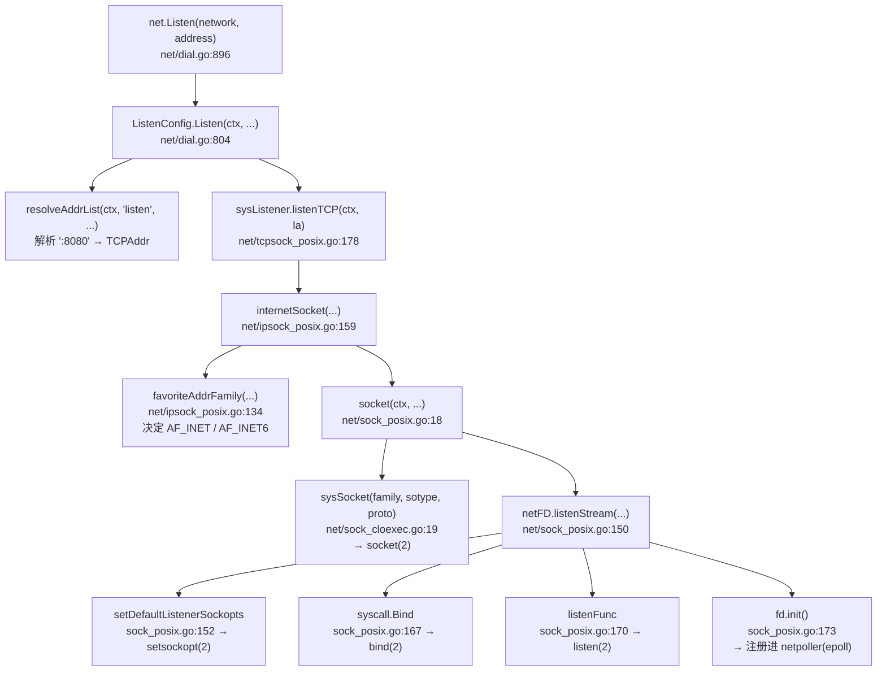

# 从 `net.Listen` 看标准库封装 —— 每一层都对应一个前人踩过的坑

> 核心命题：**标准库那"一大堆看似多余的代码"，不是被加出来的，是前人踩坑后还债的形态。**
> 由此得出的学习方法：读源码时对每一段问"它不存在会怎样"，答案就是它存在的理由。
>
> 本篇对照本机 Go 源码，版本 `go1.24.4`，路径 `$GOROOT/src/`（本机 `/home/cc/sdk/go/src/`）。所有行号均为实际核对。

---

## 0. 问题的起点

一行 Go：

```go
ln, err := net.Listen("tcp", ":8080")
```

底下是一条很深的调用链。而用 C 写，"三行就够了"：

```c
int fd = socket(AF_INET, SOCK_STREAM, 0);
bind(fd, (struct sockaddr *)&addr, sizeof(addr));
listen(fd, 128);
```

**那 Go 多出来的那些代码，到底在干什么？**

---

## 1. 调用链（真实行号）



最终落到内核的仍然只有四个系统调用：**`socket` → `setsockopt` → `bind` → `listen`**。

和手写 C 完全一样。**中间那些层，全部是在解决"怎么把这四个调用发对"。**

---

## 2. 三个铁证：每一段代码都是一笔债

### 铁证一：`SO_REUSEADDR` 是 Go 默认帮你设的

`net/sockopt_linux.go:26-29`：

```go
func setDefaultListenerSockopts(s int) error {
	// Allow reuse of recently-used addresses.
	return os.NewSyscallError("setsockopt",
		syscall.SetsockoptInt(s, syscall.SOL_SOCKET, syscall.SO_REUSEADDR, 1))
}
```

**不存在会怎样**：服务重启时，之前 `accept` 出来的连接还处于 `TIME_WAIT`（Linux 固定 60s），仍占着 bind 哈希表 → `bind()` 返回 `EADDRINUSE` → **重启要等一分钟**。

C 里这一行要你自己记得写。Go 直接写死在默认路径上。

> 相关背景见下方第 6 节「端口为什么释放不掉」。

### 铁证二：`SOCK_CLOEXEC` + `ForkLock` —— 最能说明问题的一处

Linux 快路径，`net/sock_cloexec.go:19-25`：

```go
func sysSocket(family, sotype, proto int) (int, error) {
	s, err := socketFunc(family, sotype|syscall.SOCK_NONBLOCK|syscall.SOCK_CLOEXEC, proto)
	if err != nil {
		return -1, os.NewSyscallError("socket", err)
	}
	return s, nil
}
```

老系统兜底路径，`net/sys_cloexec.go:20-45`：

```go
func sysSocket(family, sotype, proto int) (int, error) {
	// See ../syscall/exec_unix.go for description of ForkLock.
	syscall.ForkLock.RLock()          // ← 关键
	s, err := socketFunc(family, sotype, proto)
	if err == nil {
		syscall.CloseOnExec(s)
	}
	syscall.ForkLock.RUnlock()
	if err != nil {
		return -1, os.NewSyscallError("socket", err)
	}
	if err = syscall.SetNonblock(s, true); err != nil {
		poll.CloseFunc(s)
		return -1, os.NewSyscallError("setnonblock", err)
	}
	return s, nil
}
```

**`ForkLock` 是干什么的？**

在不支持 `SOCK_CLOEXEC` 的系统上，`socket()` 和 `CloseOnExec()` 是**两个独立的系统调用**。如果在这两步之间恰好有另一个 goroutine 执行了 `fork+exec`，**这个还没打上 CLOEXEC 标记的 fd 就被子进程继承走了**。

后果就是那个经典的诡异现象：**进程明明退出了，端口却一直被占着，`SO_REUSEADDR` 还救不了**（因为端口是被一个活着的 socket 真实持有）。

所以 Go 加了一把全局读写锁把这个窗口关掉。

> **这就是"多余代码"的真面目**：`ForkLock` 这一行看起来毫无必要、还引入了全局锁的开销 —— 但它挡住的是一个极难复现、极难排查的生产 bug。
>
> 而且注意 Linux 快路径的写法：`sotype|SOCK_NONBLOCK|SOCK_CLOEXEC` **合并成一次系统调用**，从根本上消除了这个窗口，所以不需要锁。**同一个问题，两种平台，两种解法** —— 这就是为什么代码会有两份。

### 铁证三：`sysSocket` 有五份实现

```
net/sock_cloexec.go:19          Linux / 现代 BSD（SOCK_CLOEXEC 快路径）
net/sys_cloexec.go:20           老系统兜底（ForkLock 版）
net/sock_cloexec_solaris.go:22  Solaris
net/sock_windows.go:20          Windows（返回 syscall.Handle，不是 int！）
net/net_fake.go:685             js/wasm 假实现
```

**同一个函数签名，五套实现。** Windows 上根本没有 fd 概念，是 `HANDLE` + IOCP，语义完全不同。

这一块复杂度不是坑，是**"总得有人写一遍"**。写在库里，所有人受益；不写在库里，每个项目重写一遍。

---

## 3. 还有这些看不见的债

| 那一层 | 位置 | 不存在会怎样 |
|--------|------|-------------|
| `resolveAddrList` | `dial.go:805` | `"localhost:8080"` `"[::1]:8080"` `":http"` 都解析不了 |
| `favoriteAddrFamily` | `ipsock_posix.go:134` | v4/v6 选错；`IPV6_V6ONLY` 各平台默认值不同，必须**运行时探测** |
| `maxListenerBacklog` | `sock_linux.go:34-51` | backlog 写死 128；系统 `somaxconn` 是 4096 时白白丢连接 |
| `setDefaultSockopts` | `sockopt_linux.go:12-24` | v6 socket 收不到 v4 连接 |
| `ListenConfig.Control` | `sock_posix.go:158-163` | 没有钩子给用户自己设 `SO_REUSEPORT` 等 |
| `fd.init()` → netpoller | `sock_posix.go:173`<br/>`internal/poll/fd_unix.go:55` | **没有 epoll 集成，一万连接要一万线程** |
| `OpError` 包装 | `dial.go:807, 828` | 只有裸 errno `98`，没有 `listen tcp :8080: bind: address already in use` |

`maxListenerBacklog` 值得单独看一眼，`net/sock_linux.go:34-51`：

```go
func maxListenerBacklog() int {
	fd, err := open("/proc/sys/net/core/somaxconn")
	// ... 读系统值，读不到才回退
	return maxAckBacklog(n)
}
```

**去读 `/proc`，而不是拍脑袋写常量。**

---

## 4. 最贵的一层：netpoller

`sock_posix.go:173` 的 `fd.init()` 最终走到 `internal/poll/fd_unix.go:55`：

```go
func (fd *FD) Init(net string, pollable bool) error {
	fd.SysFile.init()
	if net == "file" {
		fd.isFile = true
	}
	if !pollable {
		fd.isBlocking = 1
		return nil
	}
	err := fd.pd.init(fd)      // ← 注册进 runtime netpoller (epoll)
	if err != nil {
		fd.isBlocking = 1       // 降级成阻塞模式，不报错
	}
	return err
}
```

买到的效果：

```go
conn, err := ln.Accept()   // 看起来阻塞
io.Copy(dst, conn)         // 看起来阻塞
```

实际是**非阻塞 + epoll**。返回 `EAGAIN` 时 runtime 把 goroutine `gopark` 挂起，把 OS 线程让给别的 goroutine，epoll 报告就绪后再唤醒。

> **一万连接 = 一万 goroutine ≈ 几个 OS 线程。**
>
> 同样效果在 C 里要么写回调地狱（libevent 风格），要么写状态机。这一层是**你自己写不出来的** —— 它必须和调度器打通，属于 runtime 而非语言。

---

## 5. "三行 C" 的账单

那三行能跑，前提是：Linux + IPv4 + 阻塞 + 连接不多 + 不重启 + 不 fork。逐条列缺什么：

| 缺的 | 后果 |
|------|------|
| 没检查返回值 | 三处都可能失败，你不知道 |
| 没设 `SO_REUSEADDR` | 重启就 `EADDRINUSE`，等 60s |
| 没设 `CLOEXEC` | fd 被子进程继承，端口永远释放不掉 |
| 写死 `AF_INET` | IPv6 客户端连不上 |
| 写死 `sockaddr_in` | `"localhost:8080"` / `":http"` 都不支持 |
| 阻塞模式 | 一个慢连接卡死一个线程 |
| backlog 写死 128 | 高并发下 SYN 被丢 |
| 忘了 `htons` | 监听到 36895 端口而不是 8080 |
| 绑死 Linux | Windows 完全另一套 |

**全补上，三行会变成四十行 —— 而且只支持 Linux，还没有事件循环。**

Go 标准库那部分，差不多就是把这四十行**在六个操作系统上各写一遍**。

---

## 6. 背景：端口为什么释放不掉（前置知识）

理解上面两个铁证需要的背景，简记：

**端口绑在 `struct sock` 上，不是绑在进程上。** 进程只是通过 fd 持有引用。进程死了引用没了，但 `struct sock` 可能还活着 —— 归内核 TCP 状态机管。

| 情况 | 现象 | `SO_REUSEADDR` 能救吗 |
|------|------|----------------------|
| **TIME_WAIT** | 已 accept 的连接进入 TIME_WAIT（60s），仍占 bind 哈希表 | ✅ 能 |
| **fd 被子进程继承** | `ss -tlnp` 显示的是另一个进程名 | ❌ 不能（真实占用） |
| 进程卡在 D 状态 | `SIGKILL` 都杀不掉 | ❌ |
| FIN_WAIT_2 / LAST_ACK | orphan socket 还在重传 | ❌ |
| systemd socket activation | systemd 持有监听 socket（设计如此） | — |

注意：**监听套接字关闭时是 `LISTEN → CLOSE`，不经过 TIME_WAIT**。卡住端口的是那些已 `accept` 出来的连接。

> 常见误解：僵尸进程（Z 状态）**不占端口** —— `exit()` 时 `exit_files()` 已释放所有 fd。

排查：

```bash
ss -tlnp | grep :8080     # 有进程名 → fd 被继承；没有 → TIME_WAIT/orphan
ss -tanp | grep :8080     # 看所有状态
lsof -i :8080
ls -l /proc/<pid>/fd | grep socket
```

---

## 7. 复杂度守恒（Tesler 定律）

> **每个系统都有不可再减少的复杂度总量。唯一的问题是：谁来承担。**

三个去处，必选其一：

1. **库里**（Go 的选择）—— 写一次，所有人受益，你看不见
2. **你的代码里**（C 的选择）—— 每个项目重写一遍，每次都有新 bug
3. **你的 bug 列表里**（大多数人的现实）—— 上线后半夜被叫起来

**好的库不是"代码少"，而是"你不需要知道的东西，它替你知道了"。**

---

## 8. ★ 方法论：怎么读源码

这才是本篇真正要记住的东西。

### 8.1 核心提问法

读到任何一段看不懂/觉得多余的代码，问这一句：

> **"如果把这段删掉，会出什么问题？"**

答案就是它存在的理由。上面 `ForkLock` 那段就是这么解出来的 —— 单看它毫无意义，问一句"删掉会怎样"，立刻牵出 fork 竞态和 fd 泄漏。

### 8.2 必须带着问题读

**这是前提，不是建议。**

能读懂 `net.Listen`，是因为**先**踩过端口释放的坑、**先**懂了 fd 和 epoll。反过来一上来硬读，只会看到一堆函数名，什么也留不下。

正确顺序：

```
遇到具体问题（端口占用 / 连接数上不去 / 重启失败）
   ↓
搞懂底层机制（TCP 状态机 / fd / epoll）
   ↓
再去读标准库源码
   ↓
「哦，原来这一行就是为了这个」  ← 真正的收获时刻
```

### 8.3 分清三种"多余代码"

不是所有封装都同一性质，要区别对待：

| 类型 | 例子 | 该怎么看待 |
|------|------|-----------|
| **踩坑固化** | `SO_REUSEADDR`、`ForkLock` | 血泪换来的默认值，**必须学** —— 这是别人的经验 |
| **复杂度集中** | 五份 `sysSocket`、v4/v6 探测 | 不是坑，是"总得有人写"。知道存在即可，**不必细读** |
| **能力发明** | netpoller + 调度器集成 | C 里根本没有的东西，**重点研究** —— 这是语言的核心竞争力 |

### 8.4 不要教条：知道怎么绕过去

抽象不是免费的，代价是：二进制体积、看不透、为不需要的功能付费、极端场景的性能天花板。

Go 留了逃生通道：

```go
import "golang.org/x/sys/unix"

fd, _ := unix.Socket(unix.AF_INET, unix.SOCK_STREAM, 0)
unix.SetsockoptInt(fd, unix.SOL_SOCKET, unix.SO_REUSEADDR, 1)
unix.Bind(fd, &unix.SockaddrInet4{Port: 8080})
unix.Listen(fd, 128)
```

和 C 一样贴地。代价是把 Go 帮你还的债重新背回来。

真实案例：`gnet`、`evio` 这类高性能网络库就绕开 `net` 包自写 epoll 循环，为省掉每连接一个 goroutine 的内存开销。**这是有意识的取舍，不是标准库写错了。**

> 判断标准：**你在哪一层工作。** 不懂这些的人，那几十行是救命的；懂了的人，它是可以绕过的。两种判断都对。

### 8.5 分清「语言 / 实现 / 运行时」

读源码时容易混淆的三件事：

| 层 | 例子 | 换个实现会变吗 |
|----|------|--------------|
| **语言** | 语法、类型系统、`go` 关键字的语义 | 不变（规范定义） |
| **实现** | gc 编译器 vs gccgo vs TinyGo | 变 |
| **运行时** | GC、GMP 调度器、netpoller | **变**（TinyGo 的 runtime 完全不同） |

`net.Listen` 的行为大部分由**运行时**决定，不在语言规范里。

---

## 9. 自己动手看

```bash
# 定位源码
go env GOROOT                                    # 本机：/home/cc/sdk/go
grep -n "^func Listen" $(go env GOROOT)/src/net/dial.go

# 看编译产物
GOSSAFUNC=main go build main.go                  # ★ 生成 ssa.html，40+ 趟优化并排看
go build -gcflags="-m -m" main.go                # 逃逸分析 + 内联决策
go build -gcflags="-S" main.go                   # 汇编
go tool objdump -s 'main\.main' ./main           # 反汇编成品
go tool compile -W main.go                       # walk 后的 AST（语法糖已展开）

# 零安装：浏览器看汇编，左右行号颜色关联
# https://godbolt.org  →  语言选 Go
```

**编译流水线**（`$GOROOT/src/cmd/compile/`，自举，带 README 导览）：

```
syntax(词法+语法) → types2(类型检查) → noder(IR) →
inline/devirtualize/escape(中端) → walk(脱糖) →
ssagen → ssa(40+趟优化) → amd64等(codegen) → cmd/link
```

**walk 阶段脱糖对照**（很多"语言特性"其实是函数调用）：

| 你写的 | 编译后 |
|--------|--------|
| `go f()` | `runtime.newproc` |
| `ch <- v` | `runtime.chansend1` |
| `m[k] = v` | `runtime.mapassign_*` |
| `append(s, x)` | 内联快路径 + `runtime.growslice` |
| `x.(T)` | `runtime.assertE2I` |

> 彩蛋：SSA 的优化规则不是手写 Go，而是用**自制 DSL** 写在 `cmd/compile/internal/ssa/_gen/*.rules` 里，再代码生成成十几万行 Go。
> ```
> (Add64 (Const64 [c]) (Const64 [d])) => (Const64 [c+d])
> (Mul64 x (Const64 [c])) && isPowerOfTwo(c) => (Lsh64x64 x (Const64 [log2(c)]))
> ```
> **这是"造语言"的正确用法 —— DSL 才是甜点区，不是通用语言。**

---

## 10. 待深入

- [ ] `runtime/netpoll.go` + `netpoll_epoll.go` —— goroutine 怎么被 park/ready
- [ ] `runtime/proc.go` —— GMP 调度器与 netpoller 的交接点
- [ ] `internal/poll/fd_unix.go` 的引用计数 —— 怎么防 `Close` 与 `Read` 并发的 use-after-close
- [ ] `resolveAddrList` 的 DNS 路径 —— cgo resolver vs pure Go resolver（影响静态链接，`CGO_ENABLED=0`）
- [ ] `ListenConfig.Control` 实战 —— 用它设 `SO_REUSEPORT` 做多进程监听
- [ ] 对照读 `gnet` —— 看它为什么要绕开 `net` 包

---

## 相关

- [[Raft源码-Leader选举]] —— 同样是"带着问题读源码"的实践
- [[etcd启动流程与双循环架构]]
- [[第8章-Goroutines和Channels]] —— netpoller 让"同步写法"成立的语言侧表现
- [[第13章-底层编程]] —— unsafe / 系统调用边界
