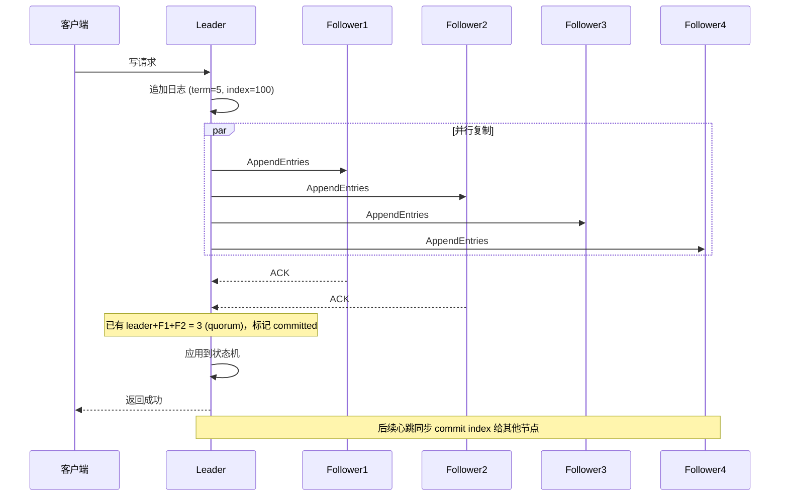

# Raft 共识算法 —— 概念入门

> 学习 etcd 源码前的必备概念铺垫。这一篇不涉及代码，纯讲分布式共识的道理。后续对照 `raft/` 包源码的笔记见 [[Raft源码实现]]（待写）。

## 1. 为什么需要"复制" + "共识"

单机存储的问题：机器挂了数据就没了。解决办法是**多副本**——比如 5 台机器各存一份完整数据。

但复制引入新问题：客户端写入时，5 台机器不可能同时收到并写入成功。网络抖动、某台变慢甚至挂掉，都会导致**多份副本数据不一致**。

**共识算法（Consensus Algorithm）** 要解决的就是：让一组不完全可靠的节点，就"一份数据/操作序列"达成一致，即使部分节点故障或网络不稳定。

## 2. CAP 定理与 etcd 的取舍

网络分区（P）发生时，C（一致性）和 A（可用性）只能二选一：
- **C**：所有节点任何时刻读到的数据都一样
- **A**：每个请求都能得到响应（哪怕数据不是最新的）

**etcd 选择 CP**：宁可暂时不可用（选不出 leader 时拒绝写请求），也不能返回不一致的数据。因为 etcd 的典型用途是配置中心、服务发现、分布式锁（如 Kubernetes 元数据存储），读到脏数据的危害远大于短暂拒绝服务。

## 3. Raft 解决的核心问题

Raft 把"数据一致性"转化为：**让所有节点对一份操作日志（log）的顺序和内容达成一致**。

不直接同步"最终数据状态"，而是同步"如何一步步达到这个状态的操作序列"。所有节点按相同顺序执行相同操作，最终状态自然一致 —— 这叫**状态机复制（State Machine Replication）**。

Raft 拆成三个子问题：

### ① Leader 选举（Leader Election）
集群选出唯一 leader，所有写请求都经过它。避免"多个节点同时决定顺序"的复杂情况——顺序完全由 leader 决定。

### ② 日志复制（Log Replication）
Leader 把每个操作作为一条 log entry 发给其他节点（follower）。**只有超过半数（quorum）节点确认写入，这条记录才算"提交（commit）"**，才能应用到状态机、返回客户端成功。

### ③ 安全性（Safety）
保证上面两点在异常情况（leader 挂了、网络分区、消息丢失/乱序）下不破坏一致性。例如：新 leader 必须包含所有已提交的日志，不能选出数据落后的节点当 leader。

## 4. 关键概念

| 概念 | 含义 |
|---|---|
| **Term（任期）** | 逻辑时钟，单调递增整数。每次选举产生新 term，一个 term 内最多一个 leader，用来判断"谁的信息更新" |
| **Log Entry** | 一条操作记录，包含索引（index）、term、命令内容 |
| **Commit Index** | 已被多数节点确认、可安全应用到状态机的日志位置 |
| **Quorum（多数派）** | `⌊n/2⌋+1`。5 节点集群 quorum=3，最多容忍 2 个节点故障 |
| **Election Timeout** | Follower 多久没收到 leader 心跳就发起新一轮选举（通常带随机值，避免多个节点同时发起选举导致"选票分裂"） |

## 5. 一次写入的完整流程（5 节点集群）

关键点：**只要 quorum 确认即可，不需要等全部节点写完** —— 这就是为什么能容忍少数节点故障或变慢。

## 6. 为什么是 Raft 而不是 Paxos

Paxos 更早、被证明正确，但出了名的难理解、难正确实现。Raft 论文的目标是**"可理解性"优先**——把选举和日志复制拆分成清晰独立的子问题，用 term 这种简单机制替代 Paxos 更抽象的提案编号机制。etcd 作者选 Raft，很大程度上是因为它更容易正确实现和调试。

## 待学 / 下一步

- [ ] 对照 `raft/raft.go` 源码看状态机（Follower/Candidate/Leader）如何实现
- [ ] `raft/log_unstable.go`、`raft/storage.go` —— 日志存储结构
- [ ] etcd 如何用 WAL（Write-Ahead Log）持久化 Raft 日志
- [ ] MVCC 存储层如何在 Raft commit 之后应用到实际 KV 数据
