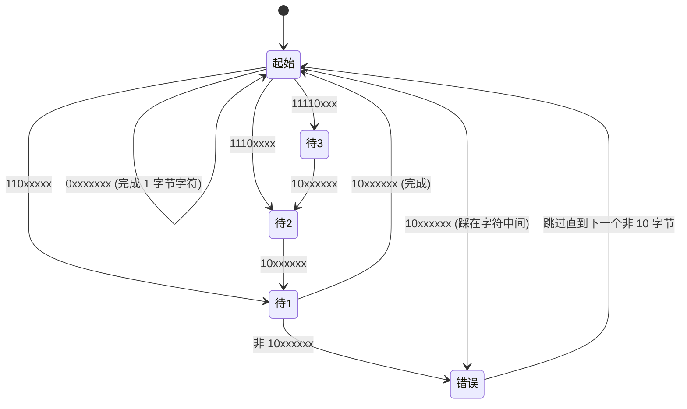

# UTF-8

> 配套图解(浏览器打开,含可交互的"输入文字→实时看字节"小工具):`技术学习/字符编码/UTF-8-图解.html`
> 规范:RFC 3629 / Unicode Standard §3.9

## 0. 一句话

**Unicode 负责给每个字符发号码,UTF-8 负责把号码打包成字节。**
两者是两层,经常被混为一谈 —— 「Unicode 编码」这种说法本身就是含混的。

| 层 | 名字 | 管什么 | 例子 |
|---|---|---|---|
| 字符集 | Unicode | 字符 ↔ 码点(code point) | `中` = U+4E2D |
| 编码方式 | UTF-8 / UTF-16 / UTF-32 | 码点 ↔ 字节序列 | U+4E2D = `E4 B8 AD` |

同一个码点,用不同编码方式落到磁盘上是完全不同的字节:

| 字符 | 码点 | UTF-8 | UTF-16LE | UTF-32LE |
|---|---|---|---|---|
| `A` | U+0041 | `41` | `41 00` | `41 00 00 00` |
| `中` | U+4E2D | `E4 B8 AD` | `2D 4E` | `2D 4E 00 00` |
| `😀` | U+1F600 | `F0 9F 98 80` | `3D D8 00 DE`(代理对) | `00 F6 01 00` |

---

## 1. 为什么不能"一个字符固定 N 字节"

- **1 字节**(ASCII/GBK 那条路):最多 256 个号码,装不下几万汉字。
- **4 字节**(UTF-32):定长、随机访问 O(1),但英文文本直接胖 4 倍,而且字节流里全是 `00` —— C 语言的 `strlen`/`strcpy` 会以为字符串在第一个字符就结束了,所有存量代码全部报废。

UTF-8 的取舍:**放弃定长,换来变长 + 与 ASCII 字节级兼容**。

---

## 2. 编码规则

第一个字节开头连续有几个 `1`,这个字符就占几个字节;后续字节一律 `10` 开头。

| 码点范围 | 字节数 | 模板 | 有效载荷位数 |
|---|---|---|---|
| U+0000 – U+007F | 1 | `0xxxxxxx` | 7 |
| U+0080 – U+07FF | 2 | `110xxxxx 10xxxxxx` | 11 |
| U+0800 – U+FFFF | 3 | `1110xxxx 10xxxxxx 10xxxxxx` | 16 |
| U+10000 – U+10FFFF | 4 | `11110xxx 10xxxxxx 10xxxxxx 10xxxxxx` | 21 |

`x` 是真正的码点二进制位(高位补零后从左往右填),模板中的 `0/110/1110/11110/10` 是**结构标记**,不携带信息。

> **上限为什么是 U+10FFFF 而不是 21 位能表示的 U+1FFFFF?**
> 因为 UTF-16 用代理对(surrogate pair)最多只能表示到 U+10FFFF,为了三种 UTF 互相无损转换,RFC 3629 把 UTF-8 也砍到了这里,并把 5、6 字节形式作废。

### 字节取值速查

| 字节角色 | 十六进制范围 |
|---|---|
| ASCII(单字节) | `00`–`7F` |
| 后续字节(continuation) | `80`–`BF` |
| 2 字节首字节 | `C2`–`DF`(`C0`/`C1` 非法,见第 5 节) |
| 3 字节首字节 | `E0`–`EF` |
| 4 字节首字节 | `F0`–`F4` |
| **永不出现** | `C0`、`C1`、`F5`–`FF` |

---

## 3. 手工推导

### `A` = U+0041 → `41`
落在 U+0000–U+007F,原样一个字节。**UTF-8 的 ASCII 部分与 ASCII 逐字节相同**。

### `é` = U+00E9 → `C3 A9`
```
码点   0xE9      = 1110 1001          (8 位)
补到 11 位        = 000 1110 1001
切 5+6            = 00011 | 101001
套模板  110 00011 = 0xC3
        10 101001 = 0xA9
```

### `中` = U+4E2D → `E4 B8 AD`
```
码点   0x4E2D    = 0100 1110 0010 1101  (16 位)
切 4+6+6          = 0100 | 111000 | 101101
套模板  1110 0100 = 0xE4     ← 首字节,三个 1 → 共 3 字节
        10 111000 = 0xB8     ← 跟班
        10 101101 = 0xAD     ← 跟班
```
→ **一个常用汉字在 UTF-8 里是 3 字节**(GBK 里是 2 字节,这是很多"字数变了"问题的来源)。

### `😀` = U+1F600 → `F0 9F 98 80`
```
码点   0x1F600   = 1 1111 0110 0000 0000  (17 位)
补到 21 位        = 000 011111 011000 000000
切 3+6+6+6
套模板  11110 000 = 0xF0
        10 011111 = 0x9F
        10 011000 = 0x98
        10 000000 = 0x80
```

---

## 4. 这套设计换来了什么

### 4.1 ASCII 向后兼容
任何纯 ASCII 文件天然就是合法 UTF-8 文件。不需要转换,不需要迁移。

### 4.2 自同步(self-synchronizing)
后续字节固定 `10` 开头,和任何首字节都不冲突。所以:
- 从字节流任意位置切入,**只要往前退到第一个非 `10xxxxxx` 的字节**,就找到了字符边界;
- 丢失/损坏一个字节,只影响这一个字符,不会像 GBK 那样"错一个字节后面全乱"。



### 4.3 无内嵌 `00` 字节
非 ASCII 字符的每个字节最高位都是 1,不可能是 `00`。C 字符串、以 `\0` 结尾的协议都能直接用。
同理,`/`(0x2F)、`\`(0x5C)这些 ASCII 字节也**只可能**是它本身,不会作为多字节字符的一部分出现 —— 路径解析、分隔符扫描可以直接按字节做。

### 4.4 字节序无关
UTF-8 的最小单位就是 1 字节,不存在大小端问题,所以 **UTF-8 不需要 BOM**。

### 4.5 字节序 == 码点序
按字节 `memcmp` 排序的结果,和按码点排序完全一致。数据库/B+ 树可以直接比字节。

---

## 5. 非法序列(安全相关)

解码器必须拒绝下面这些,否则会有绕过漏洞:

| 类型 | 例子 | 说明 |
|---|---|---|
| **Overlong 编码** | `C0 AF` | 用 2 字节编 `/`(U+002F)。数值算出来是对的,但没用最短形式。历史上多次造成路径校验绕过(过滤器看到的是 `C0 AF`,OS 解码成 `/`)。**每个码点必须用唯一的最短形式**。 |
| **代理区码点** | `ED A0 80` | U+D800–U+DFFF 是 UTF-16 专用的代理码点,在 UTF-8 里非法。(宽松变体 WTF-8 / CESU-8 允许,但不是标准 UTF-8) |
| **超上限** | `F4 90 80 80` | > U+10FFFF |
| **截断/孤儿字节** | `E4 B8` 、单独的 `AD` | 长度不足或后续字节缺失 |

这也是 `C0`/`C1` 永不合法的原因:它们能编出的码点都 < U+0080,必然是 overlong。

---

## 6. 工程上真正会踩的坑

### 6.1 "长度"到底是什么

| 语言 | 表达式 | 含义 | `"中A😀"` 结果 |
|---|---|---|---|
| Go | `len(s)` | **字节数** | 8 |
| Go | `utf8.RuneCountInString(s)` | 码点数 | 3 |
| Python 3 | `len(s)` | 码点数 | 3 |
| Python 3 | `len(s.encode())` | 字节数 | 8 |
| Java / JS / C# | `.length` | **UTF-16 码元数** | 4(emoji 占 2) |

JS 里 `"😀".length === 2`、`"😀"[0]` 是半个代理码元 —— 这是 UTF-16 的遗留,不是 UTF-8 的问题。要按字符遍历用 `[...str]` 或 `for...of`。

### 6.2 按字节截断会切出乱码
```go
s := "你好世界"          // 你=E4 BD A0  好=E5 A5 BD ...
s[:4]                   // → "你" + 孤儿字节 \xe5,打印出来是 "你�"
```
截断要么按 rune 切(`[]rune(s)[:2]`),要么退回到最近的字符边界(往前找第一个非 `10xxxxxx` 字节)。数据库 `VARCHAR(n)` 的 n 是字符数还是字节数,不同 DB 语义不同,也是同类问题。

### 6.3 Go 的 `for range` 已经在做 UTF-8 解码
```go
for i, r := range s {   // i 是字节下标,r 是 rune(码点)
    ...
}
for i := 0; i < len(s); i++ {   // s[i] 是 byte,不是字符!
    ...
}
```

### 6.4 MySQL 的 `utf8` 是假的
MySQL 的 `utf8`(= `utf8mb3`)**每字符最多 3 字节**,存不了 emoji 和部分生僻字(4 字节),写入会报错或被截断。
必须用 `utf8mb4` + `utf8mb4_general_ci` / `utf8mb4_unicode_ci`。建库建表、连接字符集(`charset=utf8mb4`)三处都要改。

### 6.5 BOM
`EF BB BF` 是 UTF-8 编码的 U+FEFF。UTF-8 不需要它,但 Windows 记事本会加。后果:
- shell 脚本首行 `#!/bin/bash` 前多三个字节 → `command not found`
- JSON/YAML 解析失败
- 读配置时第一个 key 名字前面多了个看不见的字符

排查:`hexdump -C file | head -1`。

---

## 7. 乱码定位速查

乱码 = **字节没错,解码用的字典错了**。

| 现象 | 原因 |
|---|---|
| `涓枃` 这类怪汉字 | UTF-8 字节被当成 GBK 解 |
| `中文` / `测试` | UTF-8 字节被当成 Latin-1(ISO-8859-1)解 |
| `��` / `锟斤拷` | 已经解码失败过一次,坏字节被替换成 U+FFFD,**信息已丢,不可逆** |
| 中文全变 `?` | 转成了不支持中文的字符集(如 Latin-1) |

排查顺序:**存的时候什么编码 → 传输声明什么编码 → 读的时候按什么解**,三者对齐。
常用命令:
```bash
file -i x.txt          # 猜编码
hexdump -C x.txt | head
iconv -f gbk -t utf-8 x.txt > y.txt
```
Web 侧对应的是 `<meta charset="UTF-8">` 和 HTTP `Content-Type: text/html; charset=utf-8`。

---

## 8. 记住这三条

1. **Unicode 发号,UTF-8 打包**,是两层。
2. **首字节开头有几个 `1` 就占几字节,后续字节永远 `10` 开头** —— 由此得到自同步和 ASCII 兼容。
3. 汉字 3 字节、emoji 4 字节;**凡是用到"长度""截断""数据库字符集"的地方,先问一句:算的是字节还是字符?**

---

## 相关

- [[UTF-8-图解]] — 同主题的可交互 HTML 图解
- 待写:UTF-16 与代理对 / Unicode 归一化(NFC/NFD)与中日韩兼容区
