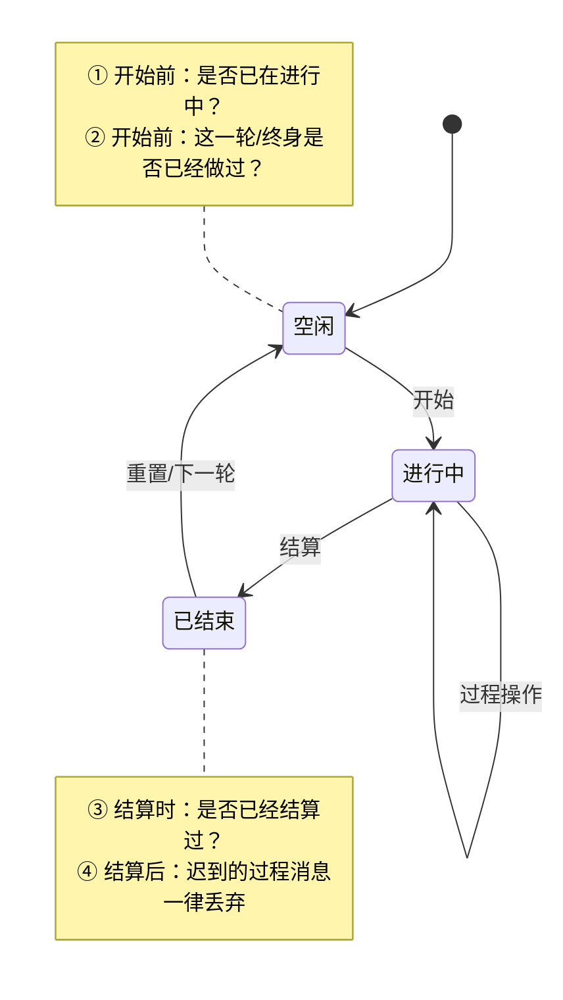

# 过程型操作的幂等设计：不要顾头不顾尾

> **一句话教训**：只要一个业务是「有开始、有过程、有结束」的，就必须假设**每一个环节的消息都会重复到达**。幂等不是只在入口挡一次重入就完事 —— **开始要挡，结束更要挡，结束之后迟到的过程消息还要挡**。

## 什么叫「过程型操作」

不是一次读写就结束，而是要在服务端**留下一段时间的中间状态**的业务：

- 塔防挑战：开始挑战 → 逐关推进 → 通关/失败结算
- 行军 / 集结：发起 → 行进中 → 到达结算 → 返回
- 活动：开启 → 进行中 → 日结 / 期末结算 → 关闭
- 建造 / 科技 / 训练：下单 → 倒计时 → 完成领取
- 数据迁移 / 老数据回填：加载 → 转换 → 落盘

它们的共同点：**状态机有一个「进行中」态**，而进行中态意味着「同一个动作可以被再发一次」的窗口是敞开的。

## 重复为什么一定会发生

不是「玩家会不会作弊」的问题，是**分布式系统的常态**：

| 来源 | 典型表现 |
|------|----------|
| 弱网重试 | 客户端没收到 Ack 自动重发，服务端收到两次「开始」 |
| 快速点击 | 一帧内两个请求进同一个 Actor，第二个读到的是没落地的旧状态 |
| 定时器 / Ticker | 跨天、结算定时器被重复注册或补跑 |
| 异步回调迟到 | 发出时属于旧阶段，回来时系统已进入新阶段 |
| 进程重启 | 加载路径被反复执行，挂在加载里的一次性逻辑被重放 |
| 运维介入 | GM 命令、补发脚本、合服流程手动重跑 |

**结论**：不能靠「正常流程不会重复」来设计，只能靠状态机本身拒绝重复。

## 四个必检点（顾头也要顾尾）

| # | 检查点 | 漏了会怎样 | 手段 |
|---|--------|-----------|------|
| ① | **开始前：已在进行中？** | 重复扣消耗、状态被覆盖、上一轮进度丢失 | `IsGoing` 之类的进行中标记 |
| ② | **开始前：这一轮已经做过？** | 一次性/限购/一次性迁移被重复消费 | 幂等键（`playerID+活动ID+requestID`）、`DataVersion` |
| ③ | **结算时：已经结算过？** | **重复发奖、重复结算 —— 直接资产事故** | 结算前判终态 + 置终态原子完成 |
| ④ | **结算后：过程消息还能改状态吗？** | 结算完的数据被迟到消息写脏，对不上账 | 终态吸收 + `epoch` / 阶段版本号 |

**「顾头不顾尾」就是只做了 ①，忘了 ③ ④。** 而 ③ ④ 才是真正会赔钱的那一端 —— ① 最多是操作失败，③ 是发两份奖励，④ 是账目永久错乱。

## 项目实证（gs）

### 做对了的：塔防两端都挡

- **头**：`game/play/internal/ctl_tiny_tower_single.go:174` —— 开始新章节前 `if tower.GetIsGoing() { return ErrCodeStageCant }`，重复点击的第二个请求直接被拒，不会走到后面的 `cleanTowerDefense` + 扣消耗。
- **尾**：结算函数 `endWithSuccess`（`ctl_tiny_tower_defense.go:1334`）第一件事就是 `SetIsGoingOn(false)`，把状态机推进终态。
- **尾之后**：所有过程操作统一先判 `if !tower.GetIsGoing() { return ErrCodeTowerNotGoingOn }` —— `ctl_tiny_tower_defense.go:129 / 186 / 490 / 1666`。结算完再飘进来的「合并单位」「换阵容」等消息一律拒绝。

这套写法值得抄：**进行中标记既是开始的门闩，也是结束后的门闩，一个变量守两端。**

### 只顾了头的：军备竞赛日结

日结时异步删旧排行，玩家又能进新排行，**迟到的回调仍然写得进新阶段的数据**，排行错乱。

止血方案是加 `Cleaning` 标记（`game/actv/internal/activity/template/arms_race/logic.go:46 / 90 / 155`）：日结开始置 `true`，删除回调返回后置 `false`，期间添加排行的回调直接 `return`。

但 `Cleaning bool` **只能表达一个阶段**，天然扛不住「跨了两轮」的迟到回调。治本是 `epoch`：异步请求带上发起时的阶段版本，回调里 `callback.epoch != current.epoch` 就只打日志不写状态。详见 [[gs项目历史Bug复盘与工程治理]]。

### 结束态没检测的变体：加载路径重放

战甲试炼把「经验消耗积分 ×27」的一次性换算写进了通用 `LoadProgresses`。**加载是可重复发生的生命周期动作**，重启一次就再乘一次。

同类：[[活动兑换终身限购未考虑线上老数据兼容]] —— 终身限购的计数换了存储位置却没回填，"已经做过"这一维度（检查点 ②）等于没有。

## 落到代码的四种手段

1. **进行中标记（最轻）**：一个 `bool` 守住 ① 和 ④。适合单玩家、单 Actor 内的过程。代价是必须保证**任何退出路径都会复位**（异常、超时、离线、重启），否则玩家会被永久卡在「进行中」。
2. **幂等键**：`playerID + 业务ID + requestID` 落库唯一索引。守住 ② ③，是扣资产/发奖励类接口的**默认要求**，不是可选项。
3. **epoch / 阶段版本号**：守住 ④。凡是「发起时的世界」和「回调时的世界」可能不是同一个的地方（跨服、异步 RPC、定时器），都要带上版本再比对。
4. **终态吸收**：状态机里 `已结束` 不接受任何回到 `进行中` 的迁移，只能通过显式的 `重置` 进入下一轮。把它写进状态迁移表，而不是散落在各个 handler 的 `if` 里。

**原子性是前提**：「判状态 → 改状态 → 扣资产 → 发奖励」必须在同一个 Actor / 事务内跑完，中间不能把可见的中间态暴露给下一个请求。判完再异步去改，等于没判。

## 自检清单

写完一个带过程的功能，逐条过：

- [ ] 连点两次「开始」，第二次被明确拒绝，且**没有产生任何副作用**（消耗、清档、通知）
- [ ] 结算函数被调用两次，第二次是 no-op，奖励只发一份
- [ ] 结算完之后再补一条过程消息，被拒绝且不改任何数据
- [ ] 进行中时进程重启，恢复后状态是「进行中」还是「卡死」？有没有兜底超时
- [ ] 异步回调迟到穿越了一次阶段切换，会写脏吗
- [ ] 加载 / 迁移逻辑执行两次，结果与一次相同（`f(f(x)) == f(x)`）
- [ ] 边界值测过 `0`、`limit-1`、`limit`、`limit+1`、单次批量跨过 limit

## 关联

- [[gs项目历史Bug复盘与工程治理]] —— 幂等、生命周期、异步 epoch 的全项目统计与代表案例
- [[活动兑换终身限购未考虑线上老数据兼容]] —— 「已经做过」这一维度缺失的实例
- [[2026-08-11-行军装备每日首次登录显示为被卸下]] —— 同类思路：改了一端就要回头看另一端
- [[行军流程]]、[[远征火车-玩法逻辑]] —— 典型的过程型状态机
