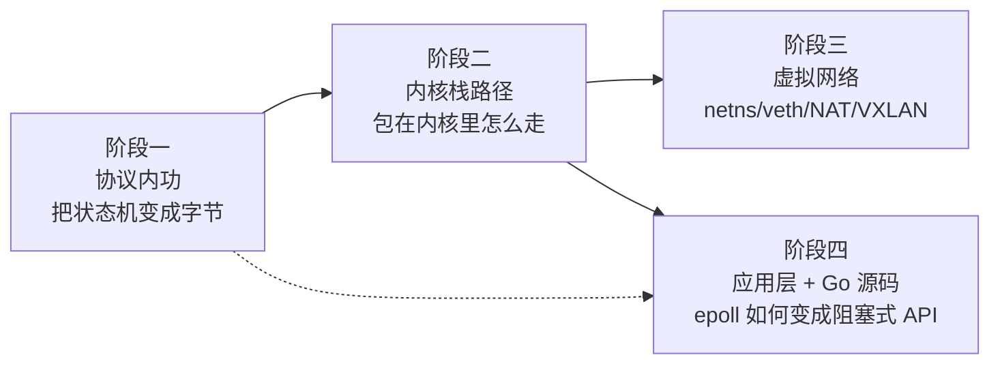
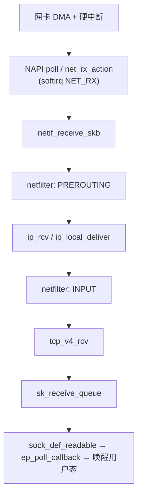

# 网络基础学习路线图

> 四个阶段自底向上，构成一条依赖链，**不建议乱序**：
> 先有「包长什么样」的直觉 → 才看得懂内核在搬什么 → 才知道容器网络不是背命令 → 才知道 Go netpoll 那几百行买到了什么。

## 0. 起点与前置

**已有底子**：C、socket、fd、TCP 状态机、epoll。所以入门科普全部跳过，本路线的落点是**「为什么这样设计」**而非「怎么用」。

**实验环境**（2026-08-25 核实）：

| 项 | 状态 |
|---|---|
| 用户 | `cc`，在 `sudo` 组 + `docker` 组 |
| `sudo` | 需要密码（在 Claude Code 里用 `! sudo ...` 自己敲更顺） |
| 内核 | 7.0.0-29-generic |
| 已装工具 | `tcpdump` `ip` `nc` `curl` `dig` `strace` `iptables` `nft` `bpftrace` `gcc` `python3` |
| 缺失工具 | `socat`、`tshark`/`wireshark`（按需 `apt install`） |
| Go | 1.24.4，源码在 `/home/cc/sdk/go/src`（阶段四可引真实行号） |
| Docker | 免 sudo 可用 |
| **内核源码** | ⚠️ **只有 headers**（`/usr/src/linux-headers-7.0.0-29-generic`），**阶段二开始前需补完整源码**：`apt-get source linux-image-unsigned-$(uname -r)` 或 clone stable 树 |

**节奏**：20 个小节 + 4 个 capstone，每次 1–2 小时，约 **5 周**。

**每节固定三件事**：
1. 一个能跑的实验（**先猜后跑**：开跑前写下预期，跑完对差异——差异才是信息量）
2. 一处源码 / RFC 锚点
3. 一句「删掉会怎样」——**这是每节真正的产出，写不出来就是没懂**



---

## 阶段一：协议内功（6 节 + capstone，约 1.5 周）

状态机是「图」，这阶段要把它变成「字节」。

| # | 主题 | 实验 | 追问：删掉会怎样 |
|---|---|---|---|
| 1 | 一个包的全貌 | `ping` + `tcpdump -i any -xx -vv icmp`，手工把十六进制拆成以太网头 / IP 头，**手算 IP 校验和** | 以太网有 FCS、IP 有校验和、TCP 还有一个——三层校验为什么不冗余？ |
| 2 | ARP 与二层 | `ip neigh`、`arping`，清空 ARP 表再 ping 看广播 | 为什么需要 ARP？网卡直接认 IP 不行吗？ |
| 3 | 分片与 MTU | `ping -s 2000 -M do` 看 ICMP frag needed；`ip link set mtu` 改小复现 PMTUD 黑洞 | 有 IP 分片了，TCP 为什么还要协商 MSS 自己切？ |
| 4 | 握手挥手的真实包 | `nc -l` + `nc`，`tcpdump -S`（绝对序号）看 SYN / SYN-ACK / ACK；`ss -tan` 跟状态迁移 | 为什么三次不是两次？TIME_WAIT 为什么落在主动关闭方，2MSL 在防谁？ |
| 5 | 重传 / SACK / Nagle | `tc qdisc add dev lo root netem loss 10% delay 100ms` 注入丢包，`ss -ti` 看 `retrans` `rtt` `cwnd` | Nagle + 延迟 ACK 的 40ms 死锁怎么发生的？有了 SACK 为什么还需要 RTO？ |
| 6 | 拥塞控制 | `sysctl net.ipv4.tcp_congestion_control` 在 cubic / bbr 间切，配 netem 限带宽，采样 `ss -ti` 画 cwnd 曲线 | 慢启动为什么是指数？BBR 不看丢包看什么，凭什么敢不看？ |

### Capstone 1 —— 用 raw socket 手工完成一次 TCP 握手

自己构造 IP + TCP 头（含**伪首部**参与的校验和），发 SYN → 收 SYN-ACK → 回 ACK → 发一个 HTTP GET。

内核会替你回 RST，先挡掉：

```bash
sudo iptables -A OUTPUT -p tcp --tcp-flags RST RST -j DROP
```

> **这个坑本身就是一节课**：它逼你面对「内核并不知道这个连接存在」——协议栈的连接状态是内核态的，raw socket 绕过了它。

---

## 阶段二：Linux 内核网络栈路径（5 节 + capstone，约 1.5 周）

> **前置**：先拉内核源码。行号在实际打开文件时再 pin，不臆测。

| # | 主题 | 实验 / 源码 | 追问：删掉会怎样 |
|---|---|---|---|
| 7 | 收包路径全景 | `bpftrace` 在 `netif_receive_skb` / `ip_rcv` / `tcp_v4_rcv` / `sock_def_readable` 上打 kprobe，ping 一次看调用序列；对照 `/proc/net/softnet_stat` | 为什么要 NAPI 轮询？纯中断在 10Gbps 下会怎么死？ |
| 8 | `sk_buff` 的四个指针 | 读 `include/linux/skbuff.h`，配合 bpftrace 打印 `skb->len` 在各层的变化 | head / data / tail / end 为什么要四个？少一个，哪个操作就得拷贝？ |
| 9 | netfilter 五个 hook | `iptables -t raw -A PREROUTING -p icmp -j TRACE` + `dmesg` 看完整链路；`conntrack -L` | nat 表为什么只在首包生效？conntrack 表满了会怎样？ |
| 10 | 队列与内存水位 | 小 backlog + 不 accept 打满全连接队列，`nstat -az TcpExt*` 看 `ListenOverflows` / `ListenDrops`；辨析 `ss -lnt` 里 Recv-Q 对 **listen socket** 和 **普通 socket** 的两种含义 | 半连接队列和全连接队列为什么要分开？SYN cookie 牺牲了什么？ |
| 11 | epoll 在内核里 | 读 `fs/eventpoll.c` 的 `ep_poll_callback`，看它如何被 `sock_def_readable` 唤醒 | LT 和 ET 的差别具体落在**哪一行代码**上？（本节直接接阶段四） |

收包路径的骨架：



### Capstone 2 —— 用 bpftrace 测出一个包的完整耗时分布

从 `netif_receive_skb` 到用户态 `read` 返回，中间 softirq 和进程调度各占多少？亲眼看到那个数字，比读十篇文章有用。

---

## 阶段三：虚拟网络与容器网络（4 节 + capstone，约 1 周）

> 本阶段的**核心原则：先手搓，再看 docker 生成了什么**。顺序反了就变成背命令。

| # | 主题 | 实验 | 追问：删掉会怎样 |
|---|---|---|---|
| 12 | netns + veth | `ip netns add`，建 veth pair，两个 ns 互 ping | veth 为什么**必须成对**？为什么不能是单个虚拟网卡？ |
| 13 | 手搓 docker0 | 纯用 `ip` + `iptables`：建 bridge、挂 veth、开 `ip_forward`、配 MASQUERADE，直到 ns 里能 `curl` 外网。**然后**去读 `iptables -t nat -L -n -v` 里 docker 自己生成的规则，逐条对上 | 少了 MASQUERADE 会怎样？包发得出去，为什么回不来？ |
| 14 | 端口映射 | `docker run -p` 后看 DNAT 规则；为什么还需要 `DOCKER-USER` 链 | 为什么从宿主机 localhost 访问 `-p` 端口需要额外一条规则？ |
| 15 | overlay / VXLAN | 用两组 netns 模拟跨主机，建 vxlan 设备，`tcpdump` 看 UDP 4789 里**套着的内层以太网帧** | 为什么要 UDP 封装？直接路由内层 IP 差在哪？ |

### Capstone 3 —— 不用 docker，手工跑一个「有网的容器」

`ip` + `iptables` + `unshare` + 一个 busybox rootfs。跑通之后，`docker network` 对你就只剩配置差异了。

---

## 阶段四：应用层协议 + Go 网络源码（5 节 + capstone，约 1 周）

> Go 源码本地就有（`/home/cc/sdk/go/src`，go1.24.4），本阶段能给到真实行号。

| # | 主题 | 实验 / 源码 | 追问：删掉会怎样 |
|---|---|---|---|
| 16 | DNS | `dig +trace` 看递归全过程；`tcpdump` 看 53 端口报文格式；构造超过 512 字节的响应触发 TCP 回退 | UDP 已经够快了，为什么必须保留 TCP 53？ |
| 17 | TLS | `openssl s_client -msg -connect`，逐条看 ClientHello / 证书 / 密钥交换；对比 TLS 1.2 与 1.3 的 RTT | 1.3 砍掉的是哪一个 RTT？0-RTT 用安全性换了什么？ |
| 18 | HTTP/1.1 → HTTP/2 | `nc` 裸手敲 HTTP 请求；`curl --http2 -v` 看 h2 帧和 HPACK | keep-alive 已经复用连接了，为什么还需要多路复用？队头阻塞卡在哪一层？ |
| 19 | **Go netpoll** | `runtime/netpoll_epoll.go`、`runtime/netpoll.go`、`internal/poll/fd_unix.go`、`net/fd_unix.go`。跟 `netpollblock` → `gopark` → `netpollready` → `goready` 这条链 | 你写的是阻塞式 `conn.Read`，底下是 ET 模式 epoll。**这几百行到底买到了什么，不能两三行搞定？** |
| 20 | `net/http` Server | Accept 循环 → 每连接一个 goroutine → `bufio` 复用；`SetReadDeadline` 怎么变成 netpoll 定时器 | 一连接一 goroutine 在 C10K 时代是禁忌，Go 凭什么敢这么写？ |

### Capstone 4 —— 同一个 HTTP echo server 写两遍

一遍 `net.Listener` + goroutine，一遍 C/Go 裸 epoll 事件循环。压测对比，然后回答：

> Go 那层封装属于 **踩坑固化**（必学）、**复杂度集中**（知道即可）、还是 **能力发明**（重点）？

---

## 贯穿全程的规矩

1. **先猜后跑**。每个实验开跑前写下预期，跑完对差异。
2. **每节收尾必须写出那句「删掉会怎样」**。写不出来说明这节没过。
3. 留意**同一个问题被推到了哪一层去解决**——比如队头阻塞在 TCP、在 HTTP/1.1、在 HTTP/2 各出现一次；重传在 TCP 有、在 QUIC 换了位置。这种「同一个矛盾在不同层的不同解法」是整条路线最大的收获。

## 进度

- [ ] 阶段一 协议内功（1–6 + Capstone 1）
- [ ] 阶段二 内核栈路径（7–11 + Capstone 2）— ⚠️ 开始前先补内核源码
- [ ] 阶段三 虚拟网络（12–15 + Capstone 3）
- [ ] 阶段四 应用层 + Go 源码（16–20 + Capstone 4）

## 笔记归档约定

本目录 `技术学习/网络/` 下按 `NN-主题.md` 排列，例如 `01-一个包的全貌.md`、`19-Go-netpoll.md`。

相关：[[Raft源码-Leader选举]]（同类源码阅读范本）
