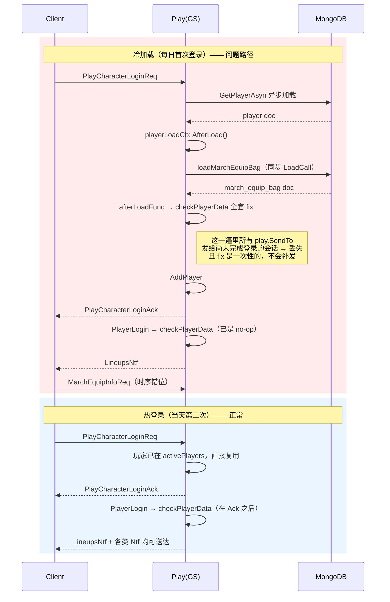

# 行军装备每日首次登录显示为被卸下

> **教训**：重构存储结构时，写入侧改了不算改完 —— 要一并回头看**下发链路**。老模型下"编队消息是自足的"这条隐含契约，重构后悄悄失效了，没人显式检查。

## 一句话结论

v1040 把行军装备从「道具背包按 cfgID 计数」重构为「独立 collection 按 UID 存实例」后，**渲染一个装备槽所需的信息被拆到了两条协议里**（编队槽 + 背包实例列表），但登录时服务端只主动推编队，背包那条完全依赖客户端自己请求。冷加载登录（每日首次）路径比热登录多跑一大段在登录 Ack 之前执行的 fix 流程，时序被拉长，两份数据错位，界面就渲染成"未穿戴 + 加成 0"。

**服务端数据没有损坏** —— 进大地图后客户端重新拉一次就恢复了，这本身就是证明。

## 现象

- **期望**：每日首次登录后，已穿戴的行军装备状态立即正确显示，不依赖进入大地图触发。
- **实际**：首次进入行军装备界面，四个装备槽全空、显示"暂无装备"、编队战力提升为 0；返回并进入大地图后再进该界面，装备恢复为已穿戴。

### 复现步骤

1. 提前为编队穿戴行军装备并保持穿戴状态
2. 次日首次登录（关键：玩家对象需已被 LRU 踢出内存，走冷加载）
3. 登录后直接进入行军装备界面 → 槽位为空、加成 0
4. 返回并进入大地图
5. 再次进入行军装备界面 → 恢复正常

## 涉及代码

| 位置 | 说明 |
|------|------|
| `game/play/internal/mplayer/mlineup/equip.go:29` | `Slot{Part, EquipID, EquipUID, StrengthenLevel}`，**穿戴态**，随 player doc 落地 |
| `game/play/internal/mplayer/mlineup/equip.go:228` | `MarchEquip.Pack()` → `MarchSlot`，注意**不含进阶数据** |
| `game/play/internal/mplayer/mlineup/equip_bag.go:43` | `MarchEquipBag{Instances map[int64]*MarchEquipInstance, Warehouse}`，**实例+进阶数据** |
| `game/play/internal/mplayer/player.go:537` | `MarchEquipBag *mlineup.MarchEquipBag` 带 `bson:"-"`，独立 collection 存储 |
| `game/conf/game_conf.go:155` | `MarchEquipBagCollName = "march_equip_bag"` |
| `game/play/internal/mplayer/player_mgr.go:320` | `playerLoadCb`，冷加载入口，顺序是本 bug 的关键 |
| `game/play/internal/mplayer/player_mgr.go:333` | `loadMarchEquipBag`，读库失败时用**空背包**顶替（隐患，见下） |
| `game/play/internal/mplayer/player_mgr.go:393` | `GetMarchEquipBagSaveOp`，只遍历 `activePlayers` |
| `game/play/internal/ctl_login.go:419` | `PlayerLogin` → `checkPlayerData` |
| `game/play/internal/ctl_login.go:438` | `checkPlayerData`，一堆一次性 fix，末尾是行军装备迁移 |
| `game/play/internal/ctl_login.go:567`（equip 文件） | `fixMarchEquipBagMigration` 老数据迁移 |
| `game/play/internal/ctl_login.go:893` | `PlayerOnline` |
| `game/play/internal/ctl_login.go:943` | 登录唯一的编队下发：`PackLineupsNtf(p, p.GetLineupTypeByMap())` |
| `game/play/internal/ctl_login.go:1244` | `loadPlayerAfter` = `PlayerMgr.afterLoadFunc`，冷加载时调 `checkPlayerData` |
| `game/play/internal/ctl_lineup_equip.go:686` | `OnMarchEquipInfoReq` → `MarchEquipInfoAck`，**只有客户端主动请求才发** |
| `game/play/internal/ctl_power.go:159` | 战力变化时补发编队，但带 `oldTotal != newTotal` 条件 |
| `game/play/internal/handler.go:86` | `GetTargetPlayer == nil` 时**静默 return，不回任何 Ack** |
| `game/play/internal/saver.go:45` | bag 与 player doc 注册为两个独立 saveop |

## 根因分析

### 第一层：渲染一个装备槽需要两条消息，服务端只推一条

`MarchSlot` 里只有 `EquipCfgID / EquipUID / StrengthenLevel`，**进阶阶数在 `MarchEquipData` 里**，只能通过 `MarchEquipInfoAck` 拿。客户端必须把两份数据按 `EquipUID` join 起来才能画出"已穿戴 + 加成"。

而 `PlayerOnline`（`ctl_login.go:943`）只主动推了编队，背包那份完全依赖客户端发 `MarchEquipInfoReq`。补发路径 `ctl_power.go:159` 还带 `oldTotal != newTotal` 条件 —— 冷加载后战力没变化就不补发。只要两者到达顺序被扰动一次，槽位就是空的、加成算 0。

### 第二层：冷加载与热登录是两条差异很大的路径



冷热两条路径唯一的系统性差异就在这里，正好卡在"每天第一次登录"这个时间点上 —— 过夜后玩家对象被 LRU 踢出内存，次日必然走冷加载。

> 具体丢的是哪一条消息，未做客户端复现，无法钉死；但时序窗口就在 `checkPlayerData` 跑在 `PlayCharacterLoginAck` 之前这一段。

**为什么进大地图后恢复**：客户端进大地图会重新拉编队和背包（`LineupInfoReq` 等），两份数据凑齐即正常。这也反证服务端数据完好。

### 第三层：v1040 重构改了数据模型，没同步 review 下发链路

重构前 `slot.EquipID` 就是 cfgID，配置表一查就能渲染，**编队消息是自足的**。v1040 把行军装备改成独立 collection + UID 实例后，进阶数据挂到实例上，编队消息不再自足 —— 但这个隐含契约的变化没人显式检查。写入侧（穿戴/进阶/合成/仓库）都改了，登录下发侧沿用老逻辑，于是留下这个洞。

同一次重构还带来同源问题：玩家数据从「一个 doc 原子加载/保存」变成「两个 doc 分别加载、分别保存」，一致性假设也悄悄变了（见下面 P0-2、P1-2）。

**为什么 v1048 才报上来**：v1040 就埋下了，只是登录流程逐版本变重（巅峰领地等新玩法的 fix 都挂在 `checkPlayerData` 里），窗口被拉大到容易被 QA 撞上。此层为推断，非代码可确认。

## 修复方案

### P0-1 登录时把背包和编队一起推（直接解决表现）

把 `OnMarchEquipInfoReq` 的包体抽成函数，登录时主动调一次，排在编队 Ntf **之前**：

```go
// ctl_lineup_equip.go
func (play *Play) sendMarchEquipInfo(p *mplayer.Player) {
	bag := p.GetMarchEquipBag()
	play.SendTo(p.GetPlayerID(), &cspb.MarchEquipInfoAck{
		DataList:  bag.Pack(),
		ItemEquip: bag.PackWarehouse(),
	})
}

func (play *Play) OnMarchEquipInfoReq(p *mplayer.Player, _ proto.Message) {
	play.sendMarchEquipInfo(p)
}
```

```go
// ctl_login.go PlayerOnline，943 行之前
play.sendMarchEquipInfo(p)
play.SendTo(p.PlayerID, play.PackLineupsNtf(p, p.GetLineupTypeByMap()))
```

纯增量、无状态变更，冷热登录都覆盖，不依赖客户端改。

### P0-2 背包读库失败不能用空背包顶替（比本单更危险）

`player_mgr.go:343` 现在是：

```go
if res.Err != nil {
	tlog.Warnf("loadMarchEquipBag pid:%v err:%v", p.PlayerID, res.Err)
	p.SetMarchEquipBag(mlineup.NewMarchEquipBag())   // ← 空背包
	return
}
```

读库一旦失败（超时/抖动），玩家拿到空背包，下一轮 `GetMarchEquipBagSaveOp` 会把空背包**写回 DB**，玩家所有行军装备永久蒸发。

修法：给 `MarchEquipBag` 加 `Loaded bool`（`bson:"-"`），读失败时不置位；save op 里 `if !bag.Loaded { continue }`；日志升级为 `Errorf`。

### P1-1 登录自检自愈（必须以 P0-2 为前提）

校验 `slot.EquipUID > 0 && bag.Get(uid) == nil`，按 `EquipID` 重建实例并打日志；顺带兜住 `EquipID > 0 && EquipUID == 0`。

⚠️ **必须先做 P0-2**：否则读库失败那次会给每个编队凭空补出四件装备，等于刷装备，比原 bug 严重得多。

### P1-2 `DelPlayer` 前先落地 bag

`GetSaveOp` 会在保存那一轮把过期玩家从 `activePlayers` 摘掉，而 bag 的 saveop 只遍历 `activePlayers`，脏背包存在**永不落地**的窗口。修法：`DelPlayer` 前把该玩家 bag 塞进待存队列，或把两个 saveop 合并。

### 暂不做（记入下版本）

让 `MarchSlot` 自带进阶数据，客户端不再 join 背包 —— 这才是治本，但要动协议和客户端，线上版本不合适。

## 已排除的可能

排查过程中逐个排除（含线上日志核对）：

- ❌ 迁移逻辑重复执行 —— 线上 `fixMarchEquipBagMigration` 日志两天仅 82 条，且无同一 pid 重复
- ❌ 背包读库失败 —— 线上无 `loadMarchEquipBag` 报错日志
- ❌ deepcopy 漏字段 —— `Slot` / `MarchEquip` / `MarchEquipBag` / `MarchEquipInstance` 的 `DeepCopyInto` 均正确覆盖 `EquipUID`、`AdvanceData`
- ❌ 登录下发编队类型错误 —— `GetLineupTypeByMap()` 对 `MAP_EXPEDITION`（巅峰领地，线上约 38% 登录处于该地图）仍返回 `NormalType`

## 验证

- [ ] 本地构造冷加载（清内存/等 LRU 过期）后首次登录，装备槽直接正确
- [ ] 读库失败注入测试：确认空背包不会被写回 DB
- [ ] 提交：commit

## 关联

- [[登录流程]] —— 冷/热两条登录路径的完整梳理
- [[gs项目历史Bug复盘与工程治理]] —— 同类"重构只改写入侧"的模式
- [[远征-H5 1039~1048版本Bug修复清单]]
