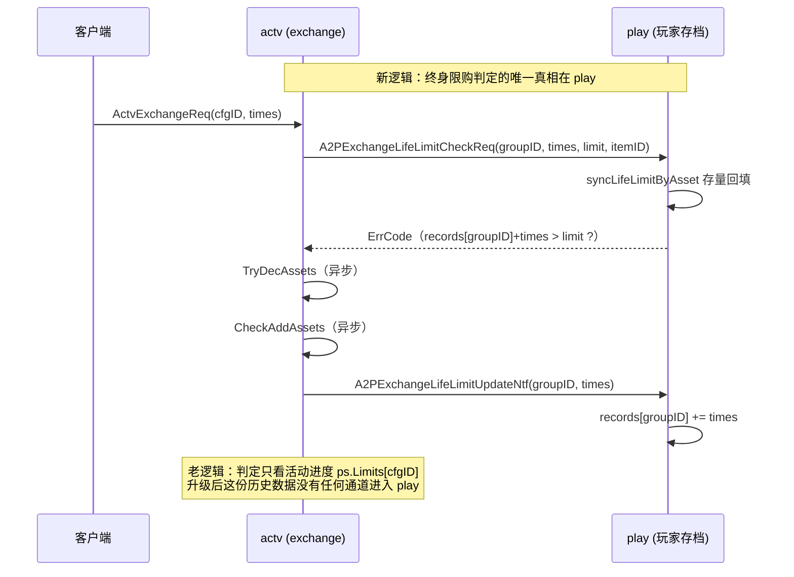

# 活动兑换终身限购未考虑线上老数据兼容

> **经典教训**：改的是**已经上线**的功能时，必须先问一句 —— 线上已经产生的老数据，在新逻辑下会变成什么样？

## 一句话结论

终身限购（`ActvExchangeLifeLimit`）在 v1042（提交 `b5cc3d78f1` 1042-H5-8688 天空之城限购）新增，把限购计数从活动进度搬到了玩家存档，但**没有做老数据回填**。功能上线前已经兑换过的玩家，在 play 侧计数为 0，额度被重置，可以再买一整轮；活动换期后终身限购直接完全失效。

最终修复方式：**不做迁移脚本，改用玩家实际拥有的道具/皮肤作为客观依据自动回填**。

## 涉及代码

| 位置 | 说明 |
|------|------|
| `game/play/internal/ctl_actv.go` | `OnA2PExchangeLifeLimitCheck` / `Get` / `Update` + 新增回填 |
| `game/play/internal/mplayer/player.go:2160` | `ActvExchangeLifeLimit map[int32]int32`，key=groupID，**新数据源** |
| `game/actv/internal/activity/template/exchange/ctl.go:39` | `exchangeItems` 兑换主流程 |
| `game/actv/internal/activity/template/exchange/logic.go` | `loadLifeLimitData` 拉取并回写展示值 |
| `game/actv/internal/activity/template/exchange/comp_limit_prog.go:17` | `PlayerExchangeProgress.Limits`，key=cfgID，**老数据源** |
| `gdconf/conf_actvexchange_ext.go:58` | `LifeLimit[0]=groupID`、`LifeLimit[1]=上限` |
| `game/play/internal/ctl_item.go:1048` | `useItemSence` 皮肤道具使用，用后 `DecAsset` 扣掉道具 |
| `game/play/internal/mplayer/mskin/skin.go:150` | `SkinIsForever` 永久皮肤判定 |

## 配置事实（决定了修复方案）

`ActvExchangeCfg.tsv` 里配了 `LifeLimit` 的**只有一组**：

```
LifeLimit  = [1,1]                                  → groupID=1，上限 1 次
changeitem = [{"typ":"item","id":3010501,"val":1}]   → 道具「天空之城」
分布 content 801~806，六个活动内容共享同一个额度
```

`ItemCfg.tsv` 中 `3010501`：`class=item_skin`、`use=2`、
`category_param = {"effect":[{"typ":"item_skin","id":1082,"val":-1}]}` → 使用后 **永久解锁皮肤 1082**。

所以终身限购的真实语义就一句话：**皮肤 1082 一辈子只能拿一次**。

## 数据流对比



## 兼容性问题（本次核心）

1. **老数据没有回填通道**
   历史兑换次数只在 actv 的 `PlayerExchangeProgress.Limits[cfgID]`。play 侧 `ActvExchangeLifeLimit` 是空的，判定却只看 play → **额度从 0 重算**。

2. **仅有的加载入口对老玩家不触发**
   `loadLifeLimitData` 只在 `packProto` 里**首次创建**进度时调用。升级时老玩家进度早已存在，永远进不去这个分支。

3. **就算触发，方向也是反的**
   `loadLifeLimitData` 是 play → actv（把 group 计数写回 `ps.Limits[cfgID]` 供展示），不会把历史次数写进 play。

4. **换期后彻底失效**
   `PlayerExchangeProgress` 继承 `actv_com.ActvProgressBase`，随活动实例走。下一期活动进度重建 → `ps.Limits` 归零，play 侧也是 0，"终身"限购形同虚设。

5. **回填必须幂等，且顺序不能反**
   `loadLifeLimitData` 会把同一 group 的计数写到该 group 下**每一个 cfgID**。若先跑它再迁移，`ps.Limits` 里是 N 份 group 值，累加回 play 就是 **N 倍翻倍**。迁移标记也不能放活动进度里（换期会丢，导致重复回填）。

## 最终修复方案

放弃"新增迁移标记字段 + 迁移 Ntf + 脚本回捞"的传统迁移路线，改用**懒惰回填**：判定依据是玩家身上的客观事实，**零迁移脚本、天然覆盖全部存量玩家**。

### 判据

```go
// 已兑换过 = 道具还在包里 || 皮肤已永久到手
p.GetAssetCount(gdconf.AssetUniteItem, itemID) > 0 || p.SkinMgr.SkinIsForever(skinID)
```

- 前半覆盖「换了还没用」
- 后半覆盖「换了已经用掉」——`useItemSence` 会把道具 `DecAsset` 扣掉，只看背包必漏
- 皮肤永久不可逆，不管哪个版本、哪一期活动拿的都算数

### 落地要点

| 点 | 做法 | 理由 |
|----|------|------|
| 回填用赋值不用累加 | `SetActvExchangeLifeLimitTimes(groupID, limit)` | check 每次都会跑，`+=` 会一次比一次大 |
| 展示路径也回填 | `OnA2PExchangeLifeLimitGet` 同样调 | 否则界面显示可兑换、点了才报超限 |
| 仅支持 `limit == 1` | `limit != 1` 直接跳过回填 | 拥有道具只能证明**至少**买过 1 次，证明不了几次 |
| 道具/皮肤 ID 不写死 | actv 从 `changeitem` 取 itemID 传给 play，play 再从 `ItemCfg.CategoryParam.Effect` 反查皮肤 | 换配置不用改代码；非皮肤类道具自动回落 |
| map 操作封装 | `Get/Set/AddActvExchangeLifeLimitTimes` | 避免裸 map 散落各处 |

### 顺带修掉的问题

| # | 问题 | 修法 |
|---|------|------|
| 1 | `Limit == 0` 语义与周期限购不一致，配置漏填上限时玩家永远买不了且无日志 | check 里 `Limit <= 0` 直接拒绝 + `Errorf` |
| 2 | `req.Times` 无校验：负数使检查恒过；`MaxInt32` 溢出绕过 | 入口 `times <= 0` 拦截 + 比较提升 int64 |
| 3 | update 玩家不在线静默丢计数，道具却已发出 | 补 `Errorf` |

### 未处理（已知限制）

- **TOCTOU 并发**：check 与 update 之间隔着 `TryDecAssets`、`CheckAddAssets` 两次异步，极限连点可能重复通过。危害有限——多出的道具用不掉（`useItemSence` 有 `ErrCodeForeverSkin` 防重），但会多扣一份材料。
- **回填只在上限=1 时生效**：当前配置全是 `[1,1]` 所以完全覆盖；若后续上限改成大于 1，存量玩家额度仍会被重置，届时需另做迁移。
- **`cfg == nil` 的 panic 未修**：`GetCfg` 返回 typed nil，接口层 `== nil` 判不出来，需改 `gdconf/conf_actvexchange_ext.go:30` 本身，影响面到公共层。

## 影响范围

### 受影响的活动（ActvType=8 兑换模板，共 9 个）

| 活动ID | ContentID | 终身限购 | 说明 |
|--------|-----------|----------|------|
| 1000008 | 801 | ✅ | 酒馆礼物 |
| 21052001 | 801 | ✅ | 酒馆礼物 |
| 21052002 | 802 | ✅ | |
| 21052003 | 803 | ✅ | |
| 21052004 | 804 | ✅ | |
| 21052005 | 805 | ✅ | |
| 21052006 | 806 | ✅ | |
| 21053001 | 901 | ❌ | 回归验证用，仅周期限购 |
| 30000102 | 1001 | — | 春节活动，`ActvExchangeCfg` 无 content=1001，理论无内容 |

### 明确不受影响

`vd_exchange`、`theme`、`exchange_shop`、`costume_pass`（Type=37 万圣节装扮通行证）都是**独立模板**，不复用本次代码，也不读 `ActvExchangeCfg`。注意 Type=37 的活动 ContentID 恰好也是 801~806，那是另一张表的编号，别被误导。

### 数据与部署

- 写入存档字段 `Player.ActvExchangeLifeLimit`
- 无 proto / 配置表 / DB 结构变更，不需要 `make g`、`make conf`、`make deepcopy`
- actv 与 play 是 game 进程内 chanrpc 模块，整体重启，无灰度兼容问题

## 测试范围

**P0 主流程（801~806）**
1. 新号：可兑换 → 换成功 → 重进显示已达上限 → 再点报错
2. 存量号·道具在背包未使用：进界面直接显示已兑换
3. 存量号·道具已使用（皮肤 1082 永久）：同上
4. 跨活动期：上期买过并用掉，新一期仍显示已兑换 ← 原来失效最严重的场景
5. 跨 content 共享：801 买过，802~806 全部不可买
6. 显示与判定一致，不出现"显示可买、点了报超限"
7. 回填后下线重登，状态保持

**P1 幂等与回归**

8. 反复进出界面、反复点兑换，DB 中值恒为 1 不累加
9. 周期限购（21053001 / content 901）正常兑换、达上限拦截、跨期重置
10. 材料不足、背包满分支正常

**P2 参数校验（需造包）**

11. `times = 0` / 负数 → 参数错误，不扣资产不崩
12. `times = MaxInt32` → 拒绝（原会溢出绕过）
13. `LifeLimit` 漏填上限 → 拒绝 + Errorf

**上线前需核对**：线上是否存在从未兑换、但通过 GM 发放或其它途径拿到 3010501 / 皮肤 1082 的玩家 —— 这类玩家会被误判为已兑换。数量为 0 可直接上。

## 复盘：线上兼容检查清单

改动**已上线**功能时，动手前逐条过一遍：

- [ ] 判定/校验的**数据源是否搬家**了？老位置的数据谁来搬？
- [ ] 老数据的**加载入口**在升级后还会不会被触发？（"首次创建时加载"对存量玩家从不触发）
- [ ] 迁移是否**幂等**？重复登录、重复触发会不会累加两次？
- [ ] 幂等标记存在**生命周期足够长**的地方吗？（活动进度会随期重建，不能当标记位）
- [ ] 迁移与展示回写的**先后顺序**会不会互相污染？
- [ ] 老数据已被清理时的**兜底路径**是什么？
- [ ] 已经因旧 bug 产生脏数据的玩家，新逻辑下表现如何？要不要修数据？
- [ ] 迁移代码的**下线时机**定了吗？

> 额外一条经验：**先找有没有"客观事实"可以当依据**。本例中"玩家是否拥有永久皮肤"就是不可逆、不随版本和活动期变化的事实，用它做判据比任何迁移脚本都可靠 —— 零迁移、零幂等标记、天然覆盖全量存量玩家。

相关：[[v1048]]
