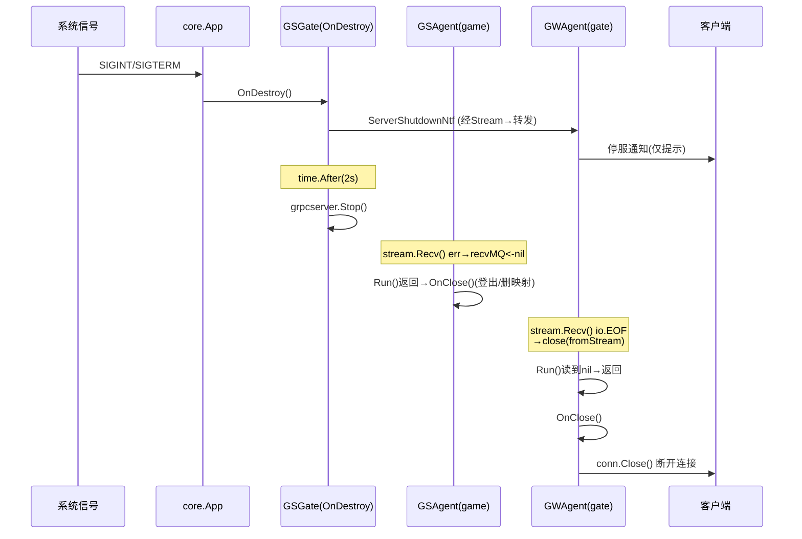

# game 停服后 gateway 断联客户端流程

## 目标

梳理 game 游戏服进程关闭（停服）后，客户端连接是如何被断开的完整链路：从 game 收到退出信号，到 gate 感知 gRPC stream 中断，再到 gate 主动关闭与客户端的连接。

## 关键角色

| 角色 | 位置 | 说明 |
|------|------|------|
| 客户端 | — | 通过 TCP/WSS 连到 gate |
| `GWAgent` | `gate/server/agent.go` | gate 侧每个客户端连接的代理，维护一条到 game 的 gRPC stream |
| `GSAgent` | `game/gsgate/internal/agent.go` | game 侧每条 gRPC stream 的代理，对应一个在线玩家 |
| `GSGate` | `game/gsgate/internal/gate.go` | game 上的网关模块，持有 gRPC server 和所有 GSAgent |
| core App | `vendor/git.tap4fun.com/fw/tse/core/core.go` | 框架，监听信号、按序停止各模块 |

连接拓扑：`客户端 ──TCP/WSS──► GWAgent ──gRPC Stream──► GSAgent ──► play`

## 核心流程

### 1. game 收到停服信号，框架逆序销毁模块

- core App 在 `core.go:261 Run()` 中 `signal.Notify` 监听 `SIGINT/SIGTERM/SIGHUP`（`core.go:266`），收到后调用 `app.Stop()`（`core.go:275`）。
- `app.Stop()`（`core.go:175`）先 `DestroyMulti()`，再**先进后出逆序**遍历模块（`core.go:185`）：发 `closeSig` → `wg.Wait()` 等 `Run()` 退出 → 调 `OnDestroy()`（`core.go:189-192`）。
- gsgate 即在此过程中执行 `OnDestroy`。

### 2. gsgate.OnDestroy：先通知、后停 gRPC

`game/gsgate/internal/gate.go:136`：

```go
func (gsGate *GSGate) OnDestroy() {
    ntf := &cspb.ServerShutdownNtf{}
    for _, agent := range gsGate.pid2Agent {
        agent.WriteMsg(ntf)        // ① 给所有在线玩家发停服通知
    }
    <-time.After(2 * time.Second)  // ② 等 2 秒，让通知发出去
    gsGate.grpcserver.Stop()       // ③ 立即停掉 gRPC server，强制断开所有 Stream
}
```

- **① ServerShutdownNtf**：仅是给客户端的"服务器即将关闭"提示，**不是断联手段**。
- **③ grpcserver.Stop()**：真正的断联触发点。它会立刻关闭所有正在进行的 `GameService.Stream` 双向流，使两端的 `stream.Recv()/Send()` 报错。

### 3. game 侧 GSAgent 收尾

- `grpcserver.Stop()` 后，GSAgent 的读协程 `goStreamReader`（`agent.go:321`）中 `stream.Recv()` 返回 err → `recvMQ <- nil`（`agent.go:327`）。
- `GSAgent.Run()` 主循环 `case frame := <-agent.recvMQ:` 收到 `nil` → return（`agent.go:227-230`）。
- 框架的 `Stream()` 在 `Run()` 返回后调用 `agent.OnClose()`（`gsgate/internal/service.go:32`）：登出玩家、删除 `pid2Agent` 映射（`agent.go:347`）。

### 4. gate 侧 GWAgent 感知 stream 中断 ★核心★

每个 GWAgent 在登录后 `OpenStreamToGame`（`gate/server/agent.go:470`）建立到 game 的 stream，并启动 `goStreamReader`（`agent.go:410`）持续 `stream.Recv()`：

```go
func (agent *GWAgent) goStreamReader(stream ..., out chan *gspb.GameFrame) {
    go func() {
        defer func() { close(out) }()   // 退出时 close(agent.fromStream)
        for {
            frame, err := stream.Recv()
            if err == io.EOF { break }   // game stop 后这里返回 EOF / 连接错误
            if err != nil { break }
            out <- frame
        }
    }()
}
```

- game 停 gRPC 后，gate 的 `stream.Recv()` 返回 `io.EOF` 或连接错误 → break → `close(agent.fromStream)`（`agent.go:412-414`）。
- `GWAgent.Run()` 主循环 `case frame := <-agent.fromStream:` 从已关闭 channel 读到零值 `nil` → `frame == nil` → return（`agent.go:205-209`）。

### 5. gate 关闭与客户端的连接

- `Run()` 返回后，网络框架回调 `OnClose()`（`gate/server/agent.go:601`）：
  - `closeStreamSend()` 关掉到 game 的 stream（`agent.go:604`）；
  - **`agent.conn.Close()` 关闭与客户端的 TCP/WSS 连接**（`agent.go:605`）——客户端在此刻检测到断线；
  - `sub.Unsubscribe()` 退订 nats，排空 `fromClient`/`fromStream` 防止读协程阻塞（`agent.go:606-615`）。

至此客户端被断联。

## 时序图



## 旁路机制：cluster / ETCD

- gate `OnInit` 里依赖 game 节点（`AutoConn: true`，`gate/server/gate.go:122-127`）。
- game 停服后其 ETCD lease 失效、节点被摘除，gate 的 cluster 会断开对该 game 节点的底层连接。
- 但**对已建立的客户端连接而言，真正驱动断联的是 gRPC stream 中断**（第 4 步），而非 ETCD 摘除事件。ETCD 主要保证新连接不再路由到已下线的 game。

## 边界与注意

- `OnDestroy` 只对 `pid2Agent`（已登录玩家）发 ShutdownNtf；未登录/握手中的连接不发，但 grpcserver.Stop() 后同样会被断开。
- 2 秒等待是"尽量送达通知"的软保证，不保证客户端一定收到。
- 若 game 是被 `kill -9`（无优雅退出），则跳过 ShutdownNtf，直接由 TCP 层断开触发 gate 的 `stream.Recv()` 报错，断联路径相同（第 4、5 步）。

## 关联文档

- [[登录流程]]
- [[行军流程]]
