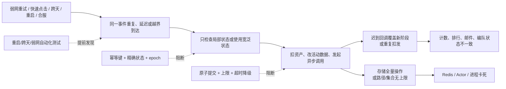

# gs 项目历史 Bug 复盘与工程治理

## 结论摘要

这个项目的 Bug 并非随机分散，主要聚集在以下边界：

1. **同一业务动作被执行多次**：弱网重试、快速点击、重复定时器、重复回调缺少幂等保护，常表现为重复扣费、重复发奖、超限兑换。
2. **生命周期切换不完整**：跨天、活动结束、服务器重启、合服、跨服返回时，旧状态、异步回调和新阶段互相覆盖。
3. **状态作用域过宽或语义混淆**：把“在跨服”当成“在 ZVZ”、把“轻伤联盟兵”当成“全部存活联盟兵”、把“当前战力”当成“最大战力”。
4. **配置单位和边界含义没有进入类型系统**：单价是“每 100 个”还是“每 1 个”、限制判断用 `>` 还是 `>=`，主要依赖开发者记忆。
5. **异步链路缺少阶段令牌**：清理旧排行、添加新排行、通知和事件回调之间没有 epoch/version，迟到回调仍可写入新状态。
6. **线上存储操作没有成本上限**：全量删 Redis 排行、路径段无限增长等操作在异常数据规模下会放大为进程或基础设施卡死。
7. **自动化门禁不足**：仓库虽然有测试入口，但当前 `Makefile` 的测试管道会掩盖失败，`check` 又注释了单测与 `golangci-lint`，使大量边界只能在线上暴露。

最值得优先治理的不是某个玩法，而是四个横切能力：**经济操作幂等、活动/合服生命周期、异步回调版本化、可失败的测试门禁**。

## 分析范围与口径

- 仓库：`/home/cc/slgh5/gs`
- 当前代码基线分支：`h5_new_tf_v1048_remote_fight_all`
- Git 范围：`--all` 可达历史，2021-05-27 至 2026-07-22。
- 可达提交对象：36,363 个，其中非 Merge 提交 29,444 个。
- 非 Merge 提交中，标题含 `bug`、`fix`、`修复`、`异常`、`卡死`、`丢失`、`重复`、`panic` 等问题关键词的提交为 5,030 个，约占 17.1%。
- 这是**提交标题的下界统计，不是独立 Bug 数量**。多版本分支、cherry-pick、回合并和补丁移植会让同一问题产生多个提交；没有问题关键词的提交也可能在修 Bug。
- 代码文件结构信号：排除 `vendor` 后有 3,747 个 Go 文件、123 个 `_test.go` 文件。文件数比例不能替代覆盖率，但说明关键状态机需要更集中地补充测试。

### 年度提交概况

| 年份 | 全部分支可达提交 | 非 Merge 提交 | 问题关键词提交 |
|---|---:|---:|---:|
| 2021 | 923 | 531 | 99 |
| 2022 | 3,315 | 2,101 | 341 |
| 2023 | 7,375 | 5,720 | 964 |
| 2024 | 6,301 | 4,768 | 772 |
| 2025 | 11,038 | 9,875 | 1,644 |
| 2026（截至 07-22） | 7,411 | 6,449 | 1,210 |

### 提交标题中的高频风险域

以下分类可重叠，只用于判断热点，不能当作 Bug 数量：

| 风险域 | 命中提交数 | 说明 |
|---|---:|---|
| 跨服 / 合服 / ZVZ / 远征 | 2,806 | 场景切换、数据归属、回城和合并窗口是最大热点 |
| 配置 / 协议 / 字段 / 枚举 | 1,823 | 配置单位、字段语义、生成物同步和错误码易错 |
| 时间 / 跨天 / 定时器 / 结算 | 1,311 | 活动阶段、TTL、补发和跨天清理反复出现 |
| 数据一致性 / 计数 / 积分 / 战力 | 1,220 | 服务端状态、排行、客户端展示容易不同步 |
| 重启 / 恢复 / 老数据兼容 | 476 | 加载时迁移和恢复流程缺少版本化 |
| 空值 / 越界 / 上限 / panic | 363 | 配置缺失、旧数据、空集合和极值处理不足 |
| 重复 / 幂等 / 多发 / 多扣 | 190 | 直接影响资产和奖励，数量不大但风险最高 |
| 异步 / 回调 / 卡死 / 泄漏 | 165 | 数量较少，但通常是线上严重问题 |

## 问题形成链路



## 代表性问题、根因与处理方式

### 1. 重复请求与经济操作不幂等

#### 现象

- 快速点击出战重复扣体力。
- 弱网下主题商店可重复兑换。
- 联盟预备兵购买金币多扣除。

#### 根因

- 请求入口没有先判断“本次业务是否已开始/已完成”。
- 上限判断存在 `>` / `>=` 边界错误。
- 配置价格实际按“每 100 个”计价，代码却按“每 1 个”相乘；数量和计价单位只存在于约定中。

#### 已有处理

- 提交 `1aa34d810a` 在扣体力前增加 `tower.GetIsGoing()` 防重入，当前代码位于 `game/play/internal/ctl_tiny_tower_single.go:174`。
- 提交 `f0c0bbd424` 把兑换限制从 `>` 修正为 `>=`，历史代码位于 `f0c0bbd424:game/actv/internal/activity/template/theme/logic.go:196`。
- 提交 `944f859aec` 按每 100 个预备兵计算价格，历史代码位于 `944f859aec:game/play/internal/ctl_zvz_union_soldier_buy.go:53`。

#### 推荐治理

1. 所有扣资产/发奖励接口使用业务幂等键，例如 `playerID + activityID + requestID`。
2. 在同一 Actor 或事务内完成“校验限额 → 扣资产 → 记录次数 → 发奖励”，不要把可见中间态暴露给下一请求。
3. 配置字段命名携带单位，如 `CostPer100`、`DurationSec`，在读取层转换成统一单位。
4. 边界测试至少覆盖 `0`、`limit-1`、`limit`、`limit+1`、单次批量跨过 limit、相同请求重复两次。

### 2. 异步回调跨越活动阶段

#### 现象

军备竞赛日结时异步删除旧排行，玩家又进入新排行，迟到的清理/添加回调造成排行数据错乱。

#### 根因

异步调用发出时属于“旧阶段”，回调执行时系统可能已经进入“新阶段”；回调没有携带阶段版本，也没有判断目标对象是否仍属于原阶段。

#### 已有处理

提交 `d4bf037c78` 增加 `Cleaning` 状态：日结开始置为 true，删除回调结束后清除，添加排行回调在清理期间拒绝回写。当前证据：

- `game/actv/internal/activity/template/arms_race/logic.go:46`
- `game/actv/internal/activity/template/arms_race/logic.go:90`
- `game/actv/internal/activity/template/arms_race/logic.go:155`

#### 推荐治理

`Cleaning bool` 能止血，但只能表达一个阶段。长期应给活动实例、排行分组和异步请求增加 `epoch`：回调只在 `callback.epoch == current.epoch` 时生效；旧回调只记录日志，不修改新阶段。

### 3. 通知路径触发业务事件导致重入

#### 现象

线上 Actor 卡死。

#### 根因

提交 `0f90c52c61` 显示 `HeroPropNtf` 在下发英雄通知后又触发 `LineupUpdate` 事件。通知函数原本应是输出边界，却携带业务状态变更，容易形成“事件 → 通知 → 同一事件”的重入链。

#### 已有处理

删除通知函数内的 `play.Event.Fire(...)`，让通知只负责打包和发送。

#### 推荐治理

- 规定 `Pack*`、`Send*`、`*Ntf` 不得触发业务事件或再次写核心状态。
- 业务事件由命令处理完成后统一发布，并加入同调用链事件深度或 event-id 检测。
- 线上卡死日志补充 actor mailbox 长度、当前消息类型、处理耗时和最近事件链。

### 4. 重启加载路径内执行可重复数据迁移

#### 现象

战甲试炼在服务器重启或更新后，把极品经验消耗积分按 27 倍再次计算。

#### 根因

提交 `21936c2cb6` 表明倍率转换被放在通用 `LoadProgresses` 中。加载是可重复发生的生命周期动作，不适合承载不可重复的数据转换；即使存在布尔标记，旧数据、落盘时序或字段兼容问题仍可能让转换再次命中。

#### 已有处理

删除 `LoadProgresses` 内 27 倍转换逻辑，避免重启时重放。

#### 推荐治理

- 数据迁移使用显式 `DataVersion`，从版本 N 到 N+1 只执行一次并原子落盘。
- 转换函数必须满足幂等：执行两次与一次结果相同。
- 每个活动建立“首次加载、同版本重启、跨版本升级、回滚后再升级”测试矩阵。

### 5. 合服窗口内把暂时不可见误判为数据丢失

#### 现象

合服过程中玩家被异步拉上线，联盟数据尚未准备完成，上线校验却把玩家退出联盟，最终造成联盟丢失。

#### 根因

校验默认“查不到联盟 = 联盟已不存在”，没有区分“正常运行”和“合服数据装载中”。

#### 已有处理

提交 `6310faeaad` 在 `MergeMainServerId != 0` 的合服窗口跳过联盟清理；当前代码位于：

- `game/play/internal/ctl_login.go:490`
- `game/play/internal/ctl_login.go:537`

#### 推荐治理

把合服过程建模为明确状态机：`Preparing → Loading → Rebinding → Verifying → Serving`。在 `Serving` 前禁止执行具有破坏性的“缺失即清理”；校验结果使用 `Exists / NotFound / NotReady / Error`，不能用 nil 合并所有情况。

### 6. 使用宽泛状态代替玩法精确状态

#### 现象

ZVZ 结束时，把仍处于其他跨服场景的玩家也遣返回家。

#### 根因

原代码只判断 `p.InCross()`；“跨服”是基础设施状态，不等于“当前在 ZVZ 地图”。

#### 已有处理

提交 `04be63353e` 改为精确检查 `MapType == MAP_ZVZ`，当前代码位于 `game/play/internal/ctl_map.go:434`。

#### 推荐治理

- 所有退出/清理操作校验玩法实例 ID、地图类型和活动 epoch 三元组。
- 避免 `IsCross`、`IsActive` 这类宽泛布尔值直接驱动破坏性操作。
- 回归用例覆盖同一玩家在 ZVZ、GVG、远征和普通跨服地图中的差异行为。

### 7. 同一数值承载多种所有权语义

#### 现象

委托部队带联盟预备兵出城，返回后联盟预备兵丢失。

#### 根因

联盟兵和个人兵混在总存活兵数中，旧逻辑只按“联盟轻伤兵”拆回联盟池，遗漏了存活联盟兵；字段名 `UnionLightHurt` 又被复用于承载返还量，进一步模糊语义。

#### 已有处理

提交 `51a18cc362` 按委托比例从全部存活兵中拆出联盟份额并返还，历史代码位于：

- `51a18cc362:game/wmap/internal/ctl_playertroop.go:962`
- `51a18cc362:game/wmap/internal/ctl_playertroop.go:963`
- `51a18cc362:game/wmap/internal/ctl_playertroop.go:964`

#### 推荐治理

数据结构直接区分 `PersonalAlive`、`UnionAlive`、`PersonalHurt`、`UnionHurt`，不要在回城时根据比例反推所有权。为出城、战斗、治疗、回城建立守恒断言：

```text
出发个人兵 + 出发联盟兵
= 存活个人兵 + 存活联盟兵 + 伤兵 + 死兵
```

### 8. 空集合和 nil 被当作同一种初始化状态

#### 现象

线上新建小号收到创建时间以前的全服邮件。

#### 根因

代码只在 `SubscribeGroup == nil` 时初始化；Mongo/序列化后可能得到非 nil 但长度为 0 的 map，随后以时间戳 0 拉取历史邮件。

#### 已有处理

提交 `e16c2d160a` 改为 `len(ownMails.SubscribeGroup) == 0`，历史代码位于 `e16c2d160a:mail/webserver/mailserver/handler.go:205`。

#### 推荐治理

- 对集合字段定义统一规范：业务只依赖 `len == 0`，不依赖 nil/empty 差异。
- 新玩家订阅游标必须从“角色创建时间或初始化时刻”开始，不应依赖默认零值。
- 测试 Mongo 缺字段、字段为 null、空 map、已有游标四种存储形态。

### 9. 外部存储操作没有线上成本上限

#### 现象

宴会活动删除遗留排行榜时 Redis 卡死。

#### 根因

活动主链路直接执行跨服排行全量删除，数据量、Redis 单线程阻塞时间和调用超时没有上限。

#### 已有处理

提交 `fd26e59f24` 在线上模式直接跳过删除，历史代码位于 `fd26e59f24:game/play/internal/ctl_banquet.go:737`。这是有效止血，但遗留 key 仍需要生命周期治理。

#### 推荐治理

- 排行 key 带活动实例版本，并设置 TTL；新活动切新 key，不同步全量删除旧 key。
- 必须清理时使用渐进扫描、分批 unlink/删除、限速和独立后台任务。
- 指标包含 key 数量、元素量、命令耗时、超时数和清理积压。

### 10. 路径异常没有资源上限

#### 现象

寻路失败后反复绕路，路径段持续增长，最终卡死或造成内存风险。

#### 根因

原来的 3 秒“飞行穿过”是时间型临时绕过，未保证实体在窗口内一定穿过阻挡；失败后仍可能继续追加路径段。

#### 已有处理

提交 `4ce7147e2b`：

- 用 `ExcludeID` 精确记录本次允许穿过的阻挡，当前代码位于 `game/wmap/internal/mmap/melem/munit/mentity/moving.go:89`。
- 增加最大 10,000 路径段上限并停止异常移动，当前代码位于 `game/wmap/internal/mmap/melem/munit/mentity/moving.go:145`，常量位于 `gdconf/def.go:1838`。

#### 推荐治理

10,000 是最终保险，不应成为常态。继续增加每次重寻路次数、单实体每秒路径计算预算、相同阻挡失败次数以及告警；超过较小软阈值时应回退、重算全路径或返回明确错误。

### 11. 邮件重试状态只改内存对象

#### 现象

GMT 手动重试邮件无效。

#### 根因

旧流程先加载记录，再把 retry 字段改为 0 后入队，状态修改没有与数据库更新绑定，后续加载仍可能拿到旧重试状态。

#### 已有处理

提交 `a6160c7c55` 使用 `FindOneAndUpdate` 在取记录时原子重置 retry，历史代码位于：

- `a6160c7c55:webserver/webs/handler.go:901`
- `a6160c7c55:webserver/webs/handler.go:907`

#### 推荐治理

重试任务使用持久化状态机：`Pending → Sending → Succeeded / RetryableFailed / PermanentFailed`，状态迁移带 compare-and-set、attempt、nextRetryAt 和最后错误；进程重启后由数据库状态恢复，而不是以内存队列为事实源。

### 12. 后台认证、密码和日志边界不安全

#### 现象与根因

后台历史实现同时存在凭据方案不明确、密码升级不可撤销旧 token、请求日志可能记录 password/token、JWT 私钥通过启动参数暴露、默认密码未强制修改等风险。

#### 已有处理

提交 `b731d1bd99` 完成了一组系统性加固：

- 请求体敏感字段脱敏：`b731d1bd99:webserver/jwt/jwt.go:84`
- 默认密码强制修改中间件：`b731d1bd99:webserver/jwt/jwt.go:182`
- JWT 私钥优先从受控文件加载：`b731d1bd99:webserver/jwt/jwt.go:228`
- 明确 `bcrypt_raw` 方案并兼容迁移：`b731d1bd99:webserver/webs/password.go:19`、`:40`
- 密码变更递增 `token_version`：`b731d1bd99:webserver/webs/password.go:74`

#### 推荐治理

- 密钥只从 secret manager 或权限受控文件加载，禁止进入仓库、命令行和日志。
- 认证测试覆盖算法降级、过期 token、密码变更后的旧 token、默认密码、日志脱敏和密钥长度。
- 记录安全事件但不记录凭据原文；管理员高危操作增加审计主体、目标和 request-id。

## 工程层面的共同原因

### 1. 测试命令会掩盖失败

当前 `Makefile` 的 `test` 和 `fulltest` 把 `go test` 输出交给 `{ grep ...; true; }`，在未启用 `pipefail` 时，整个管道通常以最后的 `true` 成功结束，即使 `go test` 已失败：

- `Makefile:108`
- `Makefile:109`
- `Makefile:111`
- `Makefile:112`

同时 `check` 中的 `go test ./...` 和 `golangci-lint` 已被注释：`Makefile:114-116`。这不代表外部 CI 一定没有其他门禁，但仓库内可见的默认入口无法可靠阻断回归。

### 2. 核心状态机测试密度不足

排除 vendor 后 3,747 个 Go 文件仅有 123 个测试文件。这个比例不能说明语句覆盖率，却与历史上大量“跨天、重启、弱网、跨服、回调迟到”问题相吻合：常规单次成功路径可能能跑通，生命周期组合路径缺少可重复验证。

### 3. 多分支移植增加修复漂移

全部分支历史中存在 190 个标题以 `Revert` 开头的非 Merge 提交。它们不全是错误修复回滚，但结合大量版本移植、重复合并和同票号多提交，可以确认“修复在多个版本间漂移”是持续成本。需要明确修复源分支、目标版本矩阵和验证责任人。

### 4. 临时止血缺少后续收口

线上跳过 Redis 删除、增加 `Cleaning bool`、硬编码 10,000 路径段都能快速恢复服务，但如果没有后续任务，临时措施会固化为永久设计。Bug 单应同时记录“止血方案”和“根治任务”，并为根治任务设版本。

## 分级治理方案

### P0：立即建立可靠门禁

1. 修正 `make test/fulltest` 的退出码传播；建议直接执行 `go test`，或启用 `set -o pipefail` 后再过滤输出。
2. `check` 恢复 `go test` 与当前可运行的静态检查；新代码至少不能增加 lint/test 失败。
3. 对资产扣发、排行结算、邮件补发、合服清理增加强制回归用例。
4. 禁止线上请求同步执行未知规模的 Redis/Mongo 全量操作。

### P0：经济操作统一幂等框架

1. 请求级幂等键和结果缓存。
2. 资产变化、次数变化、奖励变化同一提交域。
3. BI 日志带 before/after、reasonID、requestID、activityID。
4. 定时对账：资产守恒、联盟兵守恒、奖励发放记录与排行结算记录一致。

### P1：生命周期和异步回调版本化

1. 活动、排行、地图、合服任务统一 `instanceID/epoch`。
2. 所有异步回调校验 epoch 后再写状态。
3. 数据迁移使用 `DataVersion`，禁止在普通 Load 中执行非幂等转换。
4. 定时器注册使用唯一 key，重复注册必须可检测。

### P1：把领域语义放进数据结构

1. 个人兵/联盟兵、当前战力/最大战力、秒/毫秒、单价/每百单价使用不同字段或类型。
2. 破坏性操作检查玩法实例、地图类型、活动阶段，不使用宽泛布尔状态。
3. 核心数值建立守恒断言和上下界断言，异常时拒绝提交并告警。

### P2：分支与复盘治理

1. Bug 修复记录源提交、目标分支、cherry-pick 提交和验证结果，避免只写“合并 bug”。
2. 同一问题出现 fix2/fix3 或回滚时，必须补充最小复现测试和根因字段。
3. 每个版本发布前按“弱网、跨天、重启、跨服、合服、配置缺失”执行固定故障矩阵。

## Bug 处理标准模板

以后处理 Bug，建议至少填写以下内容：

1. **用户现象**：玩家看到什么，资产或状态是否受损。
2. **触发条件**：弱网、重复点击、跨天、重启、合服、跨服、旧数据、配置为空等。
3. **数据不变量**：修复前后哪些数值必须守恒。
4. **根因位置**：首次错误决策发生在哪个函数，而不是最终报错点。
5. **止血方案**：是否需要开关、屏蔽、补发、回滚、限流。
6. **根治方案**：幂等、epoch、事务、类型化、TTL、状态机中的哪一项。
7. **数据修复**：受影响玩家范围、查询脚本、补偿方式和可重复执行性。
8. **回归矩阵**：正常、边界、重复、并发、重启、跨版本。
9. **上线观察**：指标、日志关键字、告警阈值、观察时长和回滚条件。

## 建议测试矩阵

| 维度 | 必测场景 |
|---|---|
| 请求 | 单次、连续双击、相同 request-id、不同 request-id、超时后重试 |
| 时间 | 阶段前 1 秒、边界时刻、阶段后 1 秒、跨天、时钟偏移 |
| 生命周期 | 首次启动、同版本重启、升级、回滚、合服装载中 |
| 异步 | 正常回调、超时、重复回调、乱序回调、回调跨 epoch |
| 数据 | nil、空集合、缺字段、旧版本字段、极大集合、配置缺失 |
| 场景 | 本服、普通跨服、ZVZ、GVG、远征，不同地图间切换 |
| 资产 | 余额刚好、差 1、批量跨限、扣除成功发奖失败、补偿重试 |

## 关联文档

- [[登录流程]]：登录加载、旧数据兼容和合服窗口校验。
- [[行军流程]]：编队、跨地图与回城状态。
- [[战斗流程]]：兵力、伤兵、死兵和战斗后状态。
- [[奖励规则-RewardCfg]]：奖励和资产变化规则。
- [[game停服-gateway断联客户端流程]]：停服、断线与重连生命周期。
- [[冰髓争夺战]]：跨服地图、行军和玩法阶段的具体案例。

## 后续建议

本文是全项目横向复盘。下一步若要转成可执行治理任务，建议拆成四张需求单：

1. `Makefile/CI 测试失败可靠透传`
2. `资产扣发接口幂等与对账框架`
3. `活动异步回调 epoch 机制`
4. `重启/跨天/合服故障矩阵自动化`

