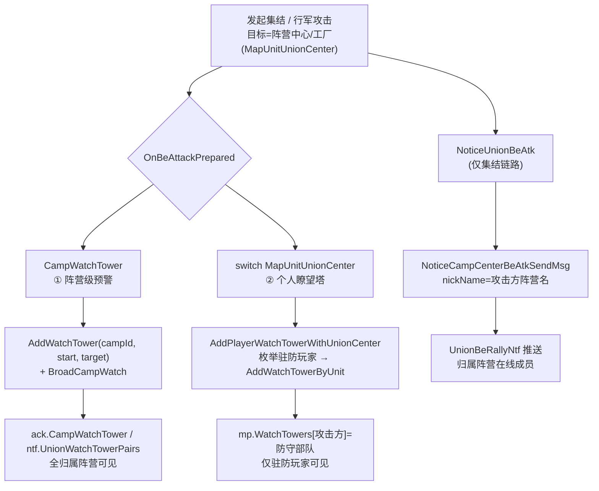
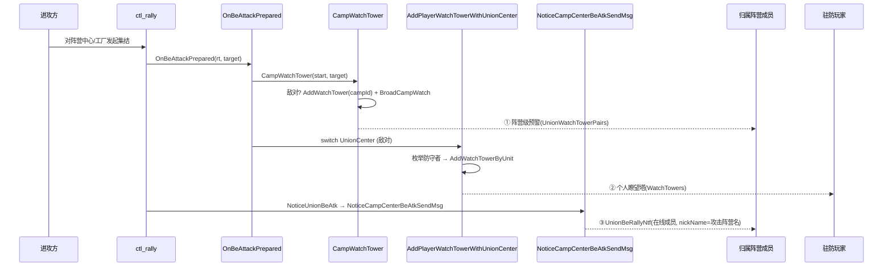

# 冰髓争夺战 - 防守方被攻击预警

> 父模块：[[冰髓争夺战]]　相关：[[行军流程]]
> 需求：H5-10072【1046】【功能优化】冰髓争夺战防守方被攻击提示【服务器】
> 提交：`f5e96c518f`

## 目标

冰髓战中，进攻方对**阵营中心及其附属建筑（工厂）**发起攻击/集结时，原来防守方没有任何提示。本次对齐火龙巢穴的提示能力，给阵营中心/工厂补三层提示：

1. **阵营级预警**（camp watch）—— 全归属阵营可见的"瞭望塔"标记。
2. **个人瞭望塔**（personal watch）—— 驻防在建筑里的防守玩家个人地图标记。
3. **被集结通知**（`UnionBeRallyNtf`）—— 被集结时给归属阵营在线成员推一条弹窗，昵称为发起攻击阵营名。

> 关键事实：冰髓战里**阵营中心和工厂都是同一种单位 `MapUnitUnionCenter`（`mcity.ExpHordeCenter`）**，靠 `IsCenterBuild()` / `ExpBuildType` 区分。所以一处分支两者全覆盖。归属阵营 owner 类型是 `TypeHordeOwner`，`OwnerInfo().ID` 即 campId。

## 触发入口

所有提示都挂在攻击/集结的预备流程上，无需新增入口：

| 场景 | 入口 | 调用 |
|------|------|------|
| 发起集结 | `ctl_rally.go:213` | `OnBeAttackPrepared(rt, target, action, false)` |
| 发起集结 | `ctl_rally.go:215` | `NoticeUnionBeAtk(rt, target)` |
| 行军攻击 | `ctl_lineup.go:1045` / `ctl_march.go:473` | `OnBeAttackPrepared(start, target, action, true)` |

`OnBeAttackPrepared`（`ctl_march.go:2189`）在 `action == 攻击 || 集结` 时统一分发预警。

---

## 三层提示总览



---

## ① 阵营级预警（camp watch）

复用火车那套阵营级预警机制，归属阵营全员可见。

**添加**：`OnBeAttackPrepared` → `CampWatchTower`（`ctl_exptrain.go:2032`）

```go
func (wmap *WMap) CampWatchTower(start, target munit.IUnit) {
    if start == nil || target == nil { return }
    campId := wmap.campWatchTowerCampId(target)   // 火车 / 阵营中心
    if campId <= 0 { return }
    // 阵营中心及附属建筑：仅敌方来犯才预警（火车无需此判断）
    if cspb.IsMapUnitUnionCenter(target) &&
        wmap.WildMap.GetUnitRelation(start, target, wmap.GetUnionCamp) != gdconf.RelationEnemy {
        return
    }
    wmap.BattlefieldMgr.AddWatchTower(campId, start.GetID(), target.GetID())
    wmap.BroadCampWatch(campId, 0)
}
```

- `campWatchTowerCampId`（`ctl_exptrain.go:2069`）按建筑类型解析归属阵营 id：火车取 `train.OwnerInfo().ID`，阵营中心取 `target.OwnerInfo().ID`。**纯按类型，不含关系判断**。
- 敌对关系判断（`GetUnitRelation(..., GetUnionCamp)`）只放在添加侧。

**数据落点**：`BattlefieldMgr` 的 `WatchTower map[int32]map[int64]int64`（campId → 攻击方id → 建筑id），见 `expedition/mgr.go:97`。

**下发**：
- 主动拉取：`OnCampWatchTowerReq` → `GetCampWatchTowersInfo(campId)`（`ctl_battlefield.go`）→ `ack.CampWatchTower`。其中 `getDefenderBuildingInfo`（`ctl_union.go:810`）已有 `MapUnitUnionCenter` 分支，打包建筑战力/驻防成员。
- 广播：`BroadCampWatch` → `ntf.UnionWatchTowerPairs`。
- 战斗中：`GetCampWatchTowersInfo` 在攻击方 `InBattle()` 时把条目翻成 `IsAtk=true`，预警从行军一直保留到战斗中。

**删除**：

| 触发 | 路径 |
|------|------|
| 集结解散（撤回/取消/战败遣散）| `DisbandRallyTroop` → `DisbandRallyTroopDelWatch` → `CheckDelCampWatchTowerWithDisbandRally`（已泛化支持阵营中心，`ctl_exptrain.go:739`）→ `DelCampWatchTower` |
| 残留兜底 | `GetCampWatchTowersInfo` 拉取时，攻击方或建筑已不存在的条目自动清理 |

> `DelCampWatchTower`（`ctl_exptrain.go:2052`）**删除不依赖攻防关系**，按建筑归属阵营直接清理，避免解散过程中关系算不出导致残留。

---

## ② 个人瞭望塔（personal watch）

给驻防在建筑里的防守玩家加个人地图标记（`mp.WatchTowers`），只加瞭望塔、**不发弹窗/推送**，与火龙巢穴的瞭望塔部分一致。

**添加**：`OnBeAttackPrepared` 的 `switch target.GetType()`（`ctl_march.go:2264`）

```go
case cspb.MapUnitUnionCenter:
    // 阵营中心及附属建筑被敌方攻击/集结时，给驻防玩家添加个人瞭望塔
    if wmap.WildMap.GetUnitRelation(start, target, wmap.GetUnionCamp) == gdconf.RelationEnemy {
        wmap.AddPlayerWatchTowerWithUnionCenter(start, target)
    }
```

`AddPlayerWatchTowerWithUnionCenter`（`ctl_march.go:2089`）枚举防守者后逐个 `AddWatchTowerByUnit`（只写 `mp.WatchTowers`，无弹窗/推送）。

**防守者枚举**：`getDefendersWitUnionBuilding` 的 `MapUnitUnionCenter` 分支（`ctl_march.go:2052`）：
1. 优先取防御集结部队 `center.GetDefenderID()` 的 `rt.GetTroops()`；
2. 兜底（尚未合并成防御集结时）只取防守类型部队 `center.GetDefenderIDs()`（= `GetDefypeIDs(TroopDefypeDefend)`，**不含冰霜怪驻防 `TroopDefypeFrostAtk`**）。

**删除**：无针对阵营中心的显式清理，靠兜底——`ctl_map.go:1929` 阵容检查时清掉"攻击单位已消失"的瞭望塔条目。**与火龙巢穴行为一致**（无泄漏，攻击方撤退后等下次阵容检查消失）。

---

## ③ 被集结通知（UnionBeRallyNtf）

集结创建时通知防守方，昵称用发起攻击阵营名。

**入口**：`NoticeUnionBeAtk`（`ctl_union.go:962`）的 switch 新增分支：

```go
case cspb.MapUnitUnionCenter:
    wmap.NoticeCampCenterBeAtkSendMsg(rt, target)
```

**实现**：`NoticeCampCenterBeAtkSendMsg`（`ctl_union.go:1045`）

```go
func (wmap *WMap) NoticeCampCenterBeAtkSendMsg(rt *mtroop.RallyTroop, target munit.IUnit) {
    pc := cache.GetPlayerCache(rt.OwnerInfo().ID)
    if pc == nil { return }
    atkCampId := pc.GetHorde()
    defCampId := int32(target.OwnerInfo().ID)
    if defCampId == 0 || atkCampId == defCampId { return }   // 同阵营不自我预警
    ntf := &cspb.UnionBeRallyNtf{
        AtkName:  pc.Name,
        CfgID:    target.GetCfgId(),
        Coord:    &cspb.Coord{X: target.GetCoord().X, Z: target.GetCoord().Z},
        NickName: wmap.getCampName(atkCampId),   // 发起攻击阵营名（getCampName: ctl_bilog.go:1626）
        Type:     target.GetType(),
    }
    for pid := range wmap.GetOnlinePlayers() {
        if p := cache.GetPlayerCache(pid); p != nil && p.GetHorde() == defCampId {
            mapSendToPlayer(pid, ntf)
        }
    }
}
```

**接收方口径**：归属阵营 + 城堡在冰地图 + 在线。
- `GetOnlinePlayers()` 是**本冰战场 wmap 实例**的在线玩家 → 隐含"城堡在冰地图 + 在线"；
- `p.GetHorde() == defCampId` → 归属阵营。

---

## 时序图（以集结进攻为例）



---

## 涉及协议 / 配置

- proto：`cspb.UnionBeRallyNtf`（被集结通知）、`cspb.CampWatchTowerAck`（含 `CampWatchTower` 字段）、`cspb.CampWatchAndOccupyCountNtf`（含 `UnionWatchTowerPairs`）。
- 配置：`getCampName` 取自 `gdconf.GetExpCampCfg(campId).Name`。

## 风险与边界

- **个人瞭望塔删除偏懒**：仅靠 `ctl_map.go:1929` stale 兜底，攻击方撤退后非即时消失（与火龙巢穴一致，无永久泄漏）。
- **预警保留语义**：阵营级预警从行军保留到战斗中（`InBattle` 翻 `IsAtk`），不可在 `DelWatchTowerByUnit` 抵达时误删——`stopMarch` 在抵达开打时也会调用。
- **同阵营保护**：阵营级预警与被集结通知都判同阵营/敌对，避免自我预警。
- **未采用方案**：阵营中心未接入 `base.Watch`（占领/被占列表，需实现 `mentity.Defender`），因被攻击预警已走 `ack.CampWatchTower`，无需重复。被集结弹窗（SelfProc 个人通知）在评审中去掉，最终不发个人通知。

## 关联

- [[冰髓争夺战]] — 父模块（阶段/对阵/建筑数据结构）
- [[行军流程]] — `OnBeAttackPrepared` / 瞭望塔 / 集结所在的行军预备流程
