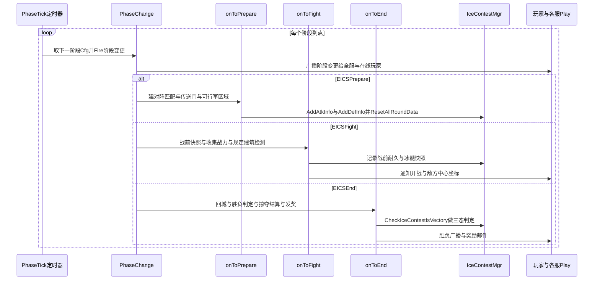

 
# 冰髓争夺战

> 梳理对象：远征战场（battlefield）中的**阵营对阵营**玩法 —— 多个阵营按回合匹配攻防，进攻方摧毁防守方阵营中心建筑掠夺「冰髓」(IceChalcedony)，按积分/掠夺量发奖。
> 这是个 **配置阶段表 + 定时器驱动** 的系统：阶段表 `IceMarrowWarStageCfg` 串成链表（`NextId`），战场按 tick 推进 `准备 → 战斗 → 结束` 三态循环，共 7 轮（`IceContestLastRound = 7`）。
> 代码主入口 `game/wmap/internal/ctl_ice_contest.go`，状态数据在 `expedition/ice_contest_mgr.go`。

## 术语缩写

| 缩写 / 名词 | 含义 |
|------|------|
| **icm** | `IceContestMgr`，冰髓战核心状态管理器 |
| **Camp / 阵营** | 一个或多个服务器组成的阵营，对阵基本单位 |
| **冰髓 / IceChalcedony** | 核心争夺资源，存于阵营中心建筑 |
| **阵营中心 / CenterBuild** | `ExpHordeCenter`，进攻方的攻击目标；含主中心 + 附属工厂(Factory) |
| **Round / 轮次** | 一场冰髓战分多轮，最后一轮 `=7` |
| **Phase / 阶段** | 单轮内的 `EICSPrepare / EICSFight / EICSEnd` |
| **规定建筑 / LevelId** | `IceMarrowWarGroupCfg.LevelId`，攻防胜负的判定建筑 |

阶段枚举 `cspb.ExpIceContestStatus`（`def.pb.go:14055`）：`EICSPrepare=1`、`EICSFight=2`、`EICSEnd=3`。

---

## 数据结构

核心管理器 `IceContestMgr`（`expedition/ice_contest_mgr.go`）关键字段：

```go
type IceContestMgr struct {
    PhaseCfgID                  int32                                      // 当前阶段配置ID（阶段表链表节点）
    PhaseEndTime                int64                                      // 当前阶段结束时间
    RoundStartTs                int64                                      // 本轮开始时间
    PlayerBattleScore           map[int64]int64                            // 每轮战斗积分（每轮重置）
    CampBuildMgr                map[int32]*CampBuildMgr                     // 阵营建筑管理 key:campId
    RoundMatchGroupResult       map[int32]*RoundGroupCamp                  // 每轮对阵 key:round
    RoundTotalUnionBattleRecord map[int32]map[int32]*RoundCampBattleRecord // 每轮每阵营战斗数据
    MarrowWarDefFailMailSent    map[int32]bool                             // 防御失败邮件已发标记（防重发）
    // ...冰霜怪 / 水晶塔驻防 / 阵营中心驻防 等子管理器
}
```

- `RoundGroupCamp`：保存单轮对阵关系，`AtkInfo`(进攻→防御列表) / `DefInfo`(防御→进攻列表)。
- `CampBuildMgr`：单阵营的中心建筑、工厂、出发/到达/防守传送门、所属分组配置。
- `RoundCampBattleRecord`：单轮单阵营战斗记录 —— 战力、胜负、掠夺/被掠夺明细(`PlunderRecords`/`PlunderedRecords`)、被摧毁建筑。

---

## 阶段一：准备 Prepare

阶段推进由 `IceContestPhaseTick`（`ctl_ice_contest.go:34`）定时驱动：到点后取下一阶段配置，更新 `PhaseCfgID` 与 `PhaseEndTime`，`Fire(IceContestPhaseChange)`。`IceContestPhaseChange`（`:66`）按阶段分发事件，并向所有服务器 / 在线玩家广播阶段变更。

进入准备阶段 `onIceContestToPrepare`（`ctl_ice_contest.go:90`）：

1. 起一个 `TimerTypeIceContestPrepareToOpen` 定时器，开战前 5 分钟提示（`module.go:373` 注册 → `IceContestToFightFiveMinTimerHandler`）。
2. 计算并设置本轮 `RoundStartTs`。
3. 按 `IceMarrowWarGroupCfg` 建立**对阵匹配**：`matchMap.AddAtkInfo/AddDefInfo` 填充进攻↔防守关系。
4. 为进攻方追加可行军区域 `AddIceContestExtraMarchArea`（对方阵营中心所在区域）。
5. 配置传送门：0 号为出发门(`SetDoorStartId`)，其余为到达门(`AddDoorArriveIds`)，并记录防守门与分组配置 `SetMarrowWarGroupCfgID`。

> 另有 `onIceContestRepairAllUnionCenter`（`:159`）在准备阶段修复所有阵营建筑并 `ResetAllRoundData()` 重置上一轮数据。

---

## 阶段二：战斗 Fight

进入战斗 `onIceContestToFight`（`ctl_ice_contest.go:170`）：

1. 通知在线玩家开战(`SelfProc_IceMarrowWarOpen`)、下发本方/敌方阵营中心位置。
2. **记录战前快照** `recordAllCampCenterBattleStart`（`:300`）：保存各建筑战斗开始时的耐久(`BattleStartDurability`)和冰髓量(`BattleStartIceChalcedony`)，用于后续掠夺结算。
3. `collectCampPowerOnFight`：通知各服 play 上报战力榜前 100 总战力，经 `OnP2MReportCampPowerNtf` 累计到阵营战斗记录。
4. 激活防御水晶塔；`checkMarrowWarGroupOnFightStart` 检测「规定建筑」占领情况。

**战斗期攻击校验**链路：
- `IceContestBattlePhaseAttackCheck`（`:243`）→ `CommonForbidAttackUnit`（`:222`，禁止打城堡/区域等）→ `CheckCampMarch`（`:179`，按攻防关系校验只能打匹配阵营的部队/集结/中心）。

**积分**：战斗阶段内击杀/防守/攻击建筑/水晶塔等行为累加 `AddPlayerBattleScore`（`ctl_union_center.go:575` 等），每轮重置。

**规定建筑机制**（`checkMarrowWarGroupOnFightStart` / `onIceContestAreaOccupy`）：
- 防守方未占领规定建筑 → 发防御失败邮件（每阵营仅一次，`MarrowWarDefFailMailSent` 去重）。
- 若进攻方已/后续占领规定建筑 → 直接把防守方中心打到摧毁(`AddHpDmgByCamp` + `UnionCenterBuildToDestroy`)，并摧毁该区域内防守阵营中心。

---

## 阶段三：结束与结算 End

进入结束 `onIceContestToEnd`（`ctl_ice_contest.go:209`）→ `OnIceContestEnterEndPhase`（`:355`）：

1. `RecallAllTroopsOnEndPhase`：所有部队 / 集结回城。
2. **`CheckIceContestIsVectory`**（`:447`）：遍历本轮对阵逐对结算。
3. `ResetAllTeleportDoors` 重置传送门、`RepaireAllUnionCenterWithDurability` 修复建筑。
4. 若为最后一轮 → `IceContestLastRoundEnd`：冰髓排行发奖 + 按掠夺量从小到大的阵营排名发奖。
5. 关停水晶塔、删除冰霜怪、结算阵营中心驻防奖励。

### 胜负三态（`checkIceContestCampBattleState` `:490`）

| 状态 | 条件 | 结果 |
|------|------|------|
| 一 | 进攻方摧毁防守方中心 | 进攻胜利(奖励) + 防守失败(奖励) |
| 二 | 进攻失败 + 防守方已占规定建筑 | 进攻失败(奖励) + 防守胜利(奖励) |
| 三 | 进攻失败 + 防守方未占规定建筑 | 双方失败通知，无奖励（防重发） |

### 冰髓掠夺计算（`CalcBuildingIceLossOnDestroy` `:660`）

> 把建筑战前冰髓 `BattleStartIceChalcedony` 按掠夺比例(主中心/工厂不同比例，受 `LootIcepulpMax` 封顶)算出可掠夺总量，**等分到每格血量**，再按各阵营在每格血上的伤害占比分配掠夺量。失败方减少冰髓、胜利方增加冰髓（`addCampCenterBuildsPlunder` `:758`）。

---

## 时序图



---

## 关键设计点

- **阶段表链表驱动**：`IceMarrowWarStageCfg` 用 `NextId` 串联，`SustainTime` 控制每阶段时长，`Round`+`StageId` 标识轮次与阶段；扩展轮次/阶段只改配置。
- **事件解耦阶段切换**：阶段变更经 `eventFacade.Fire(IceContestToPrepare/Fight/End)` 分发，符合观察者思路，各阶段处理函数互不直接耦合。
- **战前快照 + 按伤害占比分配**：掠夺结算不实时扣，而是用 `BattleStart*` 快照在结束阶段统一按每格血伤害占比分配，保证多阵营围攻时分配公平。
- **邮件去重**：`MarrowWarDefFailMailSent` 保证防御失败邮件每阵营每轮只发一次。
- **跨服聚合**：阵营由多服组成，战力 / 奖励均通过 `natsrpc.Cast` 向阵营内每个 `Sid` 下发。

## 关联
- 版本：[[v1045]]
- 相关流程：[[战斗流程]]（冰髓战的单体战斗复用世界地图战斗链路）
- 子功能：[[冰髓争夺战-防守方被攻击预警]]（v1046，阵营中心/工厂被攻击的三层提示）
- 子功能：[[冰髓争夺战-积分计算]]（战斗阶段玩家积分计算公式与落点）
