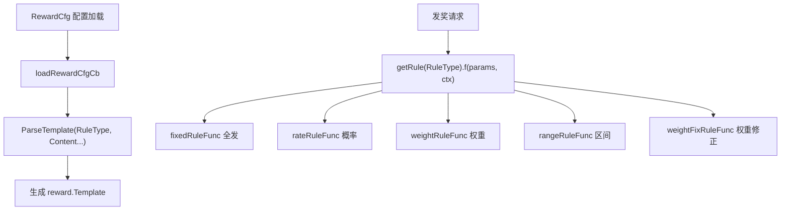

# 奖励规则 RewardCfg 设计

## 目标
梳理 `RewardCfg` 配置表的字段含义，重点说明 `RuleType`（奖励发放规则）的取值、对应实现及调用链路，便于排查掉落/发奖异常。

## 数据结构

配置结构 `gdconf/conf_reward.go:20`：

```go
type RewardCfg struct {
	Id         int32    `bson:"id"`                 // 序号
	RuleType   int32    `bson:"rule_type"`          // 规则类型（核心：决定"怎么发"）
	Important  bool     `bson:"important"`          // 是否重要
	Content    []string `bson:"content"`            // 奖励池（配合 RuleType 解析）
	DropID     int32    `bson:"drop_i_d"`           // 动态掉落ID
	Constant1  float32  `bson:"constant1,truncate"` // 浮动系数
	Constant2  float32  `bson:"constant2,truncate"` // 增值
	LevelLimit int32    `bson:"level_limit"`        // 限制等级
	DayLimit   int32    `bson:"day_limit"`          // 限制开服天数
}
```

> 注意区分两套独立概念：
> - **RuleType**（发奖规则）：决定"怎么发"——全发 / 概率抽 / 权重抽 / 区间发 / 修正权重抽。
> - **rewardTypeXxx**（资源类型，`conf_reward_ext.go:20-28`）：vm/rss/item/soldier… 决定"奖励是什么资源"。

## RuleType 的作用

`RuleType` 是一个**策略选择器（Strategy）**：同样的 `Content` 奖励池，不同 `RuleType` 走完全不同的发奖算法。

取值定义见 `gdconf/conf_reward_ext.go:13-18`：

| 值 | 常量 | 注册名 | 含义 | 实现函数 |
|----|------|--------|------|----------|
| 1 | `RewardRuleFixed` | fixed | 固定列表（全发） | `fixedRuleFunc` |
| 2 | `RewardRuleRate` | rate | 概率随机 | `rateRuleFunc` |
| 3 | `RewardRuleWeight` | weight | 权重随机（抽一个） | `weightRuleFunc` |
| 4 | `RewardRuleLevel` | level | 等级/区间分配 | `rangeRuleFunc` |
| 5 | `RewardRuleWeightFix` | weight_fix | 根据记录修正权重 | `weightFixRuleFunc` |

## 核心流程

1. **注册**：`gdconf/conf_reward_ext.go:34` 的 `init()` 调用 `reward.RegisterRule(typ, name, func)`，把 `RuleType → *Rule{f: 规则函数}` 存进包内 `ruleMap`（`reward/rules.go:38`）。
2. **别名导出**：`reward/rules.go:18-24` 把私有实现暴露成大写变量（`FixedRuleFunc = fixedRuleFunc` 等）。
3. **解析**：加载配置时 `gdconf/conf_reward_ext.go:56` 调用 `reward.ParseTemplate(cfg.RuleType, cfg.Content, cfg.LevelLimit, false, cfg.DayLimit)`（`reward/parser.go:29`）生成 `Template` 并记下 rule 类型。
4. **发奖**：通过 `getRule(typ).f(params, ctx)` 调用对应规则函数，签名统一为 `func(params []*Param, ctx *Context) ([]*Reward, error)`。



## 各规则实现细节

实现全部在 `reward` 包 `reward/rules.go`（源码：`/home/cc/slgh5-2/tse/cmlib/reward/`，import `git.tap4fun.com/fw/tse/cmlib/reward`）。

| RuleType | 实现函数 | 位置 | 核心逻辑 |
|----------|----------|------|----------|
| 1 固定 | `fixedRuleFunc` | rules.go:55 | 遍历所有 param，满足阶段(maxStage)/开服天数(svrDays)就全发 |
| 2 概率 | `rateRuleFunc` | rules.go:86 | 每个 param 用 `util.RandRate(rate)` 独立判定；含衰减系数逻辑（仅第一层 `LinkLv==0` 处理衰减） |
| 3 权重 | `weightRuleFunc` | rules.go:166 | 过滤后 `util.RandWeight(weights)` 按权重抽**一个** |
| 4 区间 | `rangeRuleFunc` | rules.go:213 | 用 `ctx.Sj.GetRewardRuleParam(rule.typ)` 取值，匹配区间发对应 unit；`ctx.Sj==nil` 则不发 |
| 5 权重修正 | `weightFixRuleFunc` | rules.go:257 | 抽取前调 `RewardRuleStepPrepared` 按历史记录修正权重，再 `RandWeight`，命中后 `RewardRuleStepComplete` |

## ⚠️ 已知坑：RuleType 与 Content 格式必须匹配

策划曾**将 `RuleType` 与 `Content` 配置不匹配**，导致发奖异常。根因在解析阶段：

`Content` 每个元素是否含 `:` 决定走哪个解析函数（`reward/parser.go:31-43`）：

| Content 格式 | 解析函数 | 产出 | 适用 RuleType |
|--------------|----------|------|---------------|
| `unit`（无 `:`） | `parseSimpleParam`（parser.go:54） | `Param{Value=0}` | 1 固定 fixed |
| `value:unit`（有 `:`） | `parseTupleParam`（parser.go:63） | `Param{Value=value}` | 2/3/4/5（概率/权重/区间/修正） |

**不匹配的后果：**
- `RuleType=2 概率` 但 Content 漏写 `:`（如只写 `unit`）→ `Param.Value=0` → `util.RandRate(0)` **永远不掉落**。
- `RuleType=3 权重` 但 Content 漏写权重 → 所有 `weights=0` → `util.RandWeight` 返回 -1 → 直接报错 `invalid weight param`。
- `RuleType=4 区间` 同理，区间阈值 `p.Value=0`，区间判定全部异常。
- 反之 `RuleType=1 固定` 但 Content 写成 `value:unit` → value 被忽略、unit 仍按 `strs[1]` 解析 → 本该概率/权重的奖励**变成全发**（最隐蔽，不报错但发多了）。

**排查建议**：发奖异常（不掉 / 报 invalid weight param / 掉太多）时，先核对该 `RewardCfg` 的 `RuleType` 与 `Content` 的 `:` 格式是否对应上。

## 风险与边界
- `rangeRuleFunc` / `weightFixRuleFunc` 依赖 `ctx.Sj`（subject），为 nil 时直接不产出奖励，排查"没掉落"时优先确认 subject 是否传入。
- `rateRuleFunc` 的衰减逻辑只在第一层生效（`ctx.IsDecay && ctx.LinkLv == 0`），多层嵌套掉落时后续层不衰减。
- `RewardRuleWeight` 每次只抽一个，配置时注意与"全发"区分。
- ⚠️ **远征玩法曾在此处出现过 bug**（详见标签 `远征出现过bug`），涉及奖励发放，改动相关规则函数时需回归远征相关掉落/发奖。

## 涉及协议 / 配置
- tsv：奖励配置表（生成 `RewardCfg`）
- 代码：`gdconf/conf_reward.go`、`gdconf/conf_reward_ext.go`、`reward/rules.go`、`reward/parser.go`

## 关联需求
- [[]]
