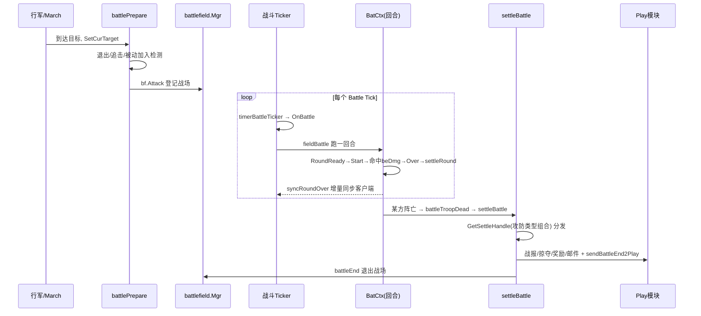

# 世界地图战斗流程

> 梳理对象：世界地图上「部队攻击目标」的核心战斗链路 —— **进入战斗 → 回合循环 → 结束结算**。
> 这是个**回合制 + 定时器驱动**的系统：战场（battlefield）按 tick 推进回合，某方阵亡后按「攻防类型组合」分发结算。
> 代码主入口 `game/wmap/internal/ctl_battle.go`，结算在 `ctl_battle_settle.go`，回合内逻辑在 `battle/battlectx.go`。

## 单位类型缩写

| 缩写 | 含义 |
|------|------|
| **PTroop** | 玩家部队（Player Troop） |
| **RTroop** | 集结部队（Rally Troop，本项目恒缩写 `rt`） |
| **NTroop** | NPC 怪物部队 |
| MapCity / CCity / TCity | 地图城 / 跨服城 / 领地城 |
| Tth / Fort / Area | 泰坦宝库 / 要塞 / 区域 |
| `IBattleUnit` | 所有可战斗单位的统一接口；`BatCtx()` 取其战斗上下文 |

---

## 阶段一：进入战斗 Engage

部队行军（`ctl_march.go`）到达目标后设置攻击目标，进入 `battlePrepare`（`ctl_battle.go:159`）：

1. **退出检测** `exitBattleLogic` / `DefenderForceCheck`：满足退出条件直接结束（怒气退出有 5s 延迟，见 `checkExitBattle:50`）。
2. **取目标** `GetMapUnitByUID`：目标不存在 → `giveUpTarget` + `battleEnd`。
3. **死亡检测**：自己或目标已死 → `battleTroopDead`。
4. **回合准备** `RoundReady`（`battlectx.go:465`）。
5. **追击判定** `battleChasing`：超出攻击范围（`BattleChasingDis`）则暂停攻击转追击；埋骨之地怪物（Bone）不追击，直接放弃。
6. **被动加入战斗** `JoinBattlePassive`：把目标拉进战斗。
7. **加入战场** `bf.Attack(...)`：登记到 `battlefield.Mgr`，等待 tick 驱动。

---

## 阶段二：回合循环 Round Loop（定时器驱动）

| 环节      | 函数（`ctl_battle.go` / `battlectx.go`）                                                                                          | 说明                                                       |
| ------- | ----------------------------------------------------------------------------------------------------------------------------- | -------------------------------------------------------- |
| Tick 入口 | `timerBattleTicker` (`ctl_battle.go:235`)                                                                                     | 遍历全地图战斗实体，投递 `iproto.Battle`，并续下一个 `TimerTypeBattle` 定时器 |
| 回合处理    | `OnBattle` (`:261`) → `fieldBattle` (`:321`)                                                                                  | 按战场分片取战斗单位，跑**一回合**；`getNextRoudDura` 算下回合间隔             |
| 回合生命周期  | `RoundReady` → `RoundStart` (`battlectx.go:476`) → `AfterRoundStart` (`:505`) → `RoundOver` (`:529`) → `settleRound` (`:550`) | 一回合的完整阶段；技能/怒气在此结算                                       |
| 命中结算    | `beDmg` (`:711`) / `Cure` (`:751`) / `beCure` (`:828`)                                                                        | 伤害→伤兵/重伤换算 `dmg2NumCb`；治疗回兵                              |
| 回合同步    | `syncRoundOver` (`ctl_battle.go:384`)                                                                                         | 回合结束把属性/战报增量同步客户端                                        |
|         |                                                                                                                               |                                                          |

> 回合内通过 `FireBattleEvent(PhaseType, ...)`（`battlectx.go:351`）触发 buff/技能的阶段事件；战报数据累积在 `ReportInfo`（`GetReportInfoByTargetId`）。

---

## 阶段三：结束与结算 End & Settle

1. 某方阵亡 → `battleTroopDead`（`ctl_battle.go:433`）→ 对每个攻击者调 `settleBattle`。
2. **`settleBattle`**（`ctl_battle_settle.go:499`）按攻防双方的 **(站位 site, 类型 type)** 组合，从策略表取 handle：
   ```
   handle := GetSettleHandle(ownerSite, ownerType, targetSite, targetType)
   // 若取不到，交换 owner/target 再取一次
   ```
3. 命中对应 handle 执行该场景的结算，例如：

   | 场景 | handle |
   |------|--------|
   | 玩家部队打 NPC | `settleBattlePTroopAtkNTroop` (`:870`) |
   | 玩家打玩家 | `settleBattlePTroopAtkPTroop` (`:995`) |
   | 玩家部队打地图城 | `settleBattlePTroopAtkMapCity` (`:1026`) |
   | 集结部队打地图城 | `settleBattleRTroopAtkMapCity` (`:2169`) |
   | 集结打玩家 / NPC | `settleBattleRTroopAtkPTroop` (`:1745`) / `RTroopAtkNTroop` (`:1873`) |
   | 区域 / 泰坦宝库 / 跨服城 / 要塞 | `settleBattleRTroopAtkArea` / `…AtkTth` / `…AtkCCity` / `…AtkFort` |

4. 结算内容（随场景不同）：**发战报** `sendXxxBReport`、伤兵/重伤回城、**掠夺资源**、**掉落奖励/金币**（NPC 见 `settleNpcTroopCoin:533`）、发邮件。
5. **同步 play** `sendBattleEnd2Play(owner,target)` 双向各一次，把结果同步到 `play` 模块（更新玩家数据、任务计数等）。
6. 清理统计 `DelReport`，最终 `battleEnd`（`ctl_battle.go:475`）退出战场收尾。

---

## 时序图



---

## 关键设计点

- **策略表分发结算**：`GetSettleHandle` 用「攻方站位+类型 × 守方站位+类型」查表，避免巨型 switch；新增战斗场景＝注册一个 handle（`initBattleSettle:53`）。
- **定时器驱动回合**：不是实时帧，而是 `TimerTypeBattle` 周期 tick，`getNextRoudDura` 控制节奏。
- **被动参战**：防守方通过 `JoinBattlePassive` 被动进入，不需主动行军。
- **退出延迟**：退出战斗后怒气保留 5s（`checkExitBattle`），策划需求。
- **战报增量**：`ReportInfo` 按 targetId 累积，`syncRoundOver` 增量下发，结算后 `DelReport` 清理。

## 关联
- 版本：[[v1045]]
- 相关流程：[[登录流程]]
- 相关 Bug：[[H5-9953 远征挑战阵亡任务计数错误]]（阵亡计数发生在结算阶段）
