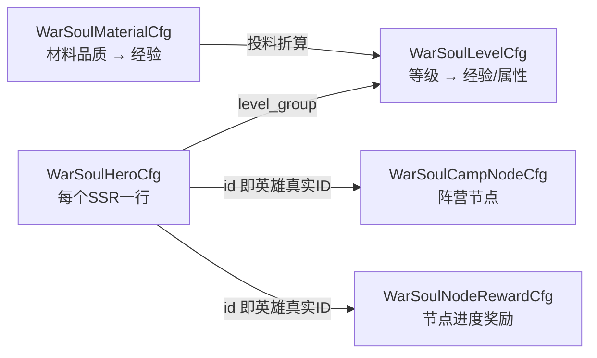

# SSR 战魂系统 配表说明（给策划）

> [!warning] 部分章节已随 2026-09-01 新版策划案作废
> 本文是按**旧版策划案**写的。改版后 `WarSoulNodeRewardCfg` 整表和 `WarSoulHeroCfg.skin_reward` 列已删除，`WarSoulCampNodeCfg` 新增了 `hero_att` 列，「阶段节点」改叫「高级节点」。
> **请先看 [[SSR战魂-改版配表变更说明]]**（第七节列了本文哪些章节作废）。等级表、材料表、id 编码规则、材料池过滤逻辑仍然有效。

对应单号 **H5-11860**，策划案《指尖王国》SSR战魂系统策划案。
服务端代码已提交在 `h5_new_tf_v1050_ssr_soul` 分支（gs / gdconfig / protocol 三仓库同名）。

本文说明**新增的 5 张表怎么填**。表结构（表头）已经建好并跑通生成流程，**数值全是占位的，需要你替换**。

---

> [!danger] <span style="color:red">最容易踩的坑：三张表的 `id` 是**算出来**的，不是随便编号</span>
>
> <span style="color:red">**`WarSoulLevelCfg.id` 必须 = `level_group × 1000 + level`**</span>
> 代码是按这个公式**直接算出 id 去查表**的，不是遍历找。<span style="color:red">**填错 = 查不到这一级 = 玩家卡在那一级升不上去**</span>，而且不报错、不崩，只是"投了材料没反应"，很难查。
>
> <span style="color:red">**`WarSoulCampNodeCfg.id` / `WarSoulNodeRewardCfg.id` 建议 = `英雄真实ID × 100 + 序号`**</span>
> 这两张表代码**不解析 id**（靠 `hero_id` 列认归属），所以编号规则本身是**约定**不是硬要求。但 <span style="color:red">**id 必须全表唯一**</span>——两个 SSR 的节点撞了 id，后加载的会把先加载的顶掉，表现是"某个英雄的节点凭空少了一个"。
>
> 按 `英雄真实ID × 100 + 序号` 编就天然不会撞，<span style="color:red">前提是**每个英雄的节点数不超过 99 个**</span>。
>
> 详见 [第二节·3](#3-id-编码规则重点)。

---

## 一、五张表是什么关系



一句话串起来：

> 玩家投**材料**（`WarSoulMaterialCfg` 折算出经验）→ 攒够经验按 **等级表**（`WarSoulLevelCfg`）升级 → 升级解锁 **阵营节点**（`WarSoulCampNodeCfg`）→ 解锁到一定数量领 **进度奖励**（`WarSoulNodeRewardCfg`）→ 节点全解锁给 **领主档案皮肤**（配在 `WarSoulHeroCfg`）。

---

## 二、通用填表约定（先看这段，能省一半返工）

### 1. tsv 行版式不要动

前 9 行是表头，**第 10 行起才是数据**。我已经建好了，你只要往下加数据行：

| 行号 | 内容 | 说明 |
|---|---|---|
| 1 | `A_INT_id` 这种 | 客户端用的类型头 |
| 2 | `cs` | 客户端+服务端都要 |
| 3 | `int` / `long` / `ext[]` | 字段类型 |
| 4 | `Id` / `NeedLevel` | 代码里的字段名 |
| 5 | 空 | 留空自动由第 4 行推导 |
| 6 | `TypIDVal_P_cspb` / `Effect_P` | 只有 `ext[]` 列要填 |
| 7 | 中文注释 | 给人看的 |
| 8、9 | 空 | 占位 |
| 10+ | **数据** | 你填这里 |

### 2. 两种 `ext[]` 列的写法

都是 JSON 数组，**不能留空字符串，没有内容就写 `[]`**。

**消耗/奖励类**（`cost`、`reward`、`skin_reward`）用 `TypIDVal`：

```json
[{"typ":"item","id":5010003,"val":2}]
```
- `typ`：`item` 道具 / `vm` 虚拟货币 / `rss` 资源
- `id`：道具或货币 ID
- `val`：数量

**属性类**（`hero_att`、`camp_att`）用 `Effect`：

```json
[{"typ":"buff","id":40111,"val":100}]
```
- `typ`：固定写 `buff`
- `id`：`BuffPropertyCfg` 里的属性 ID，**必须是 `Scope=2`（英雄作用域）的属性**，否则加不到英雄身上
- `val`：数值。万分比属性就按万分比填，`100` = 1%

> 现在占位用的是 `40111`（英雄额外百分比攻击）和 `40110`（英雄额外百分比战力）。

### 3. ID 编码规则（重点）

<span style="color:red">**这一节是全文最容易配错的地方，请逐行核对。**</span>

| 表 | id 规则 | 例 | 严格程度 |
|---|---|---|---|
| `WarSoulHeroCfg` | 直接用 SSR 的**英雄真实ID**（`D2HeroCfg.mutex_id`） | 32 | <span style="color:red">**硬要求**</span> |
| `WarSoulLevelCfg` | <span style="color:red">**`等级组 × 1000 + 等级`**</span> | 组1的5级 → 1005 | <span style="color:red">**硬要求（代码按公式算）**</span> |
| `WarSoulMaterialCfg` | <span style="color:red">**`材料类型 × 100 + 品质`**</span> | 本体+品质5 → 205 | <span style="color:red">**硬要求（代码按公式算）**</span> |
| `WarSoulCampNodeCfg` | <span style="color:red">**`英雄真实ID × 100 + 序号`**</span> | 32号第3个节点 → 3203 | 约定，但 id 必须唯一 |
| `WarSoulNodeRewardCfg` | <span style="color:red">**`英雄真实ID × 100 + 序号`**</span> | 32号第1档 → 3201 | 约定，但 id 必须唯一 |

#### 硬要求的三张表：id 填错功能直接坏

<span style="color:red">**`WarSoulHeroCfg`、`WarSoulLevelCfg`、`WarSoulMaterialCfg` 这三张表的 id，代码是「按公式算出来直接去查」的，不是遍历比对。**</span>

- `WarSoulHeroCfg`：拿英雄真实ID 直接查。id 填成别的数 → 这个 SSR 查不到战魂配置 → **战魂入口不出现**
- `WarSoulLevelCfg`：升级时算 `level_group×1000+(当前等级+1)` 去查下一级。id 填错 → **查不到下一级 → 玩家卡在这一级，投多少材料都升不上去**
- `WarSoulMaterialCfg`：折算经验时算 `material_type×100+hero_type` 去查。id 填错 → **这类材料给 0 经验，不进材料池**

<span style="color:red">**这三种错都不会报错、不会崩服，只是"功能悄悄不生效"，线上很难查。**</span>

举个具体的错例：

| id | level_group | level | 结果 |
|---|---|---|---|
| 1005 | 1 | 5 | ✅ 对，`1×1000+5=1005` |
| <span style="color:red">**1050**</span> | 1 | 5 | <span style="color:red">❌ 错。代码去查 1005 查不到，5 级这一档等于没配，玩家卡在 4 级</span> |
| <span style="color:red">**2005**</span> | 1 | 5 | <span style="color:red">❌ 错。组号和 id 对不上，同上</span> |

#### 另外两张表：id 不解析，但**必须唯一**

`WarSoulCampNodeCfg` 和 `WarSoulNodeRewardCfg`，代码是靠 <span style="color:red">**`hero_id` 列**</span> 认归属的（`conf_warsoul_ext.go:44`、`ctl_war_soul.go:274`），不去拆 id。所以：

- <span style="color:red">**真正决定"这个节点属于哪个英雄"的是 `hero_id` 列，不是 id**</span>。id 编得再漂亮，`hero_id` 填错就是挂到别的英雄身上了
- 但 <span style="color:red">**id 必须全表唯一**</span>。两行撞 id，后加载的会顶掉先加载的 → 表现是"某个英雄莫名少了一个节点"
- 按 `英雄真实ID × 100 + 序号` 编就天然不撞，<span style="color:red">前提是**每个英雄的节点/奖励档位不超过 99 个**</span>（超了就会进位撞到下一个英雄的号段）

> 想改编号规则可以，只要保证唯一即可，**但改前跟我说一声**——我要同步改文档和 GM 工具里的示例。

---

## 三、逐表说明

### 3.1 `WarSoulHeroCfg.tsv` —— 哪些 SSR 有战魂

**每个能开战魂的 SSR 一行。没在这张表里的 SSR，战魂入口不出现。**

| 字段 | 类型 | 说明 |
|---|---|---|
| `id` | int | <span style="color:red">**必须就是 SSR 的英雄真实ID（`D2HeroCfg.mutex_id`），代码拿它直接查，填别的数这个 SSR 战魂入口不出现**</span> |
| `level_group` | int | 指向 `WarSoulLevelCfg` 的等级组。多个 SSR 想共用同一套成长曲线就填同一个组号 |
| `max_level` | int | 战魂等级上限 |
| `skin_reward` | ext[] TypIDVal | **该 SSR 全部阵营节点解锁后**发放的领主档案皮肤（策划案 4.6.6） |

**现状**：已按现有 14 个 SSR 真实 ID 铺好行（32/35/42/49/51/52/53/54/55/56/57/58/64/65），`level_group` 全填 1、`max_level` 全填 30、`skin_reward` 全是 `[]`。

**你要做的**：
- 确认这 14 个 SSR 是不是都要开战魂，不开的删行
- 每个 SSR 的皮肤 ID 填进 `skin_reward`
- 如果不同 SSR 成长曲线不同，拆 `level_group`

> `max_level` 和等级表实际配到的最大等级**取小**。比如 `max_level=30` 但等级表只配到 20 级，实际上限就是 20，不会出错，但建议对齐。

---

### 3.2 `WarSoulLevelCfg.tsv` —— 等级曲线与英雄属性

**每个等级一行**，属性是**逐级累加**的：3 级英雄享受 1、2、3 级三行属性之和。

| 字段 | 类型 | 说明 |
|---|---|---|
| `id` | int | <span style="color:red">**必须 = `level_group × 1000 + level`，代码按公式查表，填错这一级等于没配**</span> |
| `level_group` | int | 等级组 |
| `level` | int | 战魂等级 |
| `need_exp` | long | **从本级升到下一级**所需经验 |
| `hero_att` | ext[] Effect | 本级提供的英雄属性，**只加给这个 SSR 自己**（策划案 4.5.1） |

**`need_exp` 的口径要特别注意**：填在第 N 行的 `need_exp`，是「**升到 N 级**」要花的经验。代码升级时查的是「下一级那一行」的 `need_exp`。

举例（等级组 1）：

| id | level | need_exp | 含义 |
|---|---|---|---|
| 1001 | 1 | 1000 | 0级→1级 要 1000 经验 |
| 1002 | 2 | 2000 | 1级→2级 要 2000 经验 |
| 1003 | 3 | 3000 | 2级→3级 要 3000 经验 |

**满级后的表现**：等级不再涨，多余经验封顶在满级那行的 `need_exp`（进度条显示满格，不会溢出）。

**现状**：等级组 1 配了 1~30 级，`need_exp = 1000 × 等级`，`hero_att` 是 `40111` 攻击万分比递增。全是占位。

---

### 3.3 `WarSoulMaterialCfg.tsv` —— 材料值多少经验

| 字段 | 类型 | 说明 |
|---|---|---|
| `id` | int | <span style="color:red">**必须 = `material_type × 100 + hero_type`，代码按公式查表，填错这类材料给 0 经验**</span> |
| `material_type` | int | **1 = 英雄碎片，2 = 英雄本体** |
| `hero_type` | int | 英雄品质，取 `D2HeroCfg.hero_type`；**0 表示通用碎片** |
| `exp` | long | 单个材料提供的战魂经验 |

**品质取值**（`D2HeroCfg.hero_type`）：1~5 是非 SSR 品质，**6 是 SSR**。

> **SSR 碎片和 SSR 本体不能当材料**（策划案 4.7.4）。代码里已经硬性拦掉了，所以 `hero_type=6` 这两行**不要配**，配了也不生效。

**没配到的组合 = 该材料不可投放**，不会进材料池。所以想禁掉某个品质，删掉那行就行。

**现状**：

| material_type | hero_type | exp |
|---|---|---|
| 1 碎片 | 0 通用 | 10 |
| 1 碎片 | 1 / 2 / 3 / 4 / 5 | 10 / 20 / 40 / 80 / 160 |
| 2 本体 | 1 / 2 / 3 / 4 / 5 | 100 / 200 / 400 / 800 / 1600 |

**待你确认**：通用碎片（`hero_asso=0` 的碎片道具）现在按 `hero_type=0` 单独一行给经验，这个口径对不对？还是想按某个具体品质算？

---

### 3.4 `WarSoulCampNodeCfg.tsv` —— 阵营节点

**每个 SSR 的每个节点一行。**

| 字段           | 类型             | 说明                                                                      |
| ------------ | -------------- | ----------------------------------------------------------------------- |
| `id`         | int            | 建议 `英雄真实ID × 100 + 序号`；<span style="color:red">**代码不解析，但必须全表唯一**</span> |
| `hero_id`    | int            | <span style="color:red">**真正决定归属的是这列，不是 id**</span>。所属 SSR 英雄真实ID       |
| `need_level` | int            | 达到这个战魂等级才能解锁                                                            |
| `node_type`  | int            | **1 = 普通节点（到级自动生效）；2 = 阶段节点（到级后还要消耗道具手动解锁）**                            |
| `cost`       | ext[] TypIDVal | 阶段节点的解锁消耗。普通节点填 `[]`                                                    |
| `camp_att`   | ext[] Effect   | 阵营属性，**加给该 SSR 所在阵营（兵种）的全部英雄**（策划案 4.5.1）                               |

**阵营取的是英雄的兵种**（`D2HeroCfg.soldiers_type`，1~4），不用在这张表里重复配，代码自己去英雄表查。

**几条重要行为**：
- 普通节点：等级一到就生效，不需要玩家点，不消耗
- 阶段节点：等级到了**也不会自动生效**，必须玩家点解锁并扣 `cost`，没解锁前属性不算数（策划案 4.6.4）
- 「全部节点解锁」= 这个 `hero_id` 下所有行都生效了，此时发 `WarSoulHeroCfg.skin_reward`

**现状**：14 个 SSR × 5 个节点 = 70 行。节点等级 5/10/15/20/25，其中 15 级和 25 级那两个是阶段节点（`node_type=2`）。**`cost` 全是 `[]`（等于现在阶段节点免费解锁）**，`camp_att` 是 `40110` 战力万分比递增。

**你要做的**：
- 定每个 SSR 的节点数量和等级卡点
- **把阶段节点的 `cost` 填上**，现在是空的
- 填 `camp_att` 真实数值

---

### 3.5 `WarSoulNodeRewardCfg.tsv` —— 阵营进度奖励

对应策划案 5.5「阵营加成每达到一次指定要求，领取一次奖励」，类似阶段任务。

| 字段 | 类型 | 说明 |
|---|---|---|
| `id` | int | 建议 `英雄真实ID × 100 + 序号`；<span style="color:red">**代码不解析，但必须全表唯一**</span> |
| `hero_id` | int | <span style="color:red">**真正决定归属的是这列，不是 id**</span>。所属 SSR 英雄真实ID |
| `need_node_count` | int | **已生效节点数量**达到这个值就能领 |
| `reward` | ext[] TypIDVal | 奖励内容 |

**`need_node_count` 数的是「已生效」的节点数**，不是「已解锁的阶段节点数」——普通节点到级自动生效也算数。

奖励是**手动领取**的，客户端会调协议来领，领过不能再领。

**现状**：每个 SSR 两档，`need_node_count` 分别是 3 和 5，`reward` 全是 `[]`。

---

## 四、四个全局配置项（`D2ConfigCfg.tsv`，id 1808~1811）

| Constant | 当前占位值 | 含义 |
|---|---|---|
| `WarSoul_Entry_Show_Star_Num` | 3 | 拥有多少个满星英雄后，SSR 详情页开始**显示**战魂入口（锁定态，策划案 4.2.1） |
| `WarSoul_Unlock_Star_Num` | 5 | 拥有多少个满星英雄后，战魂系统**解锁**（策划案 4.2.2） |
| `WarSoul_Symbiont_Star_Limit` | 15 | 共生英雄要达到几星，战魂属性才生效（策划案 4.3.3） |
| `WarSoul_Risk_Star_Threshold` | 13 | 消耗英雄本体时，几星及以上要弹**高星风险提示**（策划案 4.9.3 / 4.13.2） |

> `WarSoul_Symbiont_Star_Limit` 同时被「满星英雄数量」的统计复用——统计的是星级 ≥ 这个值的英雄数。如果「满星」和「共生门槛」想用不同数值，跟我说，我拆成两个配置。

---

## 五、策划案条款 → 配在哪

| 策划案 | 配置位置 |
|---|---|
| 4.2 系统解锁条件 | `D2ConfigCfg`：`WarSoul_Entry_Show_Star_Num` / `WarSoul_Unlock_Star_Num` |
| 4.3 能否使用战魂 | `D2ConfigCfg`：`WarSoul_Symbiont_Star_Limit`（其余是代码逻辑，不配表） |
| 4.5 属性内容与生效范围 | `WarSoulLevelCfg.hero_att`（加SSR自己）+ `WarSoulCampNodeCfg.camp_att`（加同阵营全体） |
| 4.6 阵营加成规则 | `WarSoulCampNodeCfg` 全表 + `WarSoulHeroCfg.skin_reward` |
| 4.7 材料范围 | `WarSoulMaterialCfg` 全表 |
| 4.8 材料投放页展示规则 | **不配表**，全是代码写死的过滤逻辑（见下） |
| 4.9 / 4.13 高星风险提示 | `D2ConfigCfg`：`WarSoul_Risk_Star_Threshold` |
| 4.10 升级确认 | 不配表，服务端算好返回 |
| 4.14 红点 | 不配表，客户端自己按数据判 |
| 5.5 阵营加成进度奖励 | `WarSoulNodeRewardCfg` 全表 |

**4.8 材料池的过滤规则是写死在代码里的**，改规则要改代码不是改表。当前实现（对应策划案逐条）：

- 不进材料池：SSR、上锁英雄、共生中的英雄、共鸣栏位（祭坛）上的英雄、任意编队/关卡阵容/属性试炼塔中的英雄
- **进材料池**：城墙上任的英雄、穿戴装备的英雄（消耗时装备自动卸下并返还）

---

## 六、改完表怎么生效

你改完 tsv 提交到 gdconfig 仓库后，服务端这边跑一次 `make conf` 就会把新数值导进去。**只改数值不用改代码**；**加/删列要提前跟我说**，那会改结构体。

自查清单：

<span style="color:red">**先查这四条 id 相关的，最容易错：**</span>

- [ ] <span style="color:red">`WarSoulHeroCfg.id` 就是英雄真实ID（`D2HeroCfg.mutex_id`），没写成别的编号</span>
- [ ] <span style="color:red">`WarSoulLevelCfg.id` 逐行等于 `level_group × 1000 + level`</span>
- [ ] <span style="color:red">`WarSoulMaterialCfg.id` 逐行等于 `material_type × 100 + hero_type`</span>
- [ ] <span style="color:red">`WarSoulCampNodeCfg.id` / `WarSoulNodeRewardCfg.id` 各自全表唯一，且每个英雄的行数没超过 99</span>

其余：

- [ ] `WarSoulCampNodeCfg.hero_id` / `WarSoulNodeRewardCfg.hero_id` 填的是英雄真实ID，没和 id 混淆
- [ ] `WarSoulHeroCfg.level_group` 指向的等级组在等级表里存在
- [ ] `WarSoulCampNodeCfg.hero_id` / `WarSoulNodeRewardCfg.hero_id` 在 `WarSoulHeroCfg` 里有对应行
- [ ] 所有 `ext[]` 列都是合法 JSON，没有留空字符串（没内容写 `[]`）
- [ ] `hero_att` / `camp_att` 里的属性 ID 在 `BuffPropertyCfg` 里存在且 `Scope=2`
- [ ] `WarSoulMaterialCfg` 没配 `hero_type=6`（SSR）
- [ ] 阶段节点（`node_type=2`）的 `cost` 不是空的

---

## 七、还需要你确认的几个口径

服务端已按下面的假设实现了，**如果和你的预期不一致，跟我说，改起来不大**：

1. **通用碎片经验**：按 `WarSoulMaterialCfg` 里 `hero_type=0` 那行算
2. ~~**「共生英雄达到 15 星」判定**：取**共生英雄（follow）自己的星级**~~ <span style="color:red">**此条写错了，已于 2026-09-03 修正**</span>：共生关系里 **SSR 是 follow 一侧**（`D2HeroCfg` 里非 SSR 全是 `soldiers_symbiosis=0`、SSR 全是 `1`，而建立共生要求 master 不可共生、follow 必须可共生）。所以判定取的是 **SSR 的 `SymbiontMajor` 指向的那个非 SSR 被共生英雄的星级**。详见 [[SSR战魂-改版配表变更说明]] 第八节
3. **战魂满级后**：不允许继续投料（返回「已满级」错误码），前端应置灰入口
4. **阶段节点解锁顺序**：不强制按顺序，只要等级够、道具够，任意阶段节点都能单独解锁
5. **解除共生**：战魂等级和经验保留，只是属性不生效；重新绑定满足星级的共生英雄后属性自动恢复

---

## 关联

- [[v1045]]
- 单号：H5-11860
- 分支：`h5_new_tf_v1050_ssr_soul`（gs / gdconfig / protocol）
