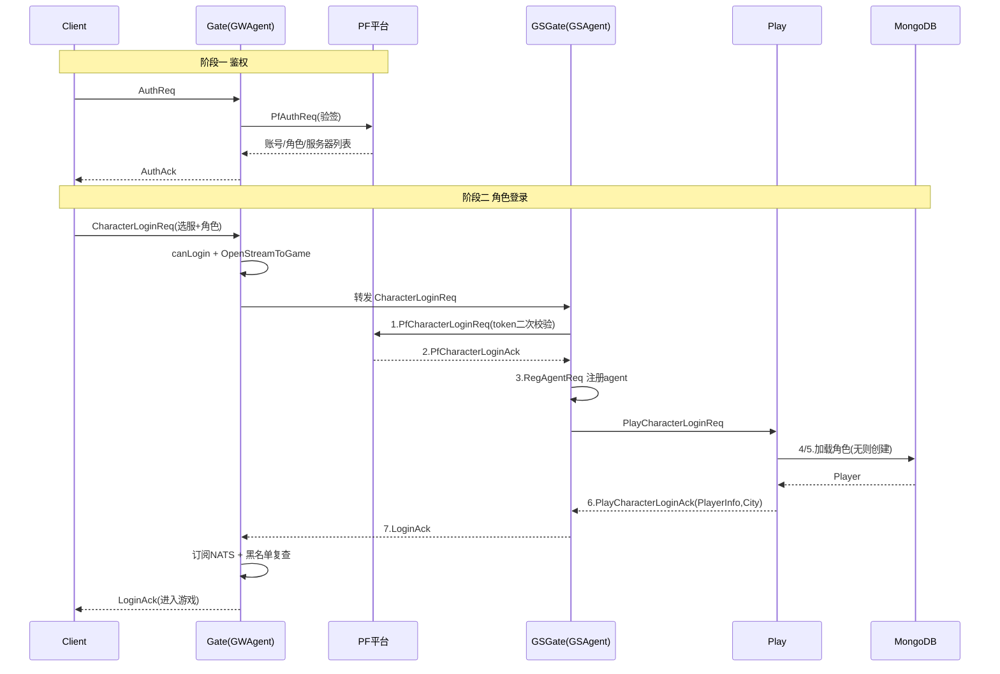

# 游戏登录流程

> 客户端从连上 gate 到进入游戏世界的完整链路。整体分两大阶段：
> **阶段一 鉴权(Auth)** 拿账号/角色列表/服务器列表；**阶段二 角色登录(Login)** 进入指定服务器加载角色。
> 代码里有 `loginstep 1~7` 日志埋点，按号排查最快。

## 参与者

| 角色 | 包 / 类型 | 职责 |
|------|-----------|------|
| Client | — | 发起 AuthReq / CharacterLoginReq |
| **Gate** | `gate/server` · `GWAgent` | 客户端唯一入口；鉴权、选服、把链路代理到目标 game |
| **PF 平台** | `conf.PFMOD`(PfAuthReq/PfCharacterLoginReq) | 账号权证验证、token 校验、角色 meta |
| **GSGate** | `game/gsgate/internal` · `GSAgent` | game 侧接收转发来的 cspb 消息，跑登录状态机、注册 agent |
| **Play** | `game/play/internal` · `Play` | 从内存/DB 加载角色，无则创建，回包 PlayerInfo |

---

## 阶段一：鉴权 Auth（Gate ↔ 平台）

`gate/server/handler.go:178 OnAuthReq`

1. 客户端发 `AuthReq`（账号/密码/第三方 token/ClientInfo）。
2. 校验 `ClientInfo` 非空、**客户端版本 ≥ 最低支持版本**(`version.GateSupport`)。
3. 调 `PFMOD` 的 `PfAuthReq` → 平台验签。失败回 `ErrCodePfAuthFailed`。
4. 成功后：缓存 `AccountID / AccountName / IP` 到 agent，拉取**服务器列表** `getServersInfo` 和 **服务器 meta** `getServerMeta`，解析平台返回的**角色列表** `covertPfCharacters`。
5. 状态置 `StateAuthed`，算出推荐服 `selectRecommand`，回 `AuthAck`（含 AccessToken/JWT、角色列表、服务器列表、推荐服、强更版本号）。

> 此时客户端拿到了「角色列表 + 服务器列表」，展示选服/选角界面。

---

## 阶段二：角色登录 Login

### Gate 侧入口 — `OnCharacterLoginReq`（`handler.go:382`）

1. 若已 `StateLogined` → `ErrCodeDuplicateLogin`。
2. `canLogin(ServerID)`：dev/beta 直接放行；否则查 meta 判断**维护时间、是否已开服、是否在线**，不满足回 `ErrCodeServerNotFound`。
3. `OpenStreamToGame(ServerID)`：开到目标 game 的代理链路；失败则回错误并 `Close`。
4. 把缓存的 `AccountID/AccountName/IP/OpenUDID` 回填进 `req.CInfo` 并重新 Marshal，`SendToGame` 转发到 game。

### Game 侧状态机 — loginstep 1~7

| # | 函数（文件） | 动作 |
|---|--------------|------|
| **1** | `gsgate OnCharacterLoginReq` (`agenthook.go:399`) | 校验状态=Init、CInfo、ServerID；FSM 事件 `PfLoginChar`；`AsynCall PFMOD PfCharacterLoginReq` 做**平台 token 二次校验** |
| **2** | `gsgate OnPfCharacterLoginAck` (`:458`) | 平台校验通过；FSM `StartRegAgent`；`AsynCall GSGATEMOD RegAgentReq` 注册 agent（处理断线重连/踢旧链接） |
| **3** | `gsgate LoginCharOnRegAgentAck` (`:509`) | 注册成功（若旧连接未关，等 `CloseSig` 或 `LogoutTimeout`）；FSM `PlayStartLogin`；`Cast PLAYMOD PlayCharacterLoginReq` |
| **4** | `play OnPlayCharacterLoginReq` (`ctl_login.go:260`) | 内存 `GetTargetPlayer` 命中则直接登录；未命中 → `GetPlayerAsyn` 从 **DB 异步加载** |
| **5** | `play OnCharacterLoginLoadPlayerCb` (`:285`) | DB 加载完成。**找不到角色(ErrNotFound) → 转去创角** `OnPlayCharacterCreateReq` |
| **6** | `play LoginWithPlayerAndReq` (`:320`) | 校验 `OriginServerID==ServerID`（否则踢下线，触发换服）；`LoginCounts` 计数；回 `PlayCharacterLoginAck`（PlayerInfo + City 等） |
| **7** | `gsgate OnPlayCharacterLoginAck` (`:577`) | FSM `PlayLoginCompleted`；组 `LoginAck`（PlayerInfo/City/SessionId/CrossServerID…）`sendToFrame` 经 gate 下发客户端 |

### Gate 收尾 — `OnLoginAck`（`handler.go:556`）

- 成功：`SetPlayerID` → **订阅该玩家的 NATS 主题** `GetPlayerGateSubj` → 置 `StateLogined`；新玩家上报导入渠道信息 `sendImportInfo`。
- **黑名单复查** `isBlacklist`：命中则回封禁错误 + 过期时间并 `Close`；否则 `WriteRaw` 把 LoginAck 透传客户端。**登录完成。**

---

## 时序图

---

## 相关分支与变体

- **FastLogin** `OnFastLoginReq`（gate `:486` / gsgate `:609`）：内部/压测用，校验 `FastLoginSecret`，命中缓存 `PCD` 时跳过平台校验直接走 `OnPfCharacterLoginAck`。
- **LoginTest** `OnLoginTestReq`：连通性/压测探针。
- **创角**：登录时 DB 查无角色 → 自动转 `OnPlayCharacterCreateReq`，成功后 `IsNewPlayer=true`。
- **断线重连**：`RegAgentReq.Reconnect=true`，超时回 `ErrCodeReconnectTimeout`（不视为错误）。
- **换服/合服**：`OriginServerID != ServerID` 触发 `ChangeServerKickOutPlayerNtf`；合服中回 `ErrCodeMaintain`。

## 关键错误码
`ErrCodeDuplicateLogin` 重复登录 · `ErrCodeServerNotFound` 服务器不可用/维护 · `ErrCodePfAuthFailed` 平台验签失败 · `ErrCodePfLoginFail` 平台登录失败 · `ErrCodeReconnectTimeout` 重连超时 · `ErrCodeMaintain` 维护/合服中 · `ErrCodeFastLoginSecretErr` 快速登录密钥错误

## 关联
- 版本：[[v1045]]
