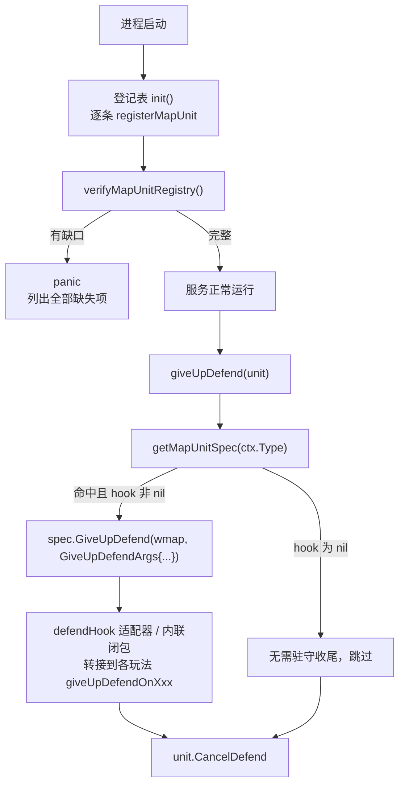

# 统一注册中枢 · 按类型分发的可扩展设计

> 一句话：**用一个统一入口囊括所有可能，对扩展开放、对修改关闭；当参数不匹配时用一个转换器（适配器）来适配。**

以「大地图单位类型 `cspb.MapUnitType` 的 `giveUpDefend`（放弃驻守）」重构为实例，沉淀这套可复用到任何「按类型/按枚举分发」场景的设计。

## 目标（要解决的痛点）

新增一种大地图单位类型时，「它要在哪些地方补逻辑」是**隐性契约**，散落在上百处 `switch GetType()` / `IsMapUnitXxx` 分支里，极易漏改——**往往测到对应功能点崩了才回头补**。

`giveUpDefend` 原本就是一个典型：一个 40 行 `switch defenderCtx.Type`，每新增一种可驻守玩法就要改这一处。

要达到：
1. **一个统一入口**：新增类型只在一处登记，主流程不再 `switch`。
2. **对扩展开放、对修改关闭**：加类型 / 加数据 / 加行为都不必回去改已有代码。
3. **漏了要在启动时报错**，而不是等运行时测出来。

## 四个设计要素

### ① 统一入口 = 类型 → 契约 的注册中枢

用一张 `map[类型]契约` 取代 `switch`。契约（`MapUnitSpec`）声明该类型拥有哪些能力、并挂上对应回调 hook。主流程只查表分发。

- 机制：`game/wmap/internal/mapunit_registry.go`
- 登记表（唯一事实来源，一表看全）：`game/wmap/internal/mapunit_registry_table.go:24` 的 `init()`
- 主流程分发：`game/wmap/internal/ctl_march.go:1416` `giveUpDefend`

```go
// mapunit_registry.go
type MapUnitSpec struct {
    Defendable   bool                              // 能力声明（见要素④）
    GiveUpDefend func(w *WMap, args GiveUpDefendArgs) // 已接线的回调 hook
}
var mapUnitTypeReg = map[cspb.MapUnitType]*MapUnitSpec{}
func registerMapUnit(t cspb.MapUnitType, spec MapUnitSpec) { /* 查重 + 存入 */ }
```

```go
// 主流程：不再 switch，查表分发
func (wmap *WMap) giveUpDefend(unit munit.ITroopUnit) {
    if ctx := unit.GetDefendCtx(); ctx != nil {
        if spec, ok := getMapUnitSpec(ctx.Type); ok && spec.GiveUpDefend != nil {
            spec.GiveUpDefend(wmap, GiveUpDefendArgs{Unit: unit, Defend: ctx})
        }
    }
    unit.CancelDefend()
}
```

### ② 对扩展开放：加数据用「参数对象」，加行为用「新字段/观察者」

回调**不用位置参数**，而是收敛成一个参数对象 `GiveUpDefendArgs`。将来回调要新数据 → 往结构体加字段即可，**回调签名不变、所有登记点零改动**。这是「对修改关闭」的关键——位置参数一旦增减，每一处登记、适配器、调用方都得改。

```go
type GiveUpDefendArgs struct {
    Unit   munit.ITroopUnit // 放弃驻守的部队
    Defend *munit.DefendCtx // 被驻守目标上下文（含 Type / ID）
    // ↓ 后续新增数据往这里加，签名与已有登记全不动
}
```

各类扩展如何做到「不改已有代码」：

| 扩展诉求 | 做法 | 是否动已有登记 |
|---|---|---|
| 加一种新类型 | 登记表加一条 `registerMapUnit` | 否 |
| 回调要新数据（加参数） | `GiveUpDefendArgs` 加字段 | 否（签名不变） |
| 某类型要多做点事 | 改**那一条**登记的闭包 | 只动它自己那行 |
| 加一种新的生命周期 hook（如 OnDefendStart） | `MapUnitSpec` 加一个字段 + 一条校验 | 否（其余类型留 nil） |
| 跨所有类型的横切行为（打点/成就） | 观察者列表 `registerXxxObserver`（按需再加） | 否 |

### ③ 参数不匹配 → 转换器（适配器）

统一入口要求回调签名一致，但**现有各玩法函数签名五花八门**（大多 `f(unit)`，个别还要 `ID`）。用**适配器**把它们「转接」到统一签名，而不是去改这些老函数：

```go
// 适配器：把只需要 (wmap, unit) 的老方法，转接成统一的 GiveUpDefend 签名
func defendHook(fn func(*WMap, munit.ITroopUnit)) func(*WMap, GiveUpDefendArgs) {
    return func(w *WMap, args GiveUpDefendArgs) { fn(w, args.Unit) }
}
```

登记时：
- 签名匹配 → 直接用适配器接现有方法：
  `GiveUpDefend: defendHook((*WMap).giveUpDefendOnUnionGvg)`
- 签名不匹配（要额外数据）→ 内联闭包从 `args` 里取，同样不碰老函数：
  ```go
  GiveUpDefend: func(w *WMap, args GiveUpDefendArgs) {
      w.TroopGiveUpDefendUnionCenter(args.Unit, args.Defend.ID) // 从 args 取 ID
  }
  ```

> 适配器/闭包这一层是「防腐层」：统一入口的稳定签名 ↔ 各具体实现的历史签名，互不牵连。老函数一行不改就能接入。

### ④ 漏了启动就报错：契约自检

只有统一入口还不够——怎么保证「新增类型时没漏登记、没漏挂 hook」？靠**启动自检**把隐性约定变成**显式、会 panic 的强制校验**。

- `checkMapUnitRegistry`（纯函数，便于单测）：`mapunit_registry.go:91`
- `verifyMapUnitRegistry`（有缺口即 panic）：`mapunit_registry.go:79`，在登记表 `init()` 末尾调用（`mapunit_registry_table.go:149`）

两级校验：

1. **枚举完整性**：遍历 `cspb.MapUnitType_name`，每个枚举值都必须登记（哪怕空 `MapUnitSpec{}` 表示「已审、无需处理」）→ 捕获「加了枚举却什么都没登记」。
2. **能力↔hook 一致性**：声明了 `Defendable` 却没挂 `GiveUpDefend` → 启动 panic 并指名缺什么。

> `Defendable bool` 的**唯一作用**：区分「故意无收尾」(false + hook nil) 与「漏挂 hook」(true + hook nil)。没有它，一个 nil 回调就无从判断是「不需要」还是「忘了」，也就无法实现「漏了就报错」。
>
> 原则：**表只声称它能保证（被校验）的东西**。不被校验、会失真的元数据（如曾经想放的 `Scoutable`/`Marchable`）宁可移出，避免给出一张骗人的表。

## 核心流程



## 本仓库的同款范式（可互相印证）

同一套「map + register + init 注册，主流程零改动」在行军模块里已有落地，可作对照：

- `marchActionCheckerReg` 按 `MarchAct` 注册前置校验，`checkActionCondition` 查表分发 —— `game/wmap/internal/ctl_march_help.go:80`（注释明写「新增玩法通过 registerMarchActionChecker 注册，无需修改主流程」）
- `marchCheckStages` 校验流水线 + `registerMarchCheckStage` —— `ctl_march_help.go:134`

详见 [[行军流程]]。工程治理背景见 [[gs项目历史Bug复盘与工程治理]]。

## 验证方式

- 单测 `game/wmap/internal/mapunit_registry_test.go`：真实表通过自检、每个枚举都登记、`Defendable` 漏 hook 被抓、缺登记时 `mustCompleteMapUnitRegistry` panic。
- `go build ./game/wmap/internal/` + `go test`：全绿。

## 适用 / 不适用

**适用**：任何「按类型/枚举做扇出分发」且「新增类型时容易漏改多处」的场景（打包、攻击、邮件、日志……皆可照此逐步收敛）。

**不适用 / 注意**：
- 分支极少且稳定（2~3 个、不会再加）时，`switch` 更直观，不必上注册表。
- 注册表放**包级全局**、init 注册、启动一次性自检；不要做成每实例 map（那样自检时机不好把握）。
- 只把**真正接线且被校验**的能力放进契约；纯元数据要么不放、要么也纳入校验，否则会失真。

## 关联

- 实例代码：`game/wmap/internal/mapunit_registry.go`、`mapunit_registry_table.go`、`ctl_march.go:1416`
- 仓库内扩展点清单：`docs/mapunit_extension_points.md`（新增 MapUnitType 的必做清单，标注已入中枢 vs 仍需手改）
- [[行军流程]] · [[gs项目历史Bug复盘与工程治理]]
