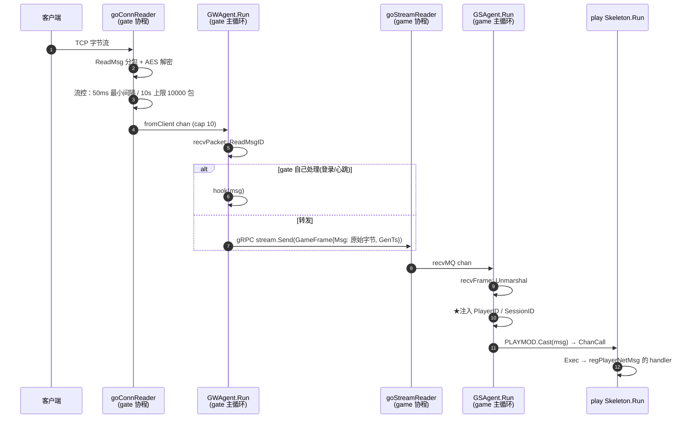
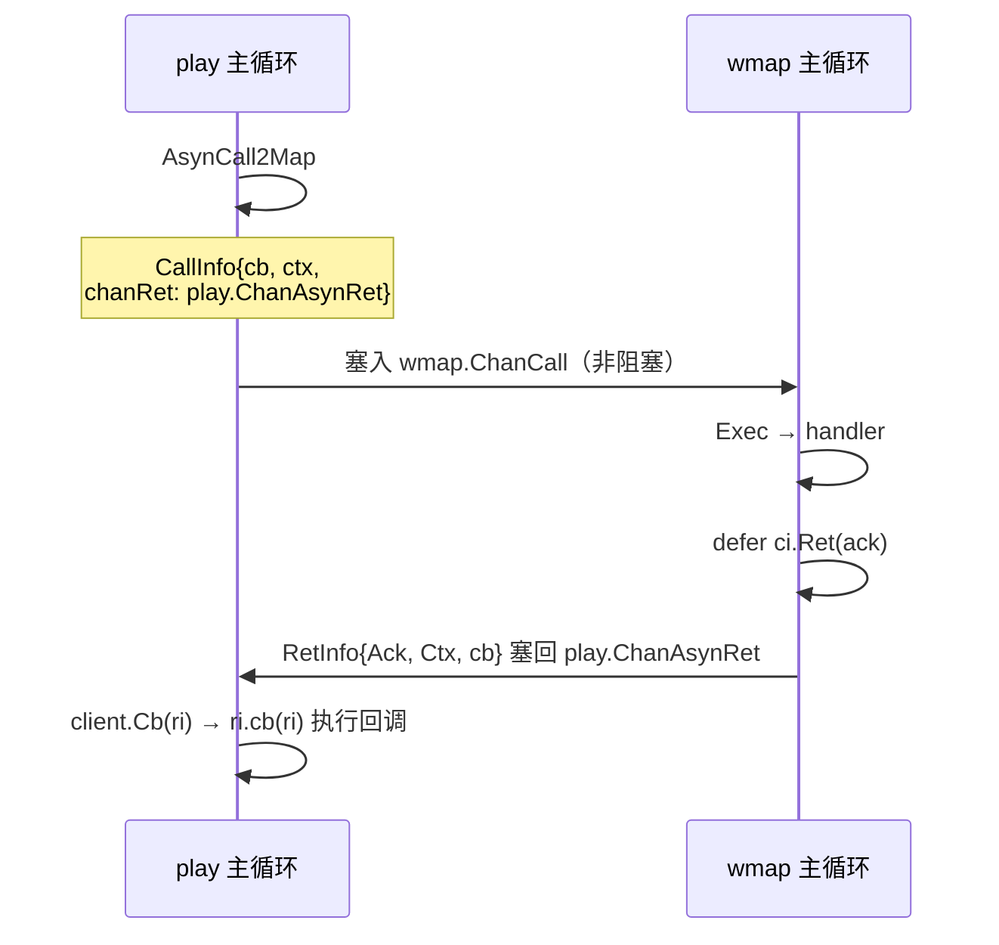

# 网络层与消息转发链路

> 一条客户端请求从 socket 字节流走到 `play` 的 handler、再从 `SendTo` 回到玩家屏幕的完整路径。
> 覆盖四段传输：**client↔gate 自定义 TCP/WS**、**gate↔game gRPC 双向流**、**进程内 chanrpc**、**进程间 nats**。
> 配合 [[登录流程]] 看：那篇讲鉴权状态机，这篇讲承载它的管道。

## 一句话总结

整套框架只有一个范式：**一条 goroutine + 一个 select 循环 + channel 作为唯一入口**。
`Skeleton` 是「每模块一条」，`Agent` 是「每连接一条」，两者结构完全同构。
因此全链路无锁，且任何一条主循环都不允许阻塞 —— 宁可丢消息。

---

## 分层概览

```
┌─ 客户端 ────────────────────────────────────────────┐
│  TCP(+AES) 或 WebSocket                            │
└────────────────────┬───────────────────────────────┘
                     │  [4B len][4B msgID][pb body]
┌─ gate 进程 ─────────▼───────────────────────────────┐
│  TCPConn / WSConn   字节流、独立写协程               │
│  MsgParser          分包(4B 长度前缀)                │
│  Codec/Processor    msgID ↔ pb 类型                 │
│  GWAgent.Run()      ★每连接一条 goroutine + select   │
└────────────────────┬───────────────────────────────┘
                     │  gRPC 双向流 GameFrame（每玩家一条）
┌─ game 进程 ─────────▼───────────────────────────────┐
│  GSAgent.Run()      ★每连接一条 goroutine + select   │
│         │ chanrpc.Cast                             │
│  play Skeleton.Run()  ←──chanrpc──→ wmap Skeleton  │
│         │                              │           │
│         └──────────── nats ────────────┘           │
└────────────────────────────────────────────────────┘
```

## 参与者

| 角色 | 包 / 类型 | 职责 |
|------|-----------|------|
| **TCPConn** | `core/network` · `TCPConn` | 字节流读写，内部含一条专职写协程 |
| **MsgParser** | `core/network` · `MsgParser` | TCP 流分包，4 字节长度前缀 |
| **Processor** | `core/network/protobuf` | msgID ↔ pb 类型注册表，编解码 |
| **GWAgent** | `gate/server` · `GWAgent` | 客户端在 gate 的代理，一条连接一个 |
| **GSAgent** | `game/gsgate/internal` · `GSAgent` | 同一客户端在 game 的代理，持有 gRPC stream |
| **GSGate** | `game/gsgate/internal` · `GSGate` | game 侧 gRPC 服务端，维护 `playerID → agent` |
| **Skeleton** | `core/module` · `Skeleton` | 模块主循环，应用层调度核心 |
| **chanrpc** | `core/chanrpc` | 进程内模块间消息与异步回调 |
| **natsrpc** | `gs/natsrpc` | 进程间 RPC，复用 chanrpc 的回调语义 |

---

## 报文格式

```
[4B 长度][4B msgID][protobuf body]
 ↑MsgParser  ↑Processor
```

`msgID = BKDRHash(protobuf 消息类型名)`（`core/network/protobuf/protobuf.go:116`）。

> **关键设计**：消息 ID 不手工维护，由类型名哈希得出。`chanrpc.MsgID`（`core/chanrpc/chanrpc.go:153`）用的是同一个 `util.BKDRHash`，所以一条 `cspb.XxxReq` 从客户端到模块路由表全程共用同一个 ID，不需要任何映射表。
>
> **代价**：改 proto 消息名 == 改协议，客户端必须同步。

限制：单包最大 128KB（`core/network/tcp_msg.go:18` `MaxMsgLen`）。

---

## 二、上行链路：客户端 → play handler



### 逐步说明

| 步 | 位置 | 动作 |
|---|---|---|
| 1 | `gate/server/agent.go:368` `goConnReader` | 独立协程读 socket，`readMessage` 分包 + AES 解密 |
| 2 | 同上 `:382-397` | **流控**：包间隔 <50ms 就 sleep 补齐；10s 内超 10000 包直接断连 |
| 3 | `gate/server/agent.go:300` `recvPacket` | 读 msgID；`pb.IsMsgIdOutDate` 过期消息直接丢；有 hook 则 gate 本地处理 |
| 4 | `gate/server/agent.go:337` | **gate 不反序列化业务消息**，原始字节塞进 gRPC stream |
| 5 | `game/gsgate/internal/agent.go:268` `recvFrame` | game 侧 Unmarshal |
| 6 | `game/gsgate/internal/agent.go:300-311` | **服务端强行注入 PlayerID / SessionID** |
| 7 | `game/gsgate/internal/agent.go:313` | `PLAYMOD.Cast(msg)`，进入 chanrpc 世界 |

### ★ PlayerID 是服务端盖上去的

```go
// game/gsgate/internal/agent.go:300-311
fieldPlayerID := reflect.ValueOf(msg).Elem().FieldByName("PlayerID")
fieldSessionID := reflect.ValueOf(msg).Elem().FieldByName("SessionID")
fieldPlayerID.SetInt(agent.PlayerID())      // 按已认证的连接身份覆盖
fieldSessionID.SetInt(agent.sessionID)
```

这解释了 `regPlayerNetMsg`（`game/play/internal/handler.go:67-83`）为什么敢用反射直接读 `PlayerID` 字段做鉴权 —— **客户端传什么都会被覆盖，伪造无效**。

同时也说明：任何要走 `regPlayerNetMsg` 的 cspb 请求，**必须有 `PlayerID int64` 字段**，否则 `:305` 会打 Errorf，且 `:69-77` 的校验会直接拒绝。

---

## 三、下行链路：`play.SendTo` → 玩家屏幕

一个 ack 要穿过 **5 个 channel、4 条 goroutine**。

| 步 | 位置 | 动作 |
|---|---|---|
| 1 | `game/play/internal/ctl_sender.go:49` | 不在线 → `needStash` 判断：丢弃，或异步加载玩家存进 `StashMsgs` 待登录补发 |
| 2 | `ctl_sender.go:62` | `GSGATEMOD.Cast(&iproto.SendByPlayerID{})` — **play 线程到此结束** |
| 3 | `game/gsgate/internal/gatehandler.go:78` | gsgate 线程：`GetAgentByPlayerID` → `agent.WriteMsg` |
| 4 | `game/gsgate/internal/agent.go:259` `streamSend` | 塞进 `sendMQ`；**满了 drop + Errorf** |
| 5 | `game/gsgate/internal/agent.go:236` | GSAgent 主循环取出 → `sendToFrame` → pb 序列化 → `stream.Send` |
| 6 | `gate/server/agent.go:410` `goStreamReader` | gate 协程收 → `fromStream` |
| 7 | `gate/server/agent.go:263` `recvFrame` | GWAgent 主循环 → `CountRespAck` 算延迟 → `WriteRaw` |
| 8 | `gate/server/agent.go:525` `WriteRaw` | AES 加密 → `conn.WriteMsg` → 加 4B 长度前缀 |
| 9 | `core/network/tcp_conn.go:48` | 写协程 `conn.Write(b)` 落 socket |

> `GameFrame.GenTs` 是发送时打的时间戳，两端 `recvFrame` 里比对，超过 10ms 打 `[SlowTrans]` 日志（`gate/server/agent.go:586`、`gsgate/internal/agent.go:290`）。**排查跨节点延迟时直接搜这个关键字。**

---

## 四、Agent 与 Skeleton 同构

这是整套框架最值得记的一点。

```go
// game/gsgate/internal/agent.go:222  GSAgent.Run()
for {
    select {
    case ri := <-agent.client.ChanAsynRet:  // ← 和 Skeleton 一模一样
        agent.client.Cb(ri)
    case frame := <-agent.recvMQ:           // 上行
        agent.recvFrame(frame)
    case msg := <-agent.sendMQ:             // 下行
        agent.sendToFrame(msg)
    }
}
```

```go
// core/module/skeleton.go:176  Skeleton.Run()
for {
    select {
    case <-closeSig:
    case ri := <-s.client.ChanAsynRet:      // 我发出的异步调用回来了
        s.client.Cb(ri)
    case ci := <-s.server.ChanCall:         // 别人调我
        s.server.Exec(ci)
    case cb := <-s.g.ChanCb:                // 协程回调
    case t := <-s.dispatcher.ChanTimer:     // 定时器
    }
}
```

**Agent 甚至持有自己的 `chanrpc.Client`**，能像模块一样发起异步调用并接收回调。区别只有粒度：Skeleton 每模块一条，Agent 每连接一条。

`GWAgent.Run()`（`gate/server/agent.go:193`）同形，多两路：心跳 timer、nats 订阅。

---

## 五、进程内消息转发与异步回调（chanrpc）

### 为什么必须异步

`Client.Call()`（`core/chanrpc/chanrpc.go:363`）是同步的，`ri := <-c.chanSyncRet` 会阻塞当前 goroutine。
play 主循环同步调 wmap、wmap 同时同步调 play → **死锁**。所以业务层一律用 `AsynCall`。

### 生命周期（同进程）



**核心**：`cb` 和 `ctx` 被塞进 `CallInfo` 一起带走（`chanrpc.go:380-390`），`chanRet` 填的是**发起方自己的 `ChanAsynRet`** —— 这就是回程地址。

### cbctx 为什么存在

回调签名是 `func(*RetInfo)`，**框架刻意不让你用闭包**。

闭包会捕获 `*mplayer.Player` 这类指针，而异步期间玩家可能已下线、对象已回收 —— 这是这类框架最经典的野指针来源。

`cbctx.SValue` 是**带 3 字符 tag 的字符串编码**（`i32`/`i64`/`str`/`bol`/`obj`…），天生只能装标量、只能传值，跨进程也能序列化。用类型系统把人按在正确写法上：

```go
// 只传 ID 和标量
cbctx.M{
    types.PlayerID:         cbctx.Int64(p.PlayerID),
    ctxTreasurePreDeducted: cbctx.Bool(preDeducted),
}

// 回调里必须重新查 + 判 nil
p := play.GetTargetPlayer(playerID)
if p == nil { return }
```

### 跨进程：同一套机制 + 一段 nats

`natsrpc.ACall`（`gs/natsrpc/external.go:33`）本质是「异步调用了本进程的 nats 模块」，
**cb 和 ctx 存在本地 CallInfo 里，从不过网**。

| 步骤 | 位置 | 动作 |
|---|---|---|
| 发出 | `natsrpc/internal/handler.go:158` `onClusterCall` | 发网络，`m.rpcqueue[sid] = ci` 存住 CallInfo，挂超时定时器 |
| 对端收 | `:42` `handleReq` | 反序列化 → `ClusterAsynCall` 投给目标模块 |
| 对端回 | 目标模块 `ci.Ret` → `:141` `onRpcCall` | `ns.Reply` 回网络 |
| 本端收 | `:106` `handleAck` | 按 sid 取回 `rpcqueue[sid]`，取消定时器，`ci.Ret(msg)` |
| 超时 | `:195` `timerNatsCall` | `ci.Ret(ClusterCallAck{Err: "timeout"})` |

**默认超时 5 秒死写在 `natsrpc/internal/handler.go:186`**，用 `ACallWithTimeout` 可覆盖。

> ⚠ **超时是必然会走到的路径，不是理论情况。** 凡是「先扣后还」类的补偿逻辑，`ri.Err != nil` 分支里的回滚是必需的，不是防御性代码。

---

## 六、每层都在丢，不阻塞

统一取舍：宁可丢消息，也不阻塞任何一条主循环。

| 位置 | 满了怎么办 | 出处 |
|---|---|---|
| `chanrpc.call` 投递模块 ChanCall | 返回 error，消息丢 | `chanrpc.go:495-499` |
| `GSAgent.sendMQ` | drop + Errorf | `gsgate/internal/agent.go:262` |
| `TCPConn.writeChan` | **直接销毁连接** | `core/network/tcp_conn.go:104` |
| `GWAgent.fromClient` (cap 10) | 阻塞 goConnReader（有意，配合流控） | `gate/server/agent.go:369` |

`writeChan` 满了断连的原注释：*"缓冲池满了, 代表有验证的异常, 或者死循环, 直接关闭连接"*。

这也是 **`Cast` 系列不可靠的根源** —— 例如 `wmap.DecAssets`（`game/wmap/internal/ctl_asset.go:58`）是单向 Cast，扣失败静默、无返回值，**撑不起需要确认的资产扣减**。需要确认的场景必须用 `AsynCall` + 回调。

---

## 七、关键常量

```go
// gate/server/agent.go:43
HeartbeatCheckDur       = 120 * time.Second     // 心跳检测周期
HeartbeatKickDur        = 300 * time.Second     // 超时踢人
FlowCtrlMinSpan         = 50 * time.Millisecond // 单连接最小包间隔
FlowCtrlStage           = 10 * time.Second      // 统计窗口
FlowCtrlStageMaxPackets = 10000                 // 窗口内上限，超则断连

// core/network/tcp_msg.go:18
MaxMsgLen = 128 * 1024                          // 单包上限

// natsrpc/internal/handler.go:186
timeout = 5 * time.Second                       // 跨进程 RPC 默认超时
```

---

## 八、排查要点

| 现象 | 先看哪里 |
|---|---|
| 客户端收不到某条 ack | `SendTo` 的 `IsOnline` 判断 + `needStash`（`ctl_sender.go:49`）；再看 `sendMQ full, drop msg` 错误日志 |
| 消息偶发丢失 | 搜 `chanrpc channel full`，模块 ChanCall 被打爆 |
| 连接莫名断开 | 搜 `close conn: channel full`（写缓冲满）、`exceed flow ctrl stage max packets`（流控）、`heartbeat timeout` |
| 跨节点延迟 | 搜 `[SlowTrans]`，>10ms 会打点 |
| 跨进程调用无响应 | 搜 `timerNatsCall`，5 秒超时会打 Infof |
| 消息没进 handler | 确认 cspb 消息有 `PlayerID int64` 字段；看 `register_message` 启动日志确认注册成功 |
| 回调里的 bug 静默消失 | `execCb` 的 recover 只打日志不传播（`chanrpc.go:441`），错误不会浮到调用方 |

## 九、易踩的坑

1. **`ci.Ret` 只能调一次**，重复调只打错误日志就返回（`chanrpc.go:68`），第二次的 ack 静默丢失。推荐 `defer ci.Ret(ack)` + 各分支只改 ack 字段。
2. **handler panic 会自动回一个 Err**（`chanrpc.go:225-228`），调用方不会永远挂着 —— 但回调里 panic 会被 `execCb` 吃掉，谁都不知道。
3. **改 proto 消息名等于改协议**，msgID 是类型名哈希出来的。
4. **`regMapMsg` 只适合 play 纯当管道的场景** —— 它是 `Cast2Map`，单向、不等回包、由 wmap 自己回客户端。一旦需要 play 侧数据（背包/资产），就必须自己包一层 `AsynCall2Map` + 回调。

---

## 相关

- [[登录流程]] — 鉴权与角色登录状态机，跑在本文这套管道上
- [[game停服-gateway断联客户端流程]] — 连接断开侧的流程
- [[统一注册中枢-按类型分发的可扩展设计]] — 消息注册的上层组织方式
