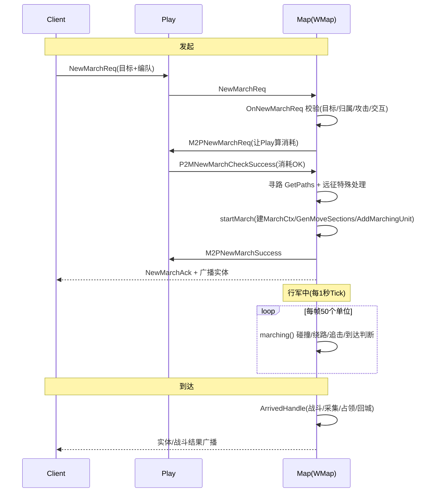

# 行军(March)流程

> 大地图上部队从发起行军到到达目标的完整链路。整体分三段：
> **发起**（Client → Play → Map 三方校验+扣费+寻路）、
> **行军中**（每秒 Tick 驱动移动/碰撞/绕路/追击）、
> **到达**（命中目标触发对应 ArrivedHandle）。
> 配套已有 PlantUML 在 `gs/docs/map/march.puml`。

## 参与者

| 角色 | 包 / 文件 | 职责 |
|------|-----------|------|
| Client | — | 发起 `NewMarchReq`（目标+编队） |
| **Play** | `game/play/internal` | 校验主城/编队、检查并扣除行军消耗 |
| **Map(WMap)** | `game/wmap/internal` · `ctl_march.go` | 行军主控：校验、寻路、创建行军、Tick驱动 |
| **MarchMgr** | `mmap/mmarch/march_mgr.go` | 行军控制器与事件 Handler 的注册/分发 |
| **UnitMgr/EntityMgr** | `mmap/melem` · `mentity/moving.go` | 移动段计算、碰撞检测、绕路、挤出 |

---

## 一、核心数据结构

`March` = `Move`（轨迹） + `MarchCtx`（行军语义）。

```go
// unit_troop.go
type March struct {
    *mentity.Move
    *MarchCtx
}

// mentity/move.go —— 轨迹
type Move struct {
    Sections    []MoveSection // 分段路径（直线/绕路弧线）
    StartTime   int64
    EndTime     int64
    TargetCoord geo.Coord     // 目标坐标
    TargetID    int64         // 目标ID
    ExcludeID   int64         // 无法绕路时强制穿过的实体
}

type MoveSection struct {
    Type       cspb.PathCoordType
    StartCoord geo.Coord
    EndCoord   geo.Coord
    StartTime  int64
    EndTime    int64
    Speed      float64
}

// ctx_march.go —— 行军上下文
type MarchCtx struct {
    MarchType         int32         // 行军类型(四元组查表)
    Action            cspb.MarchAct // 行军动作
    Costs             map[int64][]*cspb.TypIDVal // 行军消耗
    Suspend           bool          // 碰撞暂停
    SuspendStartCoord geo.Coord
    SuspendTarget     int64
    DelayGoOn         int32         // 暂停后续行倒计时
    MarchStartTime    int64
    NeedDetour        bool          // 是否参与碰撞绕路
    OldDistance       int64         // 上帧与目标距离(追击)
    ChasingLestFrame  int32         // 追击剩余帧
    MarchChange       bool          // 速度是否变化
    TgtId             int64
    TgtType           cspb.MapUnitType
}
```

> **实时坐标**：`Move.GetCoordAfterTime` 按当前时间在 Section 内插值，
> `ratio = (now - StartTime) / (EndTime - StartTime)`，无需逐帧存坐标。

### MarchAct 行军动作（`pb/cspb/def.pb.go`）

| 值 | 名称 | 值 | 名称 |
|----|------|----|------|
| 0 | StubAct(占位) | 9 | Reinforce(增援) |
| 1 | Attack(攻击) | 10 | Guard(护卫) |
| 2 | Gather(采集) | 11 | Occupy(占领) |
| 3 | Return(回城) | 12 | Move(移动空地) |
| 4 | Scout(侦查) | 13 | RewardBox(宝箱) |
| 5 | Transport(运输) | 14 | ExpTransport(远征运输) |
| 7 | Rally(集结) | 15 | ExpMeltingIce(远征魔碳) |
| 8 | JoinRally(加入集结) | | |

### 部队状态位（`types/def.go`）

```go
TroopStateBattle = 1 << 1  // 战斗中
TroopStateMarch  = 1 << 2  // 行军中
TroopStateDefend = 1 << 3  // 驻守中
TroopStateGather = 1 << 4  // 采集中
```

---

## 二、发起流程（三方握手）

`ctl_march.go: OnNewMarchReq → M2P → OnP2MNewMarchCheckSuccess → startMarch`

1. **Client → Play → Map**：客户端 `NewMarchReq`（目标+编队），Play 透传到 Map 的 `OnNewMarchReq`。
2. **Map 端校验**：目标存在？是自己的部队？`CheckCanAttack`？远征攻击限制？`CheckMarchCondition(StartMarchCheck)` 交互条件？通过后判断是否需要扣费（已进过的矿洞/废墟免扣）。
3. **Map → Play 检查消耗**：`Cast M2PNewMarchReq`，把目标类型/归属/是否打NPC等带给 Play 算资源消耗。
4. **Play → Map 确认**：消耗 OK 后回 `P2MNewMarchCheckSuccess`。
5. **Map 二次校验+寻路**：`OnP2MNewMarchCheckSuccess` 再查副本坐标限制、占领数量上限、`GetPaths` 寻路；远征地图走特殊分支（空间裂缝/传送门，比较直连与绕门路径取短）。
6. **StartMarch**：`MarchMgr.StartMarch` → 按出发单位类型取控制器 → `pTroopStartMarch` → `startMarch`。
7. **收尾**：`AttachCost` 挂消耗、加瞭望塔 `OnBeAttackPrepared`、`M2PNewMarchSuccess` 通知 Play、`BroadcastUnitNtfImpl` 广播给视野内玩家。

### startMarch 内部步骤（`ctl_march.go:1197`）

```
1. CancelDefend()              // 取消驻守
2. GetMarchType()              // 四元组查表确定行军类型
3. stopMarch0()                // 清除旧行军
4. UpdateUnitCoord(paths[0])   // 落到出发坐标
5. NewMarchCtx()               // 建行军上下文(算OldDistance/ChasingLestFrame)
6. 若 cfg.PathFinding!=0 → SetNeedDetour(true)
7. GenMoveSections()           // 路径+速度 → MoveSection[]
8. StartMove()                 // 写入 Move
9. AddMarchingUnit()           // 加入行军列表(参与Tick)
10. intelHandler()             // 触发情报系统
```

### 行军类型四元组

```
Key = "{出发单位}_{MarchAct}_{关系}_{目标单位}"
例: PlayerTroop_MarchActAttack_enemy_NpcTroop
```

通过 `marchtype` 配置表查出 MarchType，决定该行军能否驻扎(`Camp`)、能否召回(`CallBack`)、是否绕路(`PathFinding`)。

---

## 三、行军 Tick（每秒驱动）

`ctl_march_ticker.go`

```
timerMarchTicker (每 1000ms)
  → GetAllMarchingIDs() 取全部行军单位
  → Cast MarchTickSplit
  → OnMarchTickSplit: 每帧处理 50 个(MarchTickSplitCount)
       前 50 个 → marching(unit)
       剩余     → 下一帧继续 Cast
       全部完成 → 起下一个 Timer
```

> 分帧是为了摊平单帧 CPU，避免大量部队同时计算造成卡顿。

### marching() 单位处理

```
marching(unit)
 ├─ 无 march → 从行军列表移除
 ├─ Suspend 中 → return
 ├─ checkMidwayMarch 中途条件检查 → 失败则 marchingCheckFail(召回)
 ├─ Marching() 核心移动：
 │    ├─ 暂停恢复  GoOnCheck → GoOnMarch
 │    ├─ 碰撞检测  CheckCollision → 暂停/绕路/挤出/穿过
 │    ├─ 更新坐标  UpdateUnitCoord
 │    ├─ 追击      Chasing (目标移动则重新寻路)
 │    └─ 速度变化  SpeedChange (重算路径)
 ├─ isMarchArrived 到达判断
 └─ 到达 → stopMarch → CheckMarchCondition(EndCheck) → ArrivedHandle
```

---

## 四、碰撞 / 绕路 / 追击

`mentity/moving.go` · `melem/marching.go`

- **碰撞检测 `CheckCollision`**：取自身 Block 碰撞体，四叉树查附近碰撞体。
  - `CollisionActionPause` → 暂停行军；
  - 碰撞体正好是行军目标 → 忽略继续走；
  - `ExcludeID` 命中 → 强制穿过；
  - 否则尝试绕路。
- **绕路 `doDetour`**：绕路半径 `r = (自身Block+碰撞体Block+最近距离)/cos(π/8)`，
  求直线与圆交点，`GetCoordsAround` 在圆上分 16 份生成绕路点，校验都在导航网格内，再从末点重新寻路并拼接 Sections。绕路点踩静态阻挡则改走直线。
- **挤出 `doPush`**：当前坐标已在碰撞体内 → 沿"碰撞体中心→实体"方向推出到半径外，插入一段新 Section。
- **追击 `Chasing`**：目标是动态单位且终点与目标当前坐标不一致时触发。
  `ChasingLestFrame` 按距离分档（越近频率越高），每帧递减，归零或跨档时重新寻路。
- **防御**：Section 数超 `MaxMoveSectionCount` 直接停止移动，防内存膨胀。

---

## 五、到达判断与结束

`ctl_march_ticker.go: isMarchArrived`

| Action | 到达条件 |
|--------|----------|
| Attack / Rally | 与目标距离 ≤ `battleRadius`（进入战斗半径） |
| ExpMeltingIce(打 AreaBarrier) | 同上 |
| 其他 | 与终点距离 ≤ `DistanceReached` + 自身 Block 半径 |

到达后：`stopMarch` → `handleMarchArrivedBlocking`（冲进建筑阻挡半径则沿路径反向挤出）→ `CheckMarchCondition(EndMarchCheck)` → 取注册的 `ArrivedHandle` 执行（战斗/采集/占领/回城等）。任一步失败走 `marchingCheckFail` → 召回控制器。

---

## 六、驻扎 / 召回

| 操作 | 入口 | 关键 |
|------|------|------|
| **驻扎** | `OnCampReq` ← `StopMarchReq` | 校验 `marchtype.Camp==1`，`CampMapUnit` → `campPlayerTroop` |
| **召回** | `OnRecallMarchReq` ← `RecallMarchReq` | 校验 `marchtype.CallBack==1`，`RecallTroop` → `recallPlayerTroop`，停当前行军并向主城建 Return 行军 |

---

## 七、Handler 注册机制

`march_mgr.go` · `ctl_march_event.go`

```
MarchMgr
 ├─ Handles  map[string]*MarchHandle      // Check + ArrivedHandle
 ├─ Control  map[MapUnitType]*MarchControl // Start/Recall/Camp/Fail
 └─ Dispatch map[Region][Region]Handler    // 远征跨区域

// 例: PlayerTroop 控制器注册
RegisterControl(MapUnitPlayerTroop,
    pTroopStartMarch, campPlayerTroop, recallPlayerTroop, nil)
```

Handler Key 同四元组：`{出发}_{Act}_{关系}_{目标}`，如
`PlayerTroop_MarchActReturn_self_PlayerCity`（回城）、
`RallyTroop_MarchActRally_enemy_PlayerCity`（集结攻城）。

---

## 八、时序图



---

## 关联
- 版本：[[v1045]]
- 相关：[[战斗流程]]、[[冰髓争夺战]]
