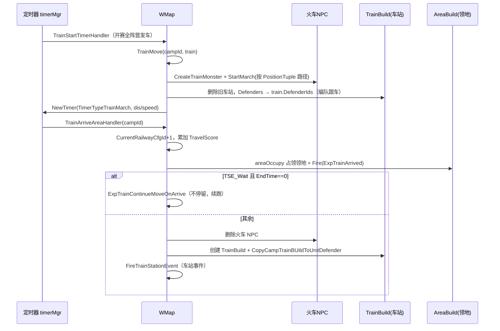
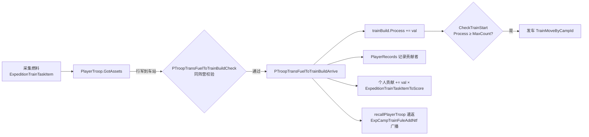

# 远征火车（毒地图）· 玩法逻辑

> 梳理对象：远征战场地图（配置表以 `PoisonMap` 前缀命名，俗称“毒地图”）中的**阵营火车玩法**。
> 代码：`game/wmap/internal/ctl_exptrain.go`、`ctl_battlefield.go`、`ctl_battlefield_train_station_handler.go`、`ctl_battlefield_game_play.go`
> 配置：`ExpRailwayCfg`、`ExpGridCfg`、`PoisonMapSpecialEventCfg`、`PoisonMapEventTaskCfg`、`ExpTrainTotalRewardCfg`、`ExpTrainDropPositionCfg`
> 相关：[[远征火车-提交配置与协议变更]]、[[远征-H5 1039~1048版本Bug修复清单]]

---

## 一、玩法定位

每个阵营一列火车，沿本阵营铁轨（`ExpRailwayCfg`，按 `map_id + camp` 分组）一站一站开向终点：

- 玩家采集**燃料**运到车站，攒满进度即发车；
- 敌对阵营可集结进攻车站，打赢会让车站**爆出燃料**；
- 火车到站**占领领地**，并可触发采集 / 丧尸 / 寻宝等小玩法；
- 到站累计**竞速积分**，活动结束按阵营排名发奖。

---

## 二、核心数据结构

| 结构 | 位置 | 说明 |
|---|---|---|
| `expedition.Train` | `game/wmap/internal/expedition/mgr.go:273` | 阵营火车持久数据：`CurrentRailwayCfgId` 当前铁轨、`MonsterID` 行进中的 NPC 载体、`TrainBuildId` 停靠时的车站建筑、`DefenderIds` 跟车驻防编队、`TimerID`、`TodayDropCount` |
| `mcity.TrainBuild` | `mmap/melem/mcity/trainbuild.go:11` | 停站期间的地图建筑单位（`MapUnitExpStopTrain`）：`Process` 燃料进度、`Defenders`/`DefenderId` 驻防、`ProcessRewards` 领奖记录、`PlayerRecords` 贡献者、`ProtectEndTs` 保护期、`TrainStandingId` 关联领地 |
| `mcity.AreaBuild` | — | 车站所在领地格，承载小玩法状态 `PlayGameEventId` / `PlayGameStatus` / `PlayGameNum` |
| `expedition.CampTrain.ScoreMgr` | `expedition/mgr.go` | 竞速积分与结算标记 |

> [!important] 关键点
> 火车只有两种存在形态——**行进中是一个 NPC 部队**（`CreateTrainMonster`，`ctl_battlefield.go:2390`），**停站时是一个建筑 `TrainBuild`**。两者互斥切换，代码里大量 nil 判断都源于此。

---

## 三、运转主链路



### 发车的两种触发条件（`ExpRailwayCfg.EndType`）

| EndType | 触发方式 | 入口 |
|---|---|---|
| `TET_Time` | 车站停留定时器到期 | `TrainStationDeadlineHandler`（`ctl_battlefield.go:2606`） |
| `TET_Process` | 燃料进度攒满 `MaxCount` | `CheckTrainStart`（`ctl_exptrain.go:111`），同时取消停留定时器 |

---

## 四、燃料与进度（玩法主循环）



主入口 `PTroopTransFuelToTrainBuildArrive`（`ctl_exptrain.go:33`）。另有三个加进度 / 加贡献的口子：

- `PTroopDefendExpTrainBuild`（`ctl_exptrain.go:212`）：驻防时身上带的燃料也直接算进度；
- `PTroopTransFuelToAreaBuildArrive`（`ctl_battlefield_game_play.go:773`）：采集类小玩法把燃料捐给领地，走 `ExpAddGamePlayNum`；
- `OnM2PExpTrainContributeItemUseReq` → `AddExpCampTrainPlayerContribute`：道具直接加贡献。

---

## 五、驻防与攻防（PVP）

| 环节 | 函数（`ctl_exptrain.go`） | 要点 |
|---|---|---|
| 驻防校验 | `PTroopDefendExpTrainBuildCheck:158` | 同阵营、人数上限 `DefenseMember`、一人一队 |
| 驻防 | `PTroopDefendExpTrainBuild:212` | 进 `Defenders`，坐标贴到车站 |
| 进攻校验 | `RTroopAtkExpTrainArriveCheck:294` | 禁同阵营、联盟集结数上限 `ExpeditionTrainRallyMax`、`ProtectEndTs` 保护期 |
| 进攻结算 | `RTroopAtkExpTrainArrive:322` | 有守方集结队直接打；没有则把散装 `Defenders` **现场合并成一支 `RallyTroop`**；一个人都没有时造一支 `owner=0` 的空队顶上，保证战斗流程不卡 |
| 战败掉落 | `ExpTrainDefendEnd:416` | 按 `ExpTrainDropPositionCfg` 在车站周围撒燃料采集物（`CreateFuelGatherItem`），每次扣 `ExpeditionTrainTaskItemDrop[1]`，受 `TodayDropCount` 每日次数限制；随后进入 `ExpeditionTrainProtectTime` 保护期，发跑马灯 + 阵营邮件 |
| 编队阵亡掉落 | `PlayerTroopDeadCheckDropFuelGahterItem:609` | 运输途中被杀，燃料原地掉落 |
| 跨天重置 | `OnEventExpTrainNextDay:506` | 重置各阵营 `TodayDropCount` |
| 放弃驻防 | `GiveupDefendExpTrain:721` | 车站还在则从建筑移除；火车已在行进中则从 `train.DefenderIds` 移除（`ExitExpTrain`） |
| 阵营预警 | `CampWatchTower` / `campWatchTowerCampId:2097` | 火车建筑不做敌对关系判断，阵营中心类建筑才判断 |

---

## 六、车站事件与小玩法

`FireTrainStationEvent`（`ctl_battlefield_train_station_handler.go:74`）用注册表按 `EventType` 分派：

| 事件类型 | 处理器 | 行为 |
|---|---|---|
| `TSE_Gather` | `handleTrainGatherEvent` | 在车站所在 zone 刷采集物 + 建停留定时器 |
| `TSE_Wait` / `TSE_Monster` / `TSE_PlayGame` | `handleTrainTimedEvent` | 只建停留定时器 |

真正的小玩法由**领地格**驱动，`TrainArrivedStandingEvent`（`ctl_battlefield_game_play.go:31`）读 `ExpGridCfg.SpecialEventId` → `PoisonMapSpecialEventCfg.Type` 分三类：

- `GamePlayTypeAtkMonster` → `GamePlayMonsterAtkTrain`（丧尸打火车，怪死 / 到站后 `refreshAtkTrainStandingMonster` 补刷）
- `GamePlayTypeGather` → `GamePlayGather`（捐矿）
- `GamePlayTypeTreasureHunt` → `GamePlayTreasureHunt`（寻宝）

计数与完成：

```
ExpAddGamePlayNum(area, num)              ctl_battlefield_game_play.go:1084
  · 达成 PoisonMapEventTaskCfg.Count 逐档发阵营奖励（ClusterCastCrossEvent 回本服）
  · 全部任务完成 → ExpGamePlayFinish
       → Fire(ExpGamePlayFinish)
       → ExpTrainOnGamePlayFinish          ctl_exptrain.go:1459
       → CheckTrainStart                   提前发车
```

> `TSE_PlayGame` 车站会把驻防编队全部遣返（`ctl_battlefield.go:2586`，策划需求）。

---

## 七、奖励与结算

| 类型 | 入口 | 配置 |
|---|---|---|
| 车站进度奖励（阵营档位） | `OnExpTrainCampRewardsReq` / `OnExpTrainBuildCampRewardsInfoReq` | `ExpRailwayCfg.RewardCount` / `Reward` |
| 进度奖励补发 | `SendTrainBuildUnRecvRewards:1382`，发车时对 `PlayerRecords` 中未领取者发邮件 | `ExpeditionTrainTaskMail` |
| 个人贡献奖励 | `OnExpTrainPlayerContributeInfoReq` / `OnExpTrainPlayerContributeRewardReq` | `ExpTrainTotalRewardCfg`（按 playbook 过滤） |
| 贡献奖励兜底补发 | `SendExpCampTrainContributionRewardsOnEnd` → `SendExpCampTrainContributionRewardsHandler` | 战场结束阶段按阵营发邮件 |
| 阵营竞速排名 | `OnActvExpTrainEndNtf`（同分比时间戳 `Stamp`） | `ActvRankSectionCfg` |

客户端查询协议：`OnExpTrainPosInfoReq`（当前位置）、`OnExpTrainNextPosReq`（下一停靠点 + 剩余秒数）、`OnExpCampTrainInfoReq`（行进中返回 0）、`OnActvExpTrainPackProto`（阵营积分榜）。

---

## 八、定时器注册

`game/wmap/internal/module.go:349-353`：

| 定时器 | 处理函数 |
|---|---|
| `TimerTypeTrainStart` | `TrainStartTimerHandler` |
| `TimerTypeTrainMarch` | `TrainArriveAreaHandler` |
| `TimerTypeTrainStationDeadLine` | `TrainStationDeadlineHandler` |
| `TimerTypeBfGamePlayEvent` | `timerGamePlayTicker` |
| `TimerTypeExpTrainCampContributeMailTicker` | `SendExpCampTrainContributionRewardsHandler` |

---

## 九、GM 命令

集中在 `ctl_exptrain.go` 后半段：

| 命令 | 作用 |
|---|---|
| `trainstart` / `alltrainstart` | 立即发车 / 全阵营发车 |
| `trainforward` / `trainback` | 前进 / 后退一站 |
| `trainforwardevent` | 跳站并触发车站事件 |
| `trainprotect` / `trainprotectend` | 开启 / 结束保护期 |
| `trainbuildprocess` | 直接加燃料进度 |
| `traincontribute` | 直接加个人贡献 |
| `trainspeedratio` | 调整火车速度倍率 |
| `trainrank` | 补发阵营排名奖 |
| `delwildtrain` | 清理与 `train.TrainBuildId` 对不上的残留火车 |

---

## 十、坑点与修复记录

### 已修复（2026-08-05，分支 `h5_new_tf_v1048_remote_fight_light`）

1. **`PTroopDefendExpTrainBuild` 删错道具**（`ctl_exptrain.go:241`）
   `for index, v := range playerTroop.GotAssets` 的循环变量**遮蔽**了外层 `var index int`，`index = index` 是自赋值，外层 `index` 恒为 0。后续 `append(GotAssets[:index], GotAssets[index+1:]...)` 永远删第 0 个元素——燃料不在首位时会删掉别的道具。
   已改为 `index := -1` + `for k, v := range`，并补 `index < 0` 保护。

2. **阵营排名奖发不出去**（`ctl_exptrain.go:1606`、`1906`）
   `r, err := reward.MakeReward(...)` 之后写成 `if err == nil { continue }`，判断反了：构造奖励**成功**时反而跳过发奖。`OnActvExpTrainEndNtf` 与 GM 命令 `cmdSendExpTrainRankRewards` 两处相同。已改为 `if err != nil`，并补齐 `cfg is nil` 日志缺失的格式化参数、修正 GM 分支里写错的函数名。

3. **`OnExpTrainPlayerContributeRewardReq` 回包数值翻倍**（`ctl_exptrain.go:963`）
   `ack.RewardsInfo[k] += ack.RewardsInfo[k] + v` 展开是 `= 2*旧值 + v`；且该循环嵌在 `for _, cfgId := range req.GetCfgId()` 内，一次请求领 N 个档位就会把整张 `rewardsInfo` 重复累加 N 次。
   已改为在 `for cfgId` 循环**外**做一次快照赋值 `ack.RewardsInfo[k] = v`，与 `OnExpTrainPlayerContributeInfoReq` 语义保持一致；`horde` 一并提到循环外，避免每次迭代重复取。

### 仍存在的可优化点

- “从 `GotAssets` 摘取燃料”的逻辑在 **4 处**重复（`PTroopTransFuelToTrainBuildArrive`、`PTroopDefendExpTrainBuild`、`PlayerTroopDeadCheckDropFuelGahterItem`、`PTroopTransFuelToAreaBuildArrive`），建议抽成 `PlayerTroop.TakeFuel(fuelId) int64`。
- `TrainBuild.Defenders` / `Process` / `PlayerRecords` 等字段仍是直接访问，未按项目规范走 Get 方法（缺 `accessor_TrainBuild.go`）。
